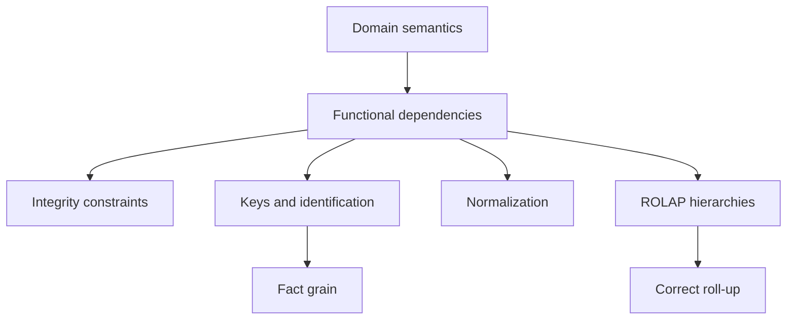

# Functional Dependencies

> [!abstract]
> A **functional dependency** is a semantic integrity constraint stating that the values of one set of attributes uniquely determine the values of another set. Functional dependencies explain the meaning of relational keys, guide normalization, and represent the many-to-one relationships used by dimensional hierarchies in ROLAP. They are properties of the schema and application domain, not accidental patterns observed in one database instance.

## Formal Definition

Let

$$
R(A_1,A_2,\ldots,A_n)
$$

be a relation schema. A functional dependency has the form

$$
X \rightarrow Y
$$

where $X$ and $Y$ are sets of attributes of $R$.

The dependency holds in an instance $r$ of $R$ when, for every pair of tuples $t_1,t_2 \in r$:

$$
t_1[X]=t_2[X] \Rightarrow t_1[Y]=t_2[Y]
$$

In words:

> Whenever two tuples agree on all attributes in $X$, they must also agree on all attributes in $Y$.

$X$ is called the **determinant**, while $Y$ contains the attributes functionally determined by $X$.

## A Simple Example

Consider:

```text
STUDENT(student_id, tax_code, name, degree_programme)
```

If each `student_id` identifies exactly one student, then:

$$
student\_id \rightarrow tax\_code,name,degree\_programme
$$

Two tuples may have the same `degree_programme` and different students, so the inverse dependency normally does not hold:

$$
degree\_programme \not\rightarrow student\_id
$$

Functional dependency is directional. Saying that $X$ determines $Y$ does not imply that $Y$ determines $X$.

## Schema Property, Not Accidental Data

Suppose the current instance is:

| student_id | name | degree_programme |
|---|---|---|
| 101 | Alice | Computer Science |
| 102 | Bob | Economics |

In this particular instance, `name -> degree_programme` happens to be true because no two students share a name. We cannot conclude that it is a valid schema dependency. A future instance may contain two people named Alice enrolled in different programmes.

A functional dependency belongs to the schema only when it follows from the semantics of the domain and must hold in **every valid instance**.

> [!important]
> Data can disprove a proposed functional dependency, but one finite instance cannot prove that the dependency is a permanent business rule.

# Functional Dependencies as Integrity Constraints

An **integrity constraint** restricts the database states considered valid. A functional dependency is one kind of integrity constraint because it forbids instances containing two tuples that agree on the determinant but disagree on a determined attribute.

If the schema declares:

$$
product \rightarrow type
$$

then this state is invalid:

| product | type |
|---|---|
| P1 | Detergent |
| P1 | Beverage |

The two tuples agree on `product` but disagree on `type`.

## Main Categories of Relational Integrity Constraints

| Constraint | Meaning | Example |
|---|---|---|
| Domain constraint | Values must belong to an allowed domain. | `quantity > 0` |
| Key constraint | A key uniquely identifies a tuple. | `student_id` is unique. |
| Entity integrity | A primary-key value cannot be null. | Every order has an identifier. |
| Referential integrity | A foreign-key value references an existing tuple. | Every order customer exists. |
| Functional dependency | Equal determinant values imply equal dependent values. | `city -> region` |
| General business constraint | An application-specific condition must hold. | A shipment date cannot precede its order date. |

Functional dependencies are therefore not the only integrity constraints. In particular, they must not be confused with foreign keys.

## Functional Dependency versus Foreign Key

A functional dependency normally constrains attributes **within one relation schema**:

$$
PRODUCT: product \rightarrow category
$$

A foreign key connects tuples in different relations:

```text
SALE.product_key references PRODUCT.product_key
```

The foreign key says that the referenced product exists. The functional dependency says that a product has one determined category. The two constraints solve different problems and often work together.

## Enforcement in SQL

Primary-key and unique constraints directly enforce important functional dependencies:

```sql
CREATE TABLE STUDENT (
    student_id       INTEGER PRIMARY KEY,
    tax_code         VARCHAR(20) UNIQUE NOT NULL,
    name             VARCHAR(100) NOT NULL,
    degree_programme VARCHAR(100) NOT NULL
);
```

The primary key implies:

$$
student\_id \rightarrow tax\_code,name,degree\_programme
$$

The unique, non-null `tax_code` is also a candidate key and implies:

$$
tax\_code \rightarrow student\_id,name,degree\_programme
$$

An arbitrary dependency such as `city -> region` is not directly declared with a standard `FUNCTIONAL DEPENDENCY` clause. It can be enforced by decomposing the schema:

```sql
CREATE TABLE CITY (
    city_id INTEGER PRIMARY KEY,
    city    VARCHAR(100) UNIQUE NOT NULL,
    region  VARCHAR(100) NOT NULL
);
```

and referencing `CITY` from other relations. Triggers or application logic are alternatives, but decomposition makes the rule structural and easier to understand.

# Keys as a Special Case of Functional Dependency

Let $R$ contain all attributes $U$.

A set of attributes $K$ is a **superkey** when:

$$
K \rightarrow U
$$

That is, $K$ functionally determines every attribute of the relation.

A **candidate key** is a minimal superkey: no proper subset of $K$ still determines all attributes. One candidate key is selected as the **primary key**; the others are alternate keys.

> [!summary]
> Every key expresses a functional dependency toward all relation attributes. Not every determinant is a key: $X \rightarrow Y$ does not make $X$ a key unless $X$ determines the complete schema.

## Example of a Composite Key

Consider:

```text
ORDER_LINE(order_id, product_id, quantity, unit_price)
```

Assume the business rule says that the same product occurs at most once in an order. Then:

$$
(order\_id,product\_id) \rightarrow quantity,unit\_price
$$

The pair `(order_id, product_id)` is a candidate key. Neither attribute alone is sufficient:

$$
order\_id \not\rightarrow quantity
$$

because an order has several lines, and:

$$
product\_id \not\rightarrow quantity
$$

because the product is sold in many orders.

If the application allows the same product to appear in multiple lines, the proposed pair is not a key. The grain and key might instead be `(order_id, line_number)`.

This demonstrates an essential principle:

> Keys are consequences of the semantics and grain of the represented facts, not merely convenient columns chosen by the designer.

# Reasoning about Functional Dependencies

## Trivial and Non-Trivial Dependencies

A dependency $X \rightarrow Y$ is **trivial** when $Y \subseteq X$:

$$
(student\_id,name) \rightarrow name
$$

It holds for every relation because agreement on the left already includes agreement on `name`.

A dependency is non-trivial when $Y$ contains attributes not already in $X$:

$$
student\_id \rightarrow name
$$

Non-trivial dependencies express meaningful semantic restrictions.

## Armstrong's Axioms

Functional dependencies can be derived using three sound and complete inference rules.

### Reflexivity

If $Y \subseteq X$, then:

$$
X \rightarrow Y
$$

### Augmentation

If $X \rightarrow Y$, then:

$$
XZ \rightarrow YZ
$$

### Transitivity

If $X \rightarrow Y$ and $Y \rightarrow Z$, then:

$$
X \rightarrow Z
$$

Useful derived rules include union, decomposition, and pseudotransitivity.

For a dimensional hierarchy:

$$
product \rightarrow type
$$

$$
type \rightarrow category
$$

transitivity gives:

$$
product \rightarrow category
$$

This is precisely why a product-level fact can be grouped unambiguously by category.

## Attribute Closure and Key Testing

The closure $X^+$ is the set of all attributes functionally determined by $X$ under a set of dependencies $F$.

Given:

```text
R(order_id, product_id, customer_id, order_date, quantity)
```

and:

$$
order\_id \rightarrow customer\_id,order\_date
$$

$$
(order\_id,product\_id) \rightarrow quantity
$$

the closure of `(order_id, product_id)` is:

$$
(order\_id,product\_id)^+
= \{order\_id,product\_id,customer\_id,order\_date,quantity\}
$$

Because the closure contains all attributes of $R$, the pair is a superkey. Because neither component alone has the same closure, it is minimal and therefore a candidate key.

# Functional Dependencies and Normalization

Functional dependencies reveal redundancy and update anomalies.

Consider:

```text
PRODUCT(product_id, product_name, type, category)
```

with:

$$
product\_id \rightarrow product\_name,type
$$

$$
type \rightarrow category
$$

Therefore:

$$
product\_id \rightarrow category
$$

but this dependency is transitive through `type`. Repeating the category for every product of the same type creates:

- **update anomalies:** changing a category requires modifying many rows;
- **insertion anomalies:** a type-category association cannot be inserted until a product exists;
- **deletion anomalies:** deleting the last product of a type may erase the category information.

A normalized decomposition is:

```text
PRODUCT(product_id, product_name, type_id)
TYPE(type_id, type, category)
```

## BCNF Intuition

A relation is in **Boyce-Codd Normal Form (BCNF)** when, for every non-trivial functional dependency $X \rightarrow Y$, $X$ is a superkey.

In the original product table, `type -> category` violates BCNF because `type` does not identify an individual product tuple. The dependency is separated into its own relation during normalization.

Normalization is especially useful for OLTP because data is frequently updated. ROLAP dimensional models may intentionally retain these transitive dependencies for a different workload.

# Functional Dependencies in the Multidimensional Model

In multidimensional analysis, facts are examined through dimensions and hierarchy levels.


Each ordinary hierarchy arc represents a many-to-one relationship and usually a functional dependency:

$$
product \rightarrow type \rightarrow category
$$

Other examples are:

$$
store \rightarrow city \rightarrow region
$$

$$
date \rightarrow month \rightarrow quarter \rightarrow year
$$

These dependencies define valid paths for OLAP aggregation.

## Why the Dependency Is Necessary for Roll-Up

Suppose the fact table contains quantities by product:

| product | quantity |
|---|---:|
| P1 | 10 |
| P2 | 15 |
| P3 | 7 |

If every product determines one type, each fact belongs to exactly one group during a roll-up:

```sql
SELECT p.type, SUM(f.quantity)
FROM SALES_FACT AS f
JOIN PRODUCT_DIM AS p
  ON f.product_key = p.product_key
GROUP BY p.type;
```

If one product belongs to multiple types, joining the fact to both types duplicates its quantity. The ordinary functional dependency fails, and the relationship must be modelled as many-to-many, usually through a bridge table and possibly allocation weights.

Functional dependencies therefore contribute to **summarizability**: the ability to obtain correct aggregates when moving up dimensional hierarchies.

> [!warning]
> Functional dependency is necessary for a strict hierarchy, but correct aggregation also depends on measure additivity, complete hierarchy mappings, compatible fact grain, and the absence of unintended duplicate joins.

## The `All` Level

The top of a hierarchy can be viewed as a constant level:

```text
category -> all products
```

Every category determines the same `All products` member. Grouping at this level removes the product distinction and yields the total across the whole dimension.

# Functional Dependencies in ROLAP

ROLAP represents multidimensional facts using relational schemas. Functional dependencies appear in both dimension tables and fact tables.

## Dimension-Table Dependencies

A denormalized product dimension may contain:

```text
PRODUCT_DIM(
    product_key,
    product_code,
    product_name,
    type,
    category,
    department
)
```

Typical dependencies are:

$$
product\_key \rightarrow product\_code,product\_name,type,category,department
$$

$$
product\_code \rightarrow product\_name,type
$$

$$
type \rightarrow category
$$

$$
category \rightarrow department
$$

The surrogate `product_key` is the relational key of the dimension row. The other dependencies encode the analytical hierarchy.

## Star Schema and Intentional Denormalization

In a [[Star Schema]], hierarchy attributes are normally kept in one dimension table even though dependencies such as

$$
type \rightarrow category
$$

produce transitive redundancy. This violates the normalization style normally preferred for OLTP, but it allows all product hierarchy levels to be reached with one join from the fact table.

The redundancy is controlled because:

- dimension tables are generally smaller than fact tables;
- updates occur through managed loading processes;
- analytical queries benefit from fewer joins;
- the hierarchy is easier for users and tools to understand.

The functional dependencies are not ignored. They document which repeated values must remain consistent during ETL.

## Snowflake Schema

A [[Snowflake Schema]] normalizes some dimensional dependencies:

```text
PRODUCT_DIM(product_key, product_code, product_name, type_key)
TYPE_DIM(type_key, type, category_key)
CATEGORY_DIM(category_key, category, department)
```

This reduces redundancy but requires additional joins during OLAP queries. Star versus snowflake is therefore a workload and maintainability trade-off, not a disagreement about whether the dependencies exist.

## The Key and Grain of a Fact Table

Consider:

```text
SALES_FACT(date_key, store_key, product_key, quantity, revenue)
```

If the declared grain is “sales of one product in one store on one date,” the dimensions determine the measures:

$$
(date\_key,store\_key,product\_key)
\rightarrow quantity,revenue
$$

The dimension-key combination is a candidate key of the fact table.

But this key is valid only if there is at most one row for that combination. If the grain is an individual receipt line, several sales of the same product may occur in one store on the same date. The fact table then needs additional identifying attributes:

```text
SALES_FACT(
    receipt_key,
    line_number,
    date_key,
    store_key,
    product_key,
    quantity,
    revenue
)
```

with:

$$
(receipt\_key,line\_number)
\rightarrow date\_key,store\_key,product\_key,quantity,revenue
$$

> [!important]
> The fact-table key is determined by the grain. Dimensions do not automatically form a key merely because they are foreign keys.

Some fact schemata also include an explicit constraint stating that a proper subset of dimensions identifies the fact. Such a constraint changes the relational key and must be documented.

## Functional Dependence Is Not Additivity

The dependency

$$
(date,store,product) \rightarrow revenue
$$

says that the coordinates determine one revenue value at the chosen grain. It does **not** say that revenue can be summed along every dimension.

Functional dependence concerns identification. **Additivity** concerns the semantic validity of an aggregation operator.

For example:

- `(date, store, product) -> inventory_level` may hold;
- inventory level is nevertheless non-additive across time.

The two properties answer different questions.

# Historical Dimensions and Surrogate Keys

Warehouse history introduces an important nuance. A business identifier may not determine one attribute value across all time.

Suppose product `P1` changes category:

| product_key | product_code | category | valid_from | valid_to |
|---:|---|---|---|---|
| 101 | P1 | Home | 2024-01-01 | 2025-06-30 |
| 205 | P1 | Garden | 2025-07-01 | null |

Across the full historical dimension:

$$
product\_code \not\rightarrow category
$$

because `P1` has two valid category values at different times. However:

$$
product\_key \rightarrow product\_code,category,valid\_from,valid\_to
$$

Each surrogate key identifies one historical version.

Alternatively, the business key together with a validity coordinate may determine the version:

$$
(product\_code,valid\_from) \rightarrow category,valid\_to
$$

This is one reason ROLAP dimensions commonly use surrogate keys. The key identifies not only the business entity but the appropriate historical version used by a fact.

# Advanced Dimensional Cases

## Cross-Dimensional Attributes

Some values depend on attributes from more than one dimension. A tax rate may satisfy:

$$
(product\_category,country) \rightarrow VAT
$$

Neither category nor country alone determines VAT. The logical schema normally uses a separate relation whose composite key contains both determinants.

## Convergence

Different hierarchy paths may reach the same attribute. For example, a store may reach `country` through its city hierarchy and through its sales district hierarchy. A convergence constraint requires the two results to agree.

Functional dependencies describe each path, while the convergence integrity constraint requires consistency between paths.

## Shared Hierarchies

The same hierarchy can play several roles. A call fact may reference the telephone-number dimension as both `calling_number` and `called_number`; a shipment may reference a date dimension as order date and delivery date.

Each surrogate key still determines the attributes of the shared dimension. Role names distinguish how the same dependency structure is used by the fact.

## Multiple Arcs and Bridge Tables

If a book can have several authors, then:

$$
book \not\rightarrow author
$$

The relationship is many-to-many and cannot be represented as an ordinary strict hierarchy arc. A bridge table is required:

```text
BOOK_AUTHOR(book_key, author_key, weight)
```

The bridge key is generally:

$$
(book\_key,author\_key)
$$

and therefore:

$$
(book\_key,author\_key) \rightarrow weight
$$

The weight can allocate measures across several authors while preventing double counting.

# Complete Conceptual Connection

| Concept | Functional-dependency interpretation |
|---|---|
| Determinant | Attribute set whose value fixes another value. |
| Integrity constraint | An FD rules out instances that violate the determination. |
| Superkey | A determinant of every relation attribute. |
| Candidate key | A minimal determinant of every relation attribute. |
| Primary key | The candidate key chosen as the principal identifier. |
| Normalization | Uses FDs to remove harmful redundancy and anomalies. |
| Dimension hierarchy | A sequence of many-to-one FDs enabling roll-up. |
| Star dimension | Intentionally stores transitive hierarchy dependencies together. |
| Snowflake dimension | Decomposes some hierarchy dependencies into separate tables. |
| Fact-table key | Determined by the fact grain; functionally determines measures and context. |
| Surrogate dimension key | Determines one warehouse member or historical version. |
| Additivity | Separate property governing whether measures can be aggregated. |
| Bridge table | Models a relationship where an ordinary hierarchy FD does not hold. |

# Final Mental Model



> [!summary]
> A functional dependency $X \rightarrow Y$ states that equal $X$ values require equal $Y$ values in every valid relation instance. It is therefore an integrity constraint. A key is a minimal attribute set that functionally determines the entire relation. In ROLAP, functional dependencies describe dimension hierarchies and fact identification: they explain how relational tables represent cube coordinates and why facts can be rolled up from detailed members to higher aggregation levels without ambiguity.

# Quick Self-Test

1. Why can one database instance disprove an FD but not establish it as a permanent semantic rule?
2. What is the difference between a functional dependency and a foreign key?
3. Why is every candidate key a determinant, but not every determinant a candidate key?
4. How can attribute closure be used to test whether a set is a superkey?
5. Which update anomalies arise from `product -> type -> category` in one normalized operational relation?
6. Why may a star schema intentionally preserve transitive dependencies?
7. How do hierarchy FDs support a roll-up from product to category?
8. Why does a many-to-many relationship invalidate an ordinary hierarchy FD?
9. How does fact grain determine the candidate key of a fact table?
10. Why are functional dependence and measure additivity different properties?
11. Why may `product_code -> category` fail in a historical dimension while `product_key -> category` still holds?
12. Which FD would model a tax rate jointly determined by product category and country?
