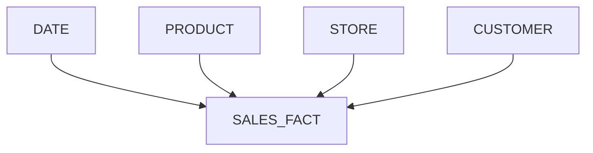
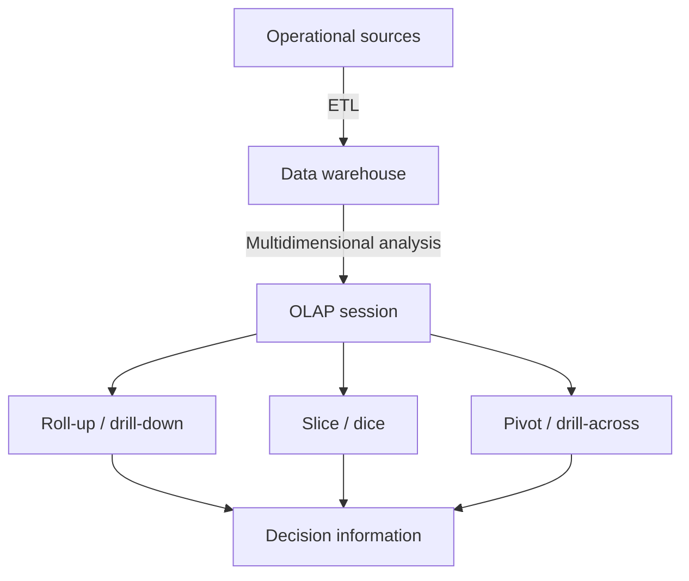

# OLAP - Online Analytical Processing

> [!abstract]
> **OLAP** is a way of interactively analysing large collections of data from multiple perspectives and at different levels of detail. It is characterized by complex, read-intensive, multidimensional queries involving filtering, grouping, comparison, and aggregation. OLAP is usually performed on a [[Data Warehouse]], because a warehouse provides integrated, historical, and analysis-oriented data without burdening operational systems.

## The Basic Idea

An operational system answers questions about individual activities:

- What is the current status of order 1258?
- Which classroom is assigned to today's lecture?
- Has this payment been registered?

OLAP answers questions about collections of activities:

- How has revenue changed over the last five years?
- What is the average grade by programme and academic year?
- Which product categories perform best in each region?

OLAP is therefore not merely a particular SQL command. It is an **analytical processing paradigm** that includes:

- a multidimensional view of data;
- complex aggregation queries;
- an interactive sequence of related questions;
- operations such as roll-up, drill-down, slice, dice, pivot, and drill-across;
- tools that translate a user's analytical actions into executable queries.

## OLAP and the Data Warehouse

The two concepts must not be confused:

```text
Data warehouse = where analytical data is integrated, organized, and stored
OLAP          = how that data is interactively explored and analysed
```

OLAP is commonly executed on a data warehouse because the warehouse offers:

- data collected from several operational or external sources;
- consistent definitions and formats;
- historical observations;
- schemas designed for aggregation;
- predominantly read-only access;
- physical separation from operational transactions.

OLAP can technically operate on another analytical source or a virtual warehouse. However, directly querying operational databases has important disadvantages: expensive scans interfere with transactions, historical data may be missing, and different sources may use incompatible meanings.

## OLTP versus OLAP

**OLTP** and **OLAP** use databases for different purposes.

| Characteristic | OLTP | OLAP |
|---|---|---|
| Purpose | Execute daily operations | Support analysis and decisions |
| Typical question | “What happened to this order?” | “How are orders changing over time?” |
| Access | Read and write a few records | Read and aggregate many records |
| Users | Many operational users | Analysts and decision-makers |
| Workload | Predictable and embedded in applications | Dynamic and exploratory |
| Data | Current and detailed | Historical, integrated, detailed or aggregated |
| Schema | Usually normalized | Often dimensional and denormalized |
| Main concern | Transaction latency and integrity | Query throughput and analytical response time |

A typical OLTP query is selective:

```sql
SELECT *
FROM ORDERS
WHERE order_id = 1258;
```

A typical OLAP query groups a large set of events:

```sql
SELECT
    year,
    region,
    product_category,
    SUM(revenue) AS total_revenue
FROM SALES_ANALYSIS
GROUP BY year, region, product_category;
```

The distinction depends on purpose and workload, not on SQL syntax alone. `SELECT` can be used in both environments.

## Multidimensional View

OLAP users interpret data according to the [[Multidimensional Data Model]]. The central elements are facts, measures, dimensions, and hierarchies.

### Facts

A **fact** is an event or evolving phenomenon being analysed, such as a sale, shipment, examination, admission, or telephone call.

The **grain** states exactly what one fact represents. For example:

> One fact represents the sale of one product in one store on one date.

### Measures

A **measure** is a quantitative property of the fact:

- quantity sold;
- revenue;
- discount;
- duration;
- number of events.

Measures are the values normally aggregated by OLAP queries. Their semantics determine which aggregation operators are valid.

### Dimensions

A **dimension** is an analysis coordinate. A sales fact might have:

- product;
- store;
- date;
- customer.

The combination of dimension values identifies the context of a fact.

### Hierarchies

A dimension can contain progressively coarser levels:

```text
date    -> month -> quarter -> year
product -> type  -> category
store   -> city  -> region
```

Hierarchy arcs normally correspond to functional dependencies. For example, if each city belongs to exactly one region:

$$
city \rightarrow region
$$

Hierarchies allow users to move between detail and summary while preserving a meaningful grouping structure.

## The Data Cube

A fact can be imagined as a cell in a multidimensional cube. Each axis represents a dimension and each cell contains measures.

```text
Coordinates:
  date    = 2026-04-10
  store   = Central Store
  product = Product A

Measures:
  quantity = 10
  revenue  = 250
```

The cube is a conceptual metaphor: an analytical model can have more than three dimensions. On a screen, cube results are usually displayed through tables with nested row and column headings.

## Primary and Secondary Events

A **primary event** is a fact at the finest represented grain. A **secondary event** summarizes several primary events at a coarser level.

For example:

```text
Primary event:   revenue for one product, store, and day
Secondary event: revenue for one category, region, and year
```

Secondary events are obtained by applying valid aggregation functions along dimensional hierarchies.

## The OLAP Session

An OLAP session is an interactive **navigation path**. The user does not need to know every question beforehand.

A possible session is:

1. Show annual revenue by product category.
2. Focus on the year with the largest decrease.
3. Break the result down by region.
4. Inspect individual cities in the weakest region.
5. Compare revenue with promotional discounts.

Each step depends on the previous result. An OLAP operator transforms the current analytical view into the next one.

## OLAP Operators

### Roll-Up

**Roll-up** moves toward a coarser level of a hierarchy and increases aggregation:

```text
day -> month -> quarter -> year
city -> region
product -> category
```

For example, rolling daily revenue up to years corresponds conceptually to:

```sql
SELECT year, SUM(revenue)
FROM SALES
GROUP BY year;
```

Roll-up requires a valid aggregation function. `SUM` works for additive measures such as quantity, but not for every measure.

### Drill-Down

**Drill-down** is the inverse of roll-up. It moves toward finer detail:

```text
year -> quarter -> month -> day
region -> city -> store
```

Drill-down is possible only if the finer-grained data was stored or can be derived. Aggregated data cannot reconstruct discarded details.

### Slice

**Slice** fixes a dimension to a specific value, producing a lower-dimensional view:

```text
year = 2026
```

If the original cube varies by year, region, and category, fixing the year leaves a view over region and category.

### Dice

**Dice** selects a sub-cube using more general conditions:

```text
year IN (2025, 2026)
region = 'Central'
category IN ('Food', 'Electronics')
revenue > 100000
```

Slice and dice restrict the events being considered. They do not necessarily change their aggregation level.

### Pivot

**Pivoting** changes how dimensions are arranged in the visualization. A dimension displayed in rows may be moved to columns.

The data and aggregation do not change. Only the perspective changes. Pivoting can make different comparisons visually immediate.

### Drill-Across

**Drill-across** combines measures from different facts or cubes, such as:

- sales revenue and promotional discount;
- ordered quantity and shipped quantity;
- admissions and treatment costs.

The facts must share compatible dimensions and be aligned to a common grain. Directly joining detailed fact tables can multiply rows and produce incorrect totals. A safer method is to aggregate each fact separately to the common dimensions and then combine the results.

## Additivity of Measures

An OLAP query may be syntactically correct but semantically wrong if a measure is aggregated incorrectly.

A measure is **additive along a dimension** when it can be summed along that dimension.

- Sales quantity is normally additive across products, stores, and time.
- Inventory level is additive across stores but not across dates.
- Unit price and percentages are normally non-additive.
- Distinct customer counts are not generally additive across products because one customer may buy several products.

> [!warning]
> Never assume that every numeric column can be summed. Aggregation depends on the meaning of the measure, the fact grain, and the dimension being traversed.

## OLAP in a Relational Database: ROLAP

**ROLAP** implements multidimensional analysis through relational tables and SQL. Facts are commonly stored in a central fact table and dimensions in surrounding dimension tables, producing a [[Star Schema]] or [[Snowflake Schema]].



The OLAP request is translated into relational operations:

| OLAP concept | Relational implementation |
|---|---|
| Cube context | Joins between fact and dimension tables |
| Slice or dice | `WHERE` predicates |
| Aggregation level | `GROUP BY` attributes |
| Measure aggregation | `SUM`, `AVG`, `MIN`, `MAX`, `COUNT` |
| Roll-up | Grouping by coarser hierarchy attributes |
| Drill-down | Adding finer grouping attributes |

Example:

```sql
SELECT
    d.year,
    s.region,
    p.category,
    SUM(f.revenue) AS total_revenue
FROM SALES_FACT AS f
JOIN DATE_DIM    AS d ON f.date_key = d.date_key
JOIN STORE_DIM   AS s ON f.store_key = s.store_key
JOIN PRODUCT_DIM AS p ON f.product_key = p.product_key
WHERE d.year >= 2024
GROUP BY d.year, s.region, p.category;
```

A ROLAP engine can receive a graphical multidimensional request, generate the SQL, execute it on the relational server, and return the result in a cube-oriented representation.

ROLAP benefits from relational scalability, mature DBMS technology, and SQL. Its cost is that large joins and aggregations may be expensive, so systems use denormalization, indexes, partitions, caching, and materialized views.

## Native Multidimensional Processing: MOLAP

**MOLAP** stores data in structures that represent multidimensional coordinates natively, commonly array-like cubes. It can execute cube operations without relational joins and often provides excellent analytical response times.

Some secondary aggregate cubes can be materialized in advance. This speeds up common roll-ups but increases storage and loading costs.

MOLAP must also address **sparsity**. Most possible combinations of dimension values may never occur. A cube with thousands of products, stores, and dates has an enormous logical space even if only a small percentage of cells contain facts.

MOLAP systems therefore use compression, chunks, and sparse-storage techniques. Hybrid OLAP can keep detailed sparse data in ROLAP form and dense or frequently accessed aggregates in MOLAP form.

## OLAP Compared with Reports and Data Mining

| Tool | Main behaviour |
|---|---|
| Report | Presents a predefined view at scheduled or requested times. |
| Dashboard | Monitors a selected set of indicators. |
| OLAP | Lets the user interactively explore known dimensions and measures. |
| Data mining | Searches for patterns or models not directly specified as a sequence of ordinary aggregations. |

OLAP is exploratory, but the user still chooses meaningful dimensions, filters, and levels. Data mining delegates more of the pattern-discovery process to an algorithm.

## Common Misconceptions

> [!question] Is OLAP simply a type of query?
> Not exactly. OLAP includes a family of analytical queries, a multidimensional model, interactive navigation, operators, and supporting tools.

> [!question] Is a data warehouse the same thing as OLAP?
> No. The warehouse stores and organizes analytical data; OLAP is a way of analysing it.

> [!question] Does OLAP require a special non-relational database?
> No. ROLAP performs OLAP through relational databases and SQL. MOLAP uses native multidimensional structures.

> [!question] Does every `GROUP BY` query count as OLAP?
> A `GROUP BY` is an important analytical operation, but OLAP normally refers to a broader, interactive, multidimensional workload over substantial integrated data.

> [!question] Does drill-down mean adding a filter?
> No. Drill-down increases detail by moving down a hierarchy. Filtering selects a subset of data. The two operations can be combined but are conceptually different.

## Final Mental Model



> [!summary]
> OLAP is the interactive analysis of facts through measures, dimensions, and hierarchies. It commonly runs on a data warehouse because warehouse data is integrated, historical, stable, and organized for broad aggregation. The warehouse is the analytical data foundation; OLAP is the processing approach used to explore that foundation.

## Quick Self-Test

1. Why is OLAP normally separated from OLTP?
2. What is the difference between a fact, a measure, and a dimension?
3. How do roll-up and drill-down use a hierarchy?
4. What is the difference between slice, dice, and pivot?
5. Why must facts have compatible grains before drill-across?
6. Why is inventory level not additive across time?
7. How does a ROLAP engine implement a multidimensional request?
8. What problem does sparsity create for MOLAP?
