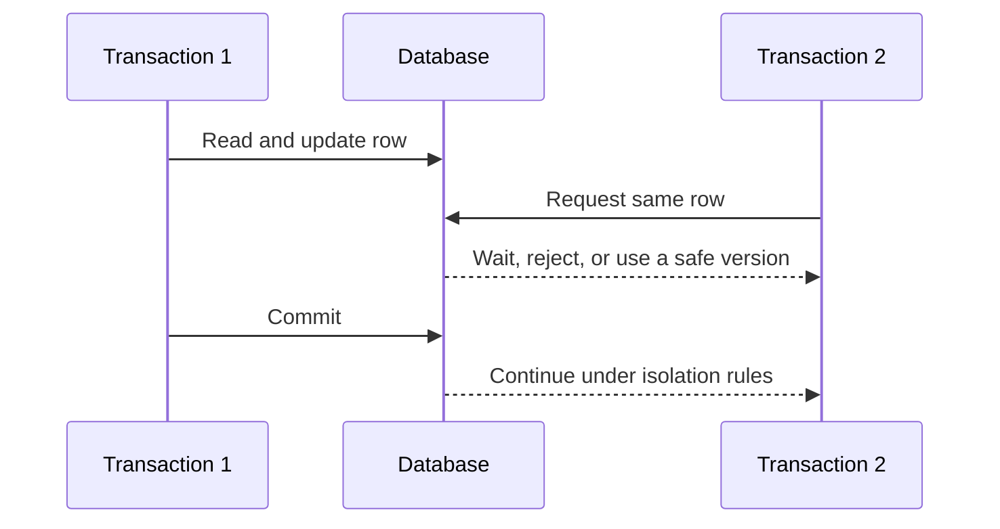
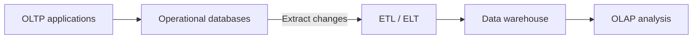
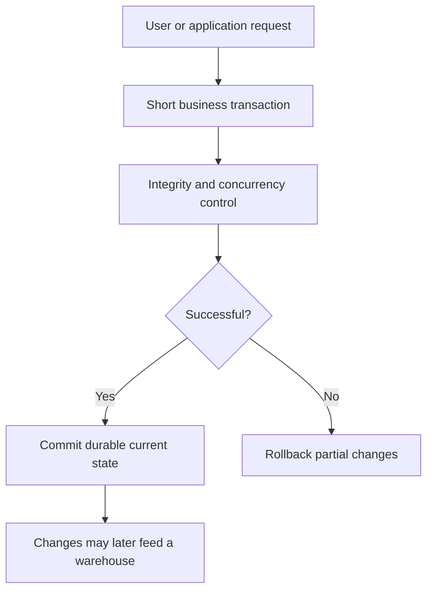

# OLTP - Online Transaction Processing

> [!abstract]
> **OLTP** is a data-processing approach designed to execute the everyday transactions of an organization reliably and with low latency. OLTP systems continuously insert, read, update, and delete a small number of records while preserving integrity under concurrent access. They are the operational sources from which data warehouses commonly obtain data for later OLAP analysis.

## The Basic Idea

An OLTP system records and manages individual operational events:

- registering a university examination;
- placing or cancelling an order;
- transferring money between accounts;
- booking a seat;
- admitting a patient;
- updating inventory after a sale.

Each operation is normally short, precisely defined, and embedded in an application. A user presses a button such as “Confirm order,” and the application executes a known sequence of SQL statements.

The main question answered by OLTP is:

> What is the current state of this specific operational activity, and how can it be changed safely?

This differs from [[OLAP]], whose central question is:

> What patterns emerge when many events are examined across dimensions and time?

## What Is a Transaction?

A **transaction** is a logical unit of work that must be treated as a whole. It may contain one SQL statement or several related statements.

Consider a bank transfer of 100 monetary units from account A to account B:

```sql
BEGIN;

UPDATE ACCOUNT
SET balance = balance - 100
WHERE account_id = 'A';

UPDATE ACCOUNT
SET balance = balance + 100
WHERE account_id = 'B';

COMMIT;
```

The two updates represent one business operation. If only the first succeeds, money disappears from the system. The DBMS must therefore commit both changes or undo both through a rollback.

```sql
ROLLBACK;
```

A transaction boundary should correspond to a meaningful business action, not an arbitrary collection of statements.

## ACID Properties

Reliable OLTP systems are commonly described through the **ACID** properties.

### Atomicity

A transaction is indivisible: either all its effects are committed or none are. In the transfer example, both account updates must succeed together.

Atomicity does not mean that the DBMS literally performs all operations at the same physical instant. It means that partial effects are not left visible as a committed result.

### Consistency

A transaction must move the database from one valid state to another, preserving declared integrity constraints and business rules.

Examples include:

- primary keys remain unique;
- foreign keys reference existing rows;
- required values are not null;
- balances and quantities obey domain rules;
- application-specific invariants remain true.

The DBMS can enforce declarative constraints, but the application and transaction design must enforce rules that are not expressible directly in the schema.

### Isolation

Concurrent transactions should not interfere in a way that produces invalid or unexpected results. Conceptually, each transaction should behave as if it were executed in an appropriate serial order.

Full serial execution would severely limit performance, so DBMSs provide isolation levels that trade stronger guarantees for greater concurrency. Problems controlled by isolation include:

- dirty reads;
- non-repeatable reads;
- phantom rows;
- lost updates and write conflicts.

Isolation may be implemented through locks, multiversion concurrency control, timestamp ordering, or related techniques.

### Durability

Once a transaction commits, its effect must survive failures such as a process crash or system restart. DBMSs achieve durability through transaction logs, write-ahead logging, recovery procedures, replication, and persistent storage.

Durability does not remove the need for backups. A committed transaction can be durable against a crash while still requiring backup and disaster-recovery mechanisms for storage loss, corruption, or operational mistakes.

## Typical OLTP Workload

An OLTP workload normally has the following characteristics:

- many concurrent users or applications;
- a high number of short transactions;
- access to a few rows per transaction;
- frequent `INSERT`, `UPDATE`, and `DELETE` operations;
- selective queries based on keys or indexes;
- predictable operations embedded in software;
- strict integrity and availability requirements;
- low response-time expectations.

Typical queries include:

```sql
SELECT *
FROM CUSTOMER
WHERE customer_id = 5012;
```

```sql
INSERT INTO ORDERS(order_id, customer_id, order_date, status)
VALUES (9182, 5012, CURRENT_DATE, 'CREATED');
```

```sql
UPDATE INVENTORY
SET available_quantity = available_quantity - 1
WHERE product_id = 42;
```

The workload is often “frozen” into the application. The system designers know that users will create orders, register payments, or modify reservations, so these operations can be optimized in advance.

## OLTP Data Model

Operational databases are commonly based on a normalized relational schema. Normalization reduces redundancy and prevents anomalies during frequent updates.

An order system might contain:

```text
CUSTOMER(customer_id, name, email)
ORDER(order_id, customer_id, order_date, status)
ORDER_LINE(order_id, product_id, quantity, unit_price)
PRODUCT(product_id, product_name, category_id)
CATEGORY(category_id, category_name)
```

Customer data is stored once rather than copied into every order. Product and category data are separated according to their functional dependencies. This design makes operational changes safer and more consistent.

> [!important]
> Normalization is not an end in itself. In OLTP it is especially valuable because the database is updated continuously. Redundant data would require the same fact to be modified in several places and could create inconsistent states.

## Integrity Constraints

OLTP correctness depends heavily on integrity constraints.

### Entity Integrity

A primary key uniquely identifies each row:

```sql
PRIMARY KEY (order_id)
```

### Referential Integrity

A foreign key ensures that a referenced row exists:

```sql
FOREIGN KEY (customer_id)
REFERENCES CUSTOMER(customer_id)
```

### Domain and Business Constraints

Column and table constraints restrict valid values:

```sql
CHECK (quantity > 0)
```

```sql
CHECK (status IN ('CREATED', 'PAID', 'SHIPPED', 'CANCELLED'))
```

Some rules span several tables or events and must be implemented through carefully designed transactions, triggers, stored procedures, or application logic.

## Concurrency Control

OLTP systems must allow many transactions to operate simultaneously without corrupting data.



Concurrency control balances correctness and throughput. Excessively broad locks reduce concurrency, while insufficient coordination can produce lost updates or inconsistent reads.

Transactions should therefore be short. Keeping a transaction open while waiting for user input holds resources and increases contention, deadlock risk, and recovery complexity.

## Logging and Recovery

The transaction log records changes needed to reconstruct a correct database state after failure. With write-ahead logging, the relevant log information is persisted before modified data pages are considered safely written.

During recovery, the DBMS can:

- **redo** committed changes not yet reflected in data files;
- **undo** incomplete transactions;
- restore a state consistent with transaction boundaries.

The operational log can also support incremental data extraction for a data warehouse through change-data-capture mechanisms.

## Indexing and Performance

OLTP indexes are designed for selective access to a small number of rows. Common examples include indexes on:

- primary and candidate keys;
- foreign keys used in frequent joins;
- order numbers, account identifiers, or reservation codes;
- columns used by important operational lookups.

Indexes improve reads but make writes more expensive because each affected index must also be maintained. An OLTP design should therefore avoid unnecessary indexes.

Performance is commonly evaluated through:

- transaction latency;
- transactions per second;
- concurrency and lock contention;
- error and rollback rates;
- availability and recovery time.

## Current State and Historical Data

OLTP databases mainly represent the state required by current operations. If a customer's address changes, the system may overwrite the old value:

```sql
UPDATE CUSTOMER
SET address = 'New address'
WHERE customer_id = 5012;
```

Some operational systems keep audit or temporal history, but long-term analytical history is not their primary purpose. A [[Data Warehouse]] commonly copies and restructures operational events so that previous values, snapshots, and trends remain available.

This distinction is not absolute:

- an OLTP database can contain historical tables;
- a warehouse can receive near-real-time updates;
- what distinguishes them is their dominant workload and design objective.

## Relationship with the Data Warehouse

Operational databases are common source systems for a warehouse.



The warehouse does not normally receive an uncontrolled copy of every operational field. The pipeline selects useful data, cleans errors, matches entities, standardizes formats, preserves history, and reorganizes the result according to analytical facts and dimensions.

Separation protects both environments:

- OLTP users retain fast and reliable transactions;
- OLAP users receive historical, integrated data optimized for large scans and aggregation.

## OLTP versus OLAP

| Characteristic | OLTP | OLAP |
|---|---|---|
| Main goal | Run the organization | Understand the organization |
| Unit of work | Individual transaction | Analytical query or session |
| Data access | Few rows | Many rows |
| Operations | Read and write | Mainly read and aggregate |
| Time focus | Current operational state | Current and historical data |
| Schema style | Usually normalized | Often dimensional and denormalized |
| Query pattern | Known and repetitive | Dynamic and exploratory |
| Typical optimization | Index lookups and short transactions | Scans, joins, grouping, and aggregates |
| Correctness emphasis | Transaction and constraint integrity | Consistency across sources and time |

Example OLTP question:

> Insert one customer's new order while guaranteeing that its products and customer exist.

Example OLAP question:

> Compare total order revenue by product category, region, and quarter over five years.

## Why Analytical Queries Are Usually Separated

An OLAP query may scan millions of rows, join several tables, and perform expensive grouping. Running it on the operational database can consume resources needed by short transactions and produce delays for both workloads.

Even if performance were acceptable, operational data may be unsuitable for enterprise analysis because:

- history has been overwritten;
- equivalent concepts use different source formats;
- schemas reflect individual applications rather than shared subjects;
- definitions have not been reconciled;
- the data is at a level of detail inconvenient for repeated analysis.

The reason for a data warehouse is therefore not merely that OLAP queries are “different SQL.” The source data must also be integrated, historized, and organized for a different purpose.

## Common Misconceptions

> [!question] Is OLTP a type of database?
> OLTP is primarily a processing workload and system purpose. A database designed around that workload is commonly called an OLTP or operational database.

> [!question] Is every `INSERT`, `UPDATE`, or `DELETE` an OLTP transaction?
> These statements are typical of OLTP, but context matters. A warehouse-loading process also inserts data. OLTP refers to interactive operational processing, not merely the presence of a write statement.

> [!question] Does a transaction always contain several SQL statements?
> No. A transaction may contain one statement or many. What matters is that it represents one atomic unit of work.

> [!question] Does normalization automatically make a system OLTP?
> No. Normalization supports frequent consistent updates, but workload and purpose determine whether a system is OLTP.

> [!question] Are operational databases forbidden from keeping history?
> No. They may keep audit and temporal data. Their principal objective remains executing current operations.

> [!question] Is consistency in ACID identical to warehouse consistency?
> Not exactly. ACID consistency concerns valid database states under transactions. Warehouse consistency also concerns reconciling meanings, codes, units, and definitions across sources and time.

## Final Mental Model



> [!summary]
> OLTP is the reliable, concurrent processing of individual operational transactions. It keeps the current working state of an organization correct and available. A data warehouse later selects, integrates, and preserves relevant OLTP data so that OLAP can analyse patterns across large historical collections.

## Quick Self-Test

1. What makes several SQL statements one transaction?
2. Explain each ACID property using a bank transfer.
3. Why are normalized schemas particularly useful for OLTP workloads?
4. How do indexes improve and also penalize an operational workload?
5. Why should an interactive application keep transactions short?
6. What is the difference between ACID consistency and warehouse consistency?
7. Why might an OLTP database be a poor source for direct historical analysis?
8. How can a transaction log support both recovery and warehouse extraction?
