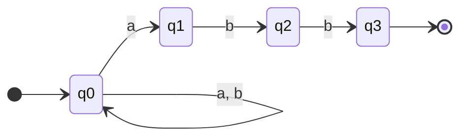

---
tags:
  - informatica/linguaggi-formali
  - programmazione
  - cybersecurity
aliases:
  - Regex
  - RegExp
  - Espressioni regolari
created: 2026-09-19
---

# Regular Expressions

> [!abstract] In breve
> Una **regular expression** (regex) è una notazione compatta per descrivere un insieme di stringhe, cioè un **linguaggio**. In teoria descrive esattamente i *linguaggi regolari* (gli stessi riconosciuti dagli automi finiti); in pratica le regex dei linguaggi di programmazione sono estese con costrutti (backreference, lookaround) che vanno oltre questa classe.

---

## 1. Fondamenti teorici

### Definizione formale
Dato un alfabeto $\Sigma$, le espressioni regolari sono definite induttivamente:

| Espressione | Linguaggio denotato |
|---|---|
| $\emptyset$ | $\emptyset$ |
| $\varepsilon$ | $\{\varepsilon\}$ |
| $a \in \Sigma$ | $\{a\}$ |
| $R_1 \mid R_2$ (unione) | $L(R_1) \cup L(R_2)$ |
| $R_1 R_2$ (concatenazione) | $L(R_1) \cdot L(R_2)$ |
| $R^*$ (stella di Kleene) | $\bigcup_{i \ge 0} L(R)^i$ |

**Precedenza**: stella > concatenazione > unione.

### Teorema di Kleene
> [!important]
> Un linguaggio è regolare ⟺ è denotato da un'espressione regolare ⟺ è riconosciuto da un automa finito (DFA/NFA).

Conversioni classiche:
- **Regex → NFA-ε**: costruzione di Thompson (lineare nella dimensione della regex)
- **NFA → DFA**: subset construction (fino a $2^n$ stati nel caso peggiore)
- **DFA → DFA minimo**: algoritmo di Hopcroft / Myhill-Nerode
- **DFA → Regex**: eliminazione degli stati

### Esempio: $(a|b)^*abb$



NFA che riconosce le stringhe su $\{a,b\}$ che terminano con `abb`.

### Limiti
Linguaggi **non** regolari (dimostrabile col *pumping lemma*):
- $\{a^n b^n \mid n \ge 0\}$
- parentesi bilanciate
- palindromi

> [!warning] Conseguenza pratica
> Non si può fare il parsing "corretto" di HTML, JSON o espressioni annidate con una regex pura. Serve un parser (grammatiche context-free).

Collegamenti: [[Automi a stati finiti]], [[Linguaggi formali]], [[Pumping lemma]]

---

## 2. Sintassi pratica

### Caratteri e classi

| Sintassi | Significato |
|---|---|
| `.` | qualsiasi carattere (tranne `\n`, salvo flag DOTALL) |
| `[abc]` | uno tra a, b, c |
| `[^abc]` | qualsiasi carattere tranne a, b, c |
| `[a-z0-9]` | range |
| `\d` / `\D` | cifra / non cifra |
| `\w` / `\W` | carattere "di parola" `[A-Za-z0-9_]` / negazione |
| `\s` / `\S` | whitespace / non whitespace |
| `\` | escape di un metacarattere (`\.`, `\*`, `\\`) |

> [!note] In Python 3 con stringhe `str`, `\d` e `\w` sono Unicode-aware (es. `\d` matcha anche `٣`). Usare il flag `re.ASCII` se serve il comportamento classico.

### Quantificatori

| Sintassi | Significato |
|---|---|
| `*` | 0 o più |
| `+` | 1 o più |
| `?` | 0 o 1 |
| `{n}` | esattamente n |
| `{n,}` | almeno n |
| `{n,m}` | tra n e m |

**Greedy vs lazy vs possessive**

| Tipo | Sintassi | Comportamento |
|---|---|---|
| Greedy | `.*` | prende il più possibile, poi fa backtracking |
| Lazy | `.*?` | prende il meno possibile |
| Possessive | `.*+` | prende il più possibile e **non** restituisce (niente backtracking) |

```text
Input:  <b>uno</b><b>due</b>
<.*>    → <b>uno</b><b>due</b>
<.*?>   → <b>
```

### Ancore e confini

| Sintassi | Significato |
|---|---|
| `^` / `$` | inizio / fine stringa (o riga con flag MULTILINE) |
| `\A` / `\Z` | inizio / fine assoluta della stringa (Python) |
| `\b` / `\B` | confine di parola / non confine |

### Gruppi

| Sintassi | Significato |
|---|---|
| `(...)` | gruppo catturante |
| `(?:...)` | gruppo non catturante |
| `(?P<nome>...)` | gruppo nominato (Python); `(?<nome>...)` in PCRE/JS |
| `\1`, `(?P=nome)` | backreference |
| `(?>...)` | gruppo atomico (niente backtracking all'interno) |
| `a\|b` | alternanza |

### Lookaround (asserzioni a larghezza zero)

| Sintassi | Nome | Significato |
|---|---|---|
| `(?=...)` | positive lookahead | seguito da ... |
| `(?!...)` | negative lookahead | non seguito da ... |
| `(?<=...)` | positive lookbehind | preceduto da ... |
| `(?<!...)` | negative lookbehind | non preceduto da ... |

Esempio classico, password con almeno una maiuscola, una cifra e lunghezza ≥ 8:
```regex
^(?=.*[A-Z])(?=.*\d).{8,}$
```

> [!info] Backreference e lookaround non sono "regolari"
> Con le backreference si riconosce ad esempio $\{ww \mid w \in \Sigma^*\}$, che non è regolare. Il matching di regex con backreference è **NP-completo**.

### Flag comuni

| Flag | Python | Effetto |
|---|---|---|
| `i` | `re.IGNORECASE` | case-insensitive |
| `m` | `re.MULTILINE` | `^`/`$` per ogni riga |
| `s` | `re.DOTALL` | `.` matcha anche `\n` |
| `x` | `re.VERBOSE` | spazi e commenti ignorati |

---

## 3. Dialetti (flavor)

| Flavor | Dove | Note |
|---|---|---|
| **POSIX BRE** | `grep`, `sed` | `\(`, `\{` vanno escapati; niente `+`/`?` standard |
| **POSIX ERE** | `grep -E`, `awk` | sintassi "moderna" di base, niente lazy/lookaround |
| **PCRE** | `grep -P`, PHP, nginx, Snort/Suricata | molto ricco |
| **Python `re`** | Python | lookbehind solo a larghezza fissa; atomic/possessive da 3.11 |
| **JavaScript** | browser, Node | lookbehind a larghezza variabile, flag `u`, `y`, `d`, `v` |
| **RE2 / Rust `regex` / Go** | Google, Rust, Go | **tempo lineare garantito**, niente backreference né lookaround |

---

## 4. Come funzionano i motori

### Motori basati su automi (DFA / simulazione NFA)
- RE2, Rust `regex`, Go, `grep` (in larga parte)
- Complessità $O(n \cdot m)$ o $O(n)$ con DFA: nessuna esplosione
- Non supportano backreference

### Motori a backtracking
- PCRE, Python `re`, Java, .NET, JavaScript, Perl
- Esplorano le alternative in profondità e tornano indietro in caso di fallimento
- Espressivi, ma **esponenziali nel caso peggiore**

---

## 5. Regex e cybersecurity

### ReDoS (Regular expression Denial of Service)

> [!danger] Catastrophic backtracking
> Con un motore a backtracking, pattern con **quantificatori annidati** o **alternative sovrapposte** possono richiedere tempo esponenziale su input costruiti ad hoc.

Pattern vulnerabili tipici:
```regex
^(a+)+$
^(a|a)*$
^(a|aa)+$
^(\w+\s?)*$
```

Con input `aaaaaaaaaaaaaaaaaaaaaaaaaaaa!` il motore prova tutte le partizioni possibili della sequenza di `a` prima di fallire.

```python
import re, time
p = re.compile(r'^(a+)+$')
for n in range(18, 27, 2):
    t = time.time()
    p.match('a' * n + '!')
    print(n, round(time.time() - t, 3))  # il tempo circa raddoppia per ogni 'a'
```

**Casi reali**: il blackout globale di Cloudflare del luglio 2019 fu causato da una regola WAF con backtracking eccessivo (`.*(?:.*=.*)`) che saturò la CPU.

**Mitigazioni**
- Usare motori lineari (RE2, Rust `regex`, `re2` binding per Python)
- Evitare quantificatori annidati; usare gruppi atomici / quantificatori possessivi
- Limitare la lunghezza dell'input prima del match
- Timeout sul matching
- Analisi statica: `semgrep`, `CodeQL` (query per ReDoS), `recheck`, `regexploit`

### Errori di validazione dell'input

> [!bug] Ancore mancanti
> ```python
> re.search(r'[a-z0-9]+', user_input)      # accetta "abc; rm -rf /"
> re.fullmatch(r'[a-z0-9]+', user_input)   # corretto
> ```

> [!bug] Il `$` di Python matcha prima di un `\n` finale
> ```python
> re.match(r'^[a-z]+$', 'admin\n')   # match! 
> re.match(r'^[a-z]+\Z', 'admin\n')  # None
> ```
> Classica causa di bypass (header injection, log injection).

> [!bug] Punto non escapato
> ```regex
> ^https://trusted.com/     → matcha anche https://trustedXcom/
> ^https://trusted\.com/    → corretto
> ```
> E attenzione anche a `^https://trusted\.com` senza `/` finale: matcha `https://trusted.com.evil.io`. Tipico nelle whitelist di redirect (open redirect) e nelle policy CORS.

> [!bug] Blacklist tramite regex
> Filtrare `<script>` con una regex è quasi sempre aggirabile (`<ScRiPt>`, `<svg onload=...>`, encoding, tag annidati). Preferire **whitelist** ed encoding contestuale, non filtri regex su HTML.

### Regex come strumento difensivo e offensivo
- **Analisi log**: `grep -E`, `awk`, query SIEM (Splunk `rex`, Elastic)
- **IDS/IPS**: opzione `pcre` nelle regole Snort/Suricata
- **Malware hunting**: stringhe regex nelle regole [[YARA]]
- **Secret scanning**: `gitleaks`, `trufflehog` (pattern per API key, token)
- **CTF / recon**: estrazione di flag, URL, IP, hash da dump

Esempio YARA:
```yara
rule suspicious_powershell {
    strings:
        $enc = /powershell(\.exe)?\s+.*-e(nc|ncodedcommand)?\s+[A-Za-z0-9+\/=]{40,}/ nocase
    condition:
        $enc
}
```

---

## 6. Pattern utili

| Scopo | Regex | Note |
|---|---|---|
| IPv4 (approssimato) | `\b(?:\d{1,3}\.){3}\d{1,3}\b` | accetta anche `999.999.999.999` |
| IPv4 (stretto) | `\b(?:(?:25[0-5]\|2[0-4]\d\|1?\d?\d)\.){3}(?:25[0-5]\|2[0-4]\d\|1?\d?\d)\b` | |
| MD5 | `\b[a-fA-F0-9]{32}\b` | |
| SHA-256 | `\b[a-fA-F0-9]{64}\b` | |
| Email (pragmatico) | `^[^@\s]+@[^@\s]+\.[^@\s]+$` | la RFC 5322 completa è impraticabile |
| Chiave AWS | `\bAKIA[0-9A-Z]{16}\b` | |
| JWT | `eyJ[\w-]+\.eyJ[\w-]+\.[\w-]+` | |
| Data ISO | `\d{4}-\d{2}-\d{2}` | non valida i giorni |

---

## 7. Python cheat sheet

```python
import re

re.search(p, s)      # primo match ovunque
re.match(p, s)       # match solo all'inizio
re.fullmatch(p, s)   # match dell'intera stringa  ← per la validazione
re.findall(p, s)     # lista di tutti i match (o dei gruppi)
re.finditer(p, s)    # iteratore di Match object
re.sub(p, repl, s)   # sostituzione
re.split(p, s)       # split
re.compile(p, flags) # precompila

m = re.search(r'(?P<user>\w+)@(?P<dom>[\w.]+)', 'mail: mario@uniroma1.it')
m.group('user')   # 'mario'
m.groupdict()     # {'user': 'mario', 'dom': 'uniroma1.it'}
m.span()          # (6, 23)
```

> [!tip] Usare sempre raw string `r'...'` per evitare il doppio escaping (`'\\d'` vs `r'\d'`).

Modalità verbose, utile per regex lunghe:
```python
ipv4_octet = re.compile(r"""
    25[0-5]      # 250-255
  | 2[0-4]\d     # 200-249
  | 1?\d?\d      # 0-199
""", re.VERBOSE)
```

---

## 8. Strumenti

- [regex101.com](https://regex101.com) — debugger con spiegazione, supporta PCRE, Python, JS, Go
- [regexr.com](https://regexr.com)
- [Debuggex](https://www.debuggex.com) — visualizzazione come diagramma
- `grep -P`, `rg` (ripgrep, motore lineare di default)

---

## 9. Esercizi

- [ ] Scrivere una regex per $\{w \in \{0,1\}^* \mid w \text{ contiene un numero pari di } 0\}$
- [ ] Costruire con Thompson l'NFA di `(ab|b)*a` e convertirlo in DFA
- [ ] Riscrivere `^(\w+\s?)*$` in forma non vulnerabile a ReDoS
- [ ] Trovare il bypass di `^https://example\.com` in una whitelist di redirect
- [ ] Estrarre tutti gli IP sorgente da un `auth.log` con tentativi SSH falliti

---

## Riferimenti
- Hopcroft, Motwani, Ullman — *Introduction to Automata Theory, Languages, and Computation*
- Russ Cox — *Regular Expression Matching Can Be Simple And Fast* (swtch.com/~rsc/regexp)
- Jeffrey Friedl — *Mastering Regular Expressions*
- OWASP — *Regular expression Denial of Service (ReDoS)*
