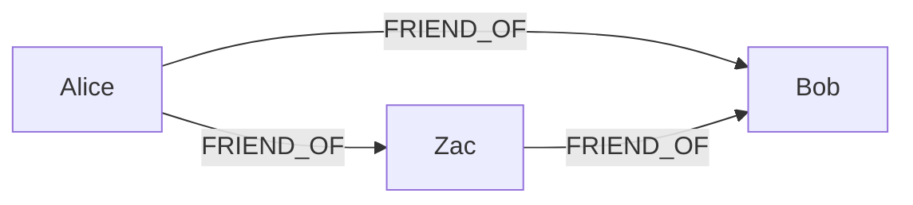
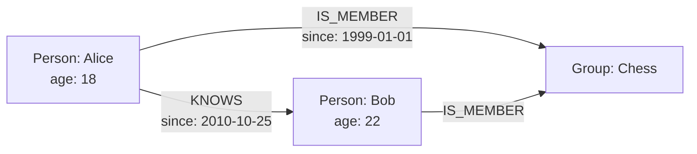
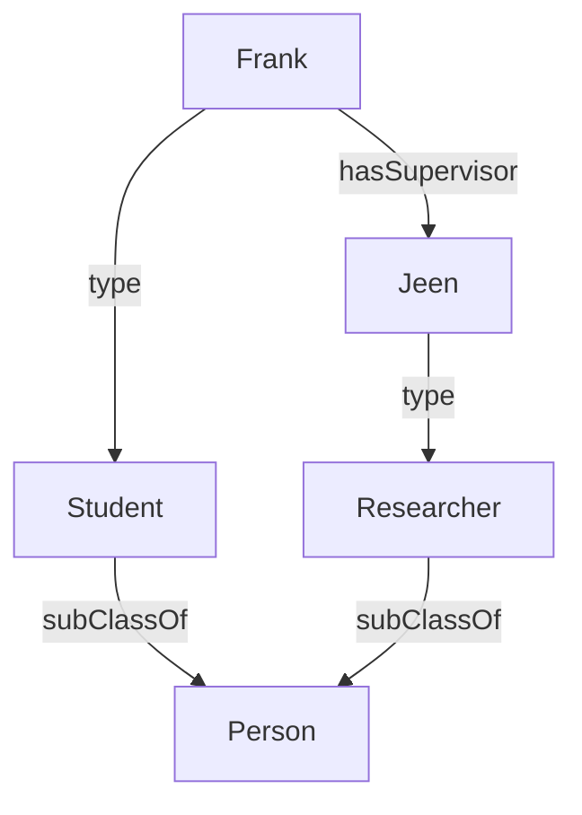
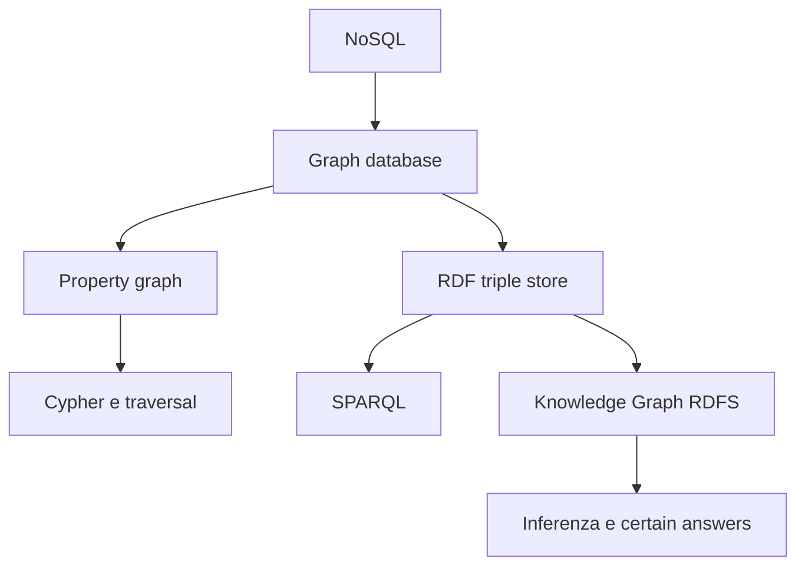

---
aliases:
  - Graph Databases
  - Database a grafo
  - RDF e SPARQL
tags:
  - sapienza
  - data-management
  - graph-databases
  - rdf
  - sparql
  - knowledge-graphs
  - rdfs
source: "3-GraphDatabases(2).pdf"
course: "Data Management"
status: "completo"
---

# Graph Databases, RDF, SPARQL e Knowledge Graphs

> [!abstract] Obiettivo della nota
> Questa nota segue l'ordine concettuale delle slide del corso: motivazione NoSQL -> graph database -> modello e interrogazione dei grafi -> RDF -> SPARQL -> Knowledge Graph e RDFS. I punti molto sintetici delle slide sono espansi con intuizioni, esempi e collegamenti tra i concetti.

## Indice

1. [[#Dal modello relazionale al movimento NoSQL]]
2. [[#Graph database]]
3. [[#Modello astratto e operazioni sui grafi]]
4. [[#Rappresentazione fisica dei grafi]]
5. [[#Visita e interrogazione dei grafi]]
6. [[#Graph Database Management Systems]]
7. [[#Property graph, hypergraph e triple store]]
8. [[#RDF - Resource Description Framework]]
9. [[#Memorizzazione di RDF]]
10. [[#SPARQL]]
11. [[#Knowledge Graph e RDFS]]
12. [[#Implicazione logica, completion e query sui Knowledge Graph]]
13. [[#Ripasso finale]]

---

## Dal modello relazionale al movimento NoSQL

### Perché nasce NoSQL

Per molti anni i database relazionali sono stati il backend dominante dei sistemi informativi. Nel frattempo sono cambiate molte tecnologie applicative - client, frontend, middleware e framework - mentre il modello relazionale è rimasto sostanzialmente stabile.

Con i Big Data si incontrano però dati caratterizzati da:

- **volume elevato**;
- **velocità di cambiamento** elevata;
- **varietà strutturale**, cioè dati regolari o irregolari, densi o sparsi, connessi o disconnessi.

Il movimento **NoSQL** nasce per rispondere a questi problemi. Il nome è normalmente interpretato come **Not Only SQL**: non implica che SQL o il modello relazionale siano inutili, ma che non rappresentino sempre la scelta migliore.

### Limiti del modello relazionale nel contesto Big Data

1. **Schema rigido**  
   Lo schema deve essere progettato in anticipo. Se la struttura dei dati cambia frequentemente, ogni cambiamento può richiedere migrazioni e modifiche applicative.

2. **Dati eterogenei e sparsi**  
   Tabelle con molti attributi opzionali possono contenere numerosi valori `NULL`; rappresentare entità molto diverse nella stessa struttura può diventare scomodo.

3. **Join pain**  
   Le relazioni non sono memorizzate come collegamenti navigabili, ma ricostruite tramite foreign key e join. Aumentando il numero delle tabelle e la profondità delle relazioni, il costo delle query può crescere sensibilmente.

> [!important] Non è una critica assoluta agli RDBMS
> I database relazionali rimangono ottimi per dati ben strutturati, vincoli forti e query tabellari. I graph database diventano particolarmente interessanti quando **le relazioni e i cammini sono il centro del problema**.

### Principali famiglie NoSQL

| Modello | Idea centrale | Esempio di utilizzo |
|---|---|---|
| **Graph-based** | Nodi e relazioni esplicite | Social network, recommendation, fraud detection |
| **Key-value** | Una chiave identifica un valore opaco | Cache, sessioni, profili semplici |
| **Document-based** | Documenti semi-strutturati, spesso JSON | Cataloghi, CMS, applicazioni web |
| **Column-oriented** | Dati organizzati per famiglie di colonne | Dati sparsi e workload distribuiti |

Il corso si concentra sui database orientati ai grafi, distinguendo:

- **graph database**, spesso basati sul modello property graph;
- **RDF database**, basati su triple e legati al Semantic Web.

---

## Graph database

### Definizione

Un **graph database** rappresenta e memorizza i dati mediante:

- **nodi** (*nodes* o *vertices*), che rappresentano entità;
- **archi** (*edges*), che rappresentano relazioni;
- eventualmente **etichette** e **proprietà**, che descrivono nodi e archi.

Un Graph Database Management System offre operazioni **CRUD** (*Create, Read, Update, Delete*) e, spesso, un linguaggio dichiarativo di query.

Molti sistemi a grafo, come Neo4j, sono progettati anche per carichi transazionali e possono garantire le proprietà **ACID**. Essere NoSQL, quindi, non significa automaticamente rinunciare alle transazioni.

### Schemaless e flessibilità

I graph database sono generalmente **schemaless**:

- i dati possono essere aggiunti incrementalmente senza definire prima uno schema globale rigido;
- nodi dello stesso dominio possono avere proprietà diverse;
- l'informazione intensionalmente simile a uno schema può comunque essere rappresentata nel grafo;
- i dati sparsi sono naturali: se una proprietà non esiste, non serve creare una colonna vuota.

> [!note] Schemaless non significa “senza struttura”
> La struttura esiste nei tipi di nodo, nelle etichette degli archi, nelle proprietà e negli eventuali vincoli. La differenza è che non deve essere necessariamente dichiarata tutta in anticipo come in uno schema relazionale.

### Le relazioni come elementi di prima classe

Un graph database è adatto quando l'informazione è già naturalmente un grafo: social network, sistemi di raccomandazione, mappe, reti di computer, controllo degli accessi e rilevamento di frodi.

Nel modello relazionale una relazione viene rappresentata indirettamente mediante chiavi esterne e tabelle associative. Nel grafo, invece, la relazione è un oggetto esplicito e direttamente navigabile.



Le relazioni sono orientate: `Alice -> Bob` non implica necessariamente `Bob -> Alice`.

### Graph database e database relazionale: amici e amici-di-amici

In un database relazionale si potrebbero usare:

```sql
Person(ID, Person)
PersonFriend(PersonID, FriendID)
```

Per trovare gli amici di Alice:

```sql
SELECT p2.Person AS alice_friend
FROM Person p1
JOIN PersonFriend pf ON p1.ID = pf.PersonID
JOIN Person p2 ON pf.FriendID = p2.ID
WHERE p1.Person = 'Alice';
```

Per trovare gli amici degli amici serve un ulteriore self-join:

```sql
SELECT p2.Person AS alice_friend_of_friend
FROM Person p1
JOIN PersonFriend pf1 ON p1.ID = pf1.PersonID
JOIN PersonFriend pf2 ON pf1.FriendID = pf2.PersonID
JOIN Person p2 ON pf2.FriendID = p2.ID
WHERE p1.Person = 'Alice'
  AND pf2.FriendID <> p1.ID;
```

La profondità è incorporata nella struttura della query: per ogni livello in più occorre aggiungere un join. In Cypher, un cammino di lunghezza compresa tra 2 e 5 si esprime direttamente:

```cypher
MATCH (p:Person)-[:FRIEND_OF*2..5]->(fof:Person)
RETURN p, fof
```

Nell'esperimento riportato nelle slide - un milione di persone, circa 50 amici ciascuna - la differenza cresce rapidamente con la profondità:

| Profondità | RDBMS | Neo4j | Record intermedi/restituiti |
|---:|---:|---:|---:|
| 2 | 0,016 s | 0,01 s | ~2.500 |
| 3 | 30,267 s | 0,168 s | ~110.000 |
| 4 | 1.543,505 s | 1,359 s | ~600.000 |
| 5 | non terminato | 2,132 s | ~800.000 |

> [!warning] Come leggere l'esperimento
> È un esempio storico, non una legge universale. Le prestazioni dipendono da implementazione, indici, distribuzione dei dati e query. Il messaggio importante è che una query di navigazione profonda può essere molto più naturale ed efficiente quando l'adiacenza è memorizzata esplicitamente.

### Join contro traversal

| Database relazionale | Graph database |
|---|---|
| La query collega tabelle mediante join. | La query attraversa archi già presenti. |
| Il grafo delle relazioni viene ricostruito al tempo di query. | La struttura del grafo è persistente. |
| Gli indici globali aiutano a individuare righe e chiavi. | Ogni nodo può mantenere riferimenti diretti ai vicini. |
| Il costo può crescere con il numero di join e di righe candidate. | Il costo locale del passaggio a un vicino può essere costante. |

---

## Modello astratto e operazioni sui grafi

### Tipo di dato astratto

Un grafo etichettato diretto è definito come:

$$G=(V,E)$$

dove:

- $V$ è un insieme finito di nodi;
- $\Sigma$ è un alfabeto finito di etichette;
- $E \subseteq V \times \Sigma \times V$ è un insieme finito di archi etichettati.

Una tripla $(u,a,v) \in E$ indica un arco da $u$ a $v$ con etichetta $a$.

Esempio:

$$
V=\{260,274,340,350\}, \qquad
\Sigma=\{DIRECTED,ACTED\_IN\}
$$

$$
E=\{(260,ACTED\_IN,350),(340,DIRECTED,350),(260,DIRECTED,274)\}
$$

### Operazioni di base

| Operazione | Significato |
|---|---|
| `AddNode(G,x)` | aggiunge il nodo `x` |
| `DeleteNode(G,x)` | elimina `x` e, normalmente, i suoi archi incidenti |
| `Adjacent(G,x,y)` | verifica se esiste un arco da `x` a `y` |
| `Neighbors(G,x)` | restituisce i vicini raggiungibili da `x` |
| `AdjacentEdges(G,x,y)` | restituisce le etichette degli archi da `x` a `y` |
| `Add(G,x,y,l)` | aggiunge l'arco $(x,l,y)$ |
| `Delete(G,x,y,l)` | elimina l'arco $(x,l,y)$ |
| `Reach(G,x,y)` | verifica se esiste almeno un cammino da `x` a `y` |
| `Path(G,x,y)` | restituisce un cammino, eventualmente il più breve |
| `2-hop(G,x)` | nodi a distanza 2 da `x` |
| `n-hop(G,x)` | nodi a distanza `n` da `x` |

> [!tip] Distinzione fondamentale
> **Adiacenza** significa “esiste un arco diretto?”. **Raggiungibilità** significa “esiste un cammino di lunghezza arbitraria?”. La seconda è una proprietà globale del grafo.

---

## Rappresentazione fisica dei grafi

La stessa struttura logica può essere memorizzata in modi diversi. La scelta influenza memoria e costo delle operazioni.

### Lista di adiacenza

Per ogni nodo si memorizza la lista dei vicini; in un grafo diretto, normalmente i vicini raggiunti dagli archi uscenti.

- aggiungere un nodo è economico;
- aggiungere un arco significa inserire il nodo destinazione nella lista del nodo sorgente;
- recuperare i vicini è molto efficiente;
- verificare una specifica adiacenza richiede una ricerca nella lista;
- ricostruire tutti gli archi richiede di visitare tutte le liste.

Memoria tipica: $O(|V|+|E|)$.

### Lista di incidenza

Nodi e archi sono oggetti espliciti:

- ogni nodo mantiene gli archi incidenti;
- ogni arco mantiene i propri estremi.

È più ricca della semplice lista di adiacenza e rende naturale associare proprietà all'arco.

### Matrice di adiacenza

Si usa una matrice $|V|\times|V|$:

- le righe rappresentano le sorgenti;
- le colonne le destinazioni;
- la cella $(i,j)$ indica se esiste un arco da $i$ a $j$ e può contenerne l'etichetta.

Vantaggi:

- test di adiacenza in $O(1)$;
- aggiunta/rimozione di un arco semplice.

Svantaggi:

- memoria $O(|V|^2)$ anche se il grafo è sparso;
- aggiungere o eliminare un nodo richiede modificare righe e colonne.

### Matrice di incidenza

La matrice ha dimensione $|V|\times|E|$:

- una riga per nodo;
- una colonna per arco;
- nelle celle si indica se il nodo è sorgente o destinazione dell'arco.

Memoria: $O(|V||E|)$. Per ottenere tutti i vicini può essere necessario scandire gran parte della matrice.

### Matrice di adiacenza compressa

Le matrici sparse possono essere compresse evitando di memorizzare le celle vuote, ad esempio mediante codifica differenziale tra posizioni consecutive. È un compromesso tra accesso matriciale e risparmio di memoria.

| Struttura | Memoria | Vicini | Test di adiacenza | Grafi ideali |
|---|---:|---:|---:|---|
| Lista di adiacenza | $O(V+E)$ | rapido | dipende dal grado | sparsi |
| Lista di incidenza | $O(V+E)$ circa | rapido | dipende dagli indici | archi come oggetti |
| Matrice di adiacenza | $O(V^2)$ | scansione di riga | $O(1)$ | densi, nodi stabili |
| Matrice di incidenza | $O(VE)$ | costoso | scansione archi | analisi strutturali specifiche |

---

## Visita e interrogazione dei grafi

### Breadth-First Search e Depth-First Search

**Breadth-First Search (BFS)** visita prima i nodi più vicini al nodo iniziale:

- usa una **coda FIFO**;
- procede per livelli;
- in un grafo non pesato trova cammini minimi in numero di archi.

**Depth-First Search (DFS)** segue un ramo il più possibile prima di tornare indietro:

- usa uno **stack LIFO** o la ricorsione;
- è utile per esplorazione, rilevamento di cicli e ordinamento topologico.

Entrambi, con liste di adiacenza, hanno costo $O(|V|+|E|)$ per una visita completa.

### Cammini ed etichette

Un cammino da $v_0$ a $v_m$ è una sequenza:

$$
\pi=(v_0,a_1,v_1)(v_1,a_2,v_2)\cdots(v_{m-1},a_m,v_m)
$$

La sua etichetta è la stringa:

$$
\lambda(\pi)=a_1a_2\cdots a_m \in \Sigma^*
$$

Interrogare un grafo può quindi significare cercare coppie di nodi collegate da un cammino la cui sequenza di etichette rispetta una certa espressione.

### Espressioni regolari sui cammini

Sintassi di base:

$$L ::= s \mid L\cdot L \mid L\mid L \mid L^* \mid L^+ \mid L? \mid (L)$$

| Costrutto | Significato |
|---|---|
| `s` | una specifica etichetta dell'alfabeto |
| `L1 L2` | concatenazione |
| `L1 \| L2` | alternativa |
| `L*` | zero o più ripetizioni |
| `L+` | una o più ripetizioni |
| `L?` | zero o una occorrenza |
| `(L)` | raggruppamento |

Esempi:

- antenati: `isChildOf+`;
- con $\Sigma=\{a,b,c,d\}$, `ab*` riconosce $\{a,ab,abb,abbb,\ldots\}$;
- `(a|(bc)+)?` riconosce $\{\varepsilon,a,bc,bcbc,bcbcbc,\ldots\}$.

### Regular Path Query

Una **Regular Path Query (RPQ)** è un'espressione regolare $L$ sull'alfabeto delle etichette. La valutazione sul grafo $G$ è:

$$
L(G)=\{(u,v)\mid \text{esiste un cammino }\pi\text{ da }u\text{ a }v\text{ e }\lambda(\pi)\in lang(L)\}
$$

Esempio: per `d+(c|e)a` cerchiamo un cammino formato da:

1. uno o più archi `d`;
2. un arco `c` oppure `e`;
3. un arco `a`.

Possono quindi corrispondere sia il cammino `dca` sia `ddca`.

> [!note] Cosa restituisce una RPQ
> Una RPQ classica restituisce le **coppie di estremi** che soddisfano il vincolo, non necessariamente il cammino concreto e neppure le proprietà dei nodi. Linguaggi come Cypher e SPARQL estendono questa idea.

#### Esercizio sulle RPQ

Alfabeto: `{isFriendOf, isChildOf, hasChild}`. Si assume che `isChildOf` sia l'inversa di `hasChild`.

> [!question]- Soluzioni ragionate
> 1. `b` è amico di `c`, oppure un genitore di `b` è amico di un genitore di `c`:
>    ```text
>    isFriendOf | isChildOf isFriendOf hasChild
>    ```
> 2. `b` è nipote di `c` nel senso “figlio di un fratello/sorella di `c`”, trascurando genere e disuguaglianze:
>    ```text
>    isChildOf isChildOf hasChild
>    ```
>    Il cammino va da `b` al genitore, poi al nonno comune, poi a `c`.
> 3. `b` è amico di `c`, oppure `c` è figlio di un amico di `b`:
>    ```text
>    isFriendOf | isFriendOf hasChild
>    ```

---

## Graph Database Management Systems

Un **GDBMS** è un sistema che memorizza, aggiorna e interroga database a grafo.

### Storage e processing nativi

Un sistema nativo usa strutture progettate appositamente per i grafi, come liste di adiacenza o strutture di incidenza, invece di serializzare tutto in tabelle generiche.

Questo si accompagna spesso a **native graph processing** e **index-free adjacency**.

### Index-free adjacency

Ogni nodo mantiene riferimenti diretti ai nodi o archi adiacenti. Per verificare o seguire un collegamento locale non è necessario consultare un indice globale: il nodo funziona come un piccolo indice dei propri vicini.

> [!important] “Index-free” non significa “senza indici”
> Un indice globale può comunque essere usato per trovare il punto di partenza, ad esempio il nodo con `name = "Alice"`. Una volta trovato il nodo, il traversal sfrutta i riferimenti locali.

### Storage non nativo

Alcuni GDBMS espongono all'utente un modello a grafo ma memorizzano internamente i dati in un RDBMS, in un object database o in un altro datastore. In questo caso l'adiacenza può dipendere da indici tradizionali.

Esistono quindi due definizioni possibili:

- **stretta**: è graph database solo un sistema con index-free adjacency;
- **funzionale**: è graph database ogni sistema che espone un modello a grafo e operazioni CRUD su di esso.

Le slide adottano la seconda.

---

## Property graph, hypergraph e triple store

### Property graph

Un **property graph** è un multigrafo diretto ed etichettato in cui:

- nodi e archi possono avere proprietà `<attributo, valore>`;
- un nodo può avere una o più etichette/tipi;
- l'etichetta di un arco esprime il tipo di relazione;
- possono esistere più archi tra la stessa coppia di nodi.



Le proprietà permettono di memorizzare dati sia sulle entità sia sulle relazioni. Le RPQ, da sole, descrivono la topologia; linguaggi come **Cypher** permettono anche di filtrare e restituire proprietà.

#### Costo intuitivo di una query property graph

Per trovare i nomi degli amici di Alice:

1. un indice globale trova i nodi con `name = "Alice"`, tipicamente in $O(\log n)$;
2. si seguono i $k$ archi `friend` uscenti;
3. si raggiungono i $k$ nodi destinazione;
4. si leggono le loro proprietà `name`.

In un RDBMS, dopo aver trovato Alice, occorre cercare le righe nella tabella associativa e poi fare ulteriori accessi indicizzati alla tabella `Person`. Il vantaggio del grafo è soprattutto nella fase ripetuta di navigazione.

### Hypergraph

Un **ipergrafo** generalizza il grafo consentendo a un arco di collegare un numero arbitrario di nodi.

Formalmente:

$$H=(V,E), \qquad E\subseteq \mathcal{P}(V)\setminus\{\varnothing\}$$

Una relazione n-aria, ad esempio una fornitura che coinvolge `Supplier`, `Product` e `Department`, può essere rappresentata come un unico **iperarco**.

Un iperarco diretto è una coppia ordinata $(T,H)$ di sottoinsiemi disgiunti di nodi, chiamati **tail** e **head**.

Vantaggio: rappresenta direttamente relazioni n-arie.  
Svantaggio: può essere meno flessibile nell'associare ruoli o proprietà diverse a ciascun partecipante. Ogni ipergrafo può comunque essere codificato in un grafo introducendo un nodo che rappresenta la relazione.

### Triple store

Un **triple store** memorizza fatti nella forma:

```text
(subject, predicate, object)
```

Esempio: `(Ginger, dancesWith, Fred)`.

Il modello standard è **RDF** e il linguaggio di query standard è **SPARQL**. I triple store provengono dal Semantic Web e sono particolarmente adatti allo scambio di dati e alla rappresentazione di conoscenza.

---

## RDF - Resource Description Framework

### Modello RDF

RDF è un modello di dati neutrale rispetto al dominio e all'applicazione. Un database RDF è un insieme di triple:

$$
(subject,predicate,object)
$$

- **subject**: la risorsa descritta;
- **predicate**: la proprietà o relazione;
- **object**: un'altra risorsa oppure un valore letterale.

Esempio:

```turtle
<http://www.w3.org/TR/rdf-syntax-grammar>
    dc:title "RDF 1.1 XML Syntax" .
```

L'intero dataset può essere visto come un grafo diretto etichettato: soggetti e oggetti sono nodi, i predicati sono archi.

### URI, literal e blank node

| Elemento | Soggetto | Predicato | Oggetto | Significato |
|---|:---:|:---:|:---:|---|
| URI/IRI | sì | sì | sì | identifica una risorsa |
| Literal | no | no | sì | valore terminale |
| Blank node | sì | no | sì | risorsa anonima |

Una stessa URI può comparire sia come nodo sia come predicato: RDF permette quindi di fare affermazioni sulle proprietà stesse.

### URI, URL, URN e IRI

Una **URI** identifica una risorsa logica o fisica:

```text
scheme:[//authority]path[?query][#fragment]
```

- una **URL** identifica e indica anche come localizzare una risorsa;
- una **URN** fornisce un nome persistente senza specificare dove recuperare la risorsa, ad esempio `urn:isbn:0-486-27557-4`;
- una **IRI** estende le URI permettendo caratteri dell'Universal Character Set.

### Literal

```turtle
ex:thisLecture ex:title "graph databases" .
ex:thisLecture ex:title "graph databases"@en .
ex:thisLecture ex:title "graph databases"^^xsd:string .
ex:thisLecture ex:date "2024-04-11"^^xsd:date .
```

Un literal può essere:

- semplice;
- associato a una lingua, come `@en`;
- tipizzato, ad esempio `xsd:integer`, `xsd:decimal`, `xsd:boolean`, `xsd:date`, `xsd:time`.

### Vocabolari e namespace

I vocabolari assegnano un significato condiviso a URI note:

- `rdf:` - vocabolario base RDF;
- `rdfs:` - classi, proprietà, sottoclassi, dominio e codominio;
- `dc:` / `dcterms:` - Dublin Core;
- `foaf:` - persone e relazioni sociali.

Il prefisso è solo un'abbreviazione sintattica. Ad esempio:

```turtle
@prefix foaf: <http://xmlns.com/foaf/0.1/> .
```

### Blank node

Un **blank node** rappresenta una risorsa di cui non si vuole o non si può fornire una URI.

```turtle
:Marco foaf:knows _:x .
_:x foaf:birthDate "01-06" .
```

Sappiamo che Marco conosce qualcuno nato il 6 gennaio, ma non identifichiamo globalmente quella persona.

> [!warning] Blank node non è una variabile
> In un dataset RDF denota una specifica risorsa anonima locale al grafo. In una query SPARQL, invece, `?x` è una variabile che può essere associata a risorse diverse.

### Relazioni n-arie in RDF

RDF usa triple, quindi una relazione con proprietà proprie viene spesso trasformata in una risorsa intermedia.

```turtle
:John :isFriendOf :Mary .

:Mary :hasFriendship _:friendship1 .
:Ann  :isInFriendship _:friendship1 .
_:friendship1 :since "2019-03-12"^^xsd:date .
```

Questo pattern è utile quando la relazione deve possedere attributi, come la data di inizio.

### Predicati anche come soggetti

Poiché una URI può essere sia predicato sia soggetto, possiamo descrivere una proprietà:

```turtle
:knows rdf:type rdf:Property .
:knows rdfs:domain :Person .
:knows rdfs:range :Person .
:Marco :knows :Maria .
```

### Reification e affermazioni di ordine superiore

La **reification** rappresenta una tripla come una risorsa, così da poter fare affermazioni sulla tripla stessa.

Per rappresentare “Joe è autore del libro ABC”:

```turtle
_:stmt rdf:type rdf:Statement .
_:stmt rdf:subject :ABC .
_:stmt rdf:predicate dc:creator .
_:stmt rdf:object "Joe" .
```

Poi si può aggiungere chi sostiene l'affermazione:

```turtle
_:stmt :claimedBy :NewYorkTimes .
```

> [!important] Reification non implica automaticamente la tripla reificata
> Le quattro triple descrivono un'affermazione, ma nello standard RDF non rendono necessariamente vero anche `:ABC dc:creator "Joe"`. Se si vuole asserire il fatto, la tripla originale va aggiunta esplicitamente.

#### Esercizio: credenza e data

“John crede che Mary sia amica di Ann dal 12 marzo 2019”. Se la data descrive la relazione di amicizia, conviene prima trasformare l'amicizia in una risorsa e poi reificare o descrivere l'affermazione su quella risorsa. Una singola reificazione della tripla `Mary isFriendOf Ann` con una proprietà `since` rischia di confondere la data del fatto con la data della credenza.

### Sintassi RDF

RDF è il **modello**; Turtle, N-Triples e RDF/XML sono **serializzazioni**.

#### Turtle

```turtle
@prefix dc: <http://purl.org/dc/terms/> .
@prefix ex: <http://example.org/> .

<http://www.w3.org/TR/rdf-syntax-grammar>
    dc:title "RDF 1.1 XML Syntax" ;
    ex:editor [
        ex:fullname "Fabien Gandon" ;
        ex:homePage <http://www-sop.inria.fr/members/Fabien.Gandon>
    ] .
```

In Turtle:

- `;` riusa lo stesso soggetto con un nuovo predicato;
- `,` riusa soggetto e predicato con un nuovo oggetto;
- `[ ... ]` introduce un blank node;
- `a` è abbreviazione di `rdf:type`.

#### RDF/XML

```xml
<?xml version="1.0"?>
<rdf:RDF
  xmlns:rdf="http://www.w3.org/1999/02/22-rdf-syntax-ns#"
  xmlns:dc="http://purl.org/dc/terms/">
  <rdf:Description rdf:about="http://www.w3.org/TR/rdf-syntax-grammar">
    <dc:title>RDF 1.1 XML Syntax</dc:title>
  </rdf:Description>
</rdf:RDF>
```

RDF/XML è più verboso ma sfrutta la sintassi e i namespace XML.

---

## Memorizzazione di RDF

Le slide distinguono tre prospettive: **relazionale**, **entity-centric** e **graph-based**.

### Prospettiva relazionale

#### Rappresentazione verticale

Tutte le triple sono memorizzate in una tabella:

```text
Triple(subject, predicate, object)
```

Eventualmente si aggiunge `context` per distinguere i named graph.

Problema: le query con più triple pattern richiedono molti self-join. Per ridurre il costo si usano indici B-tree su combinazioni come:

- `s`, `p`, `o`;
- `sp` e `o`;
- `po`;
- permutazioni complete come `spo`, `pos`, `osp`.

Memorizzare più ordinamenti accelera le query ma aumenta spazio e costo di aggiornamento.

#### Rappresentazione orizzontale

Si crea una tabella larga:

- una riga per soggetto;
- una colonna per ogni predicato;
- l'oggetto nella cella corrispondente.

Problemi:

- tabella molto **sparsa**, perché pochi soggetti hanno tutti i predicati;
- una cella può dover contenere più oggetti se una proprietà è multivalore.

#### Property tables

La tabella larga viene divisa in tabelle più piccole contenenti proprietà correlate, ad esempio `Works`, `Fans`, `Artists`.

Vantaggio: meno celle vuote.  
Svantaggio: occorre decidere come raggruppare le proprietà e le query trasversali possono richiedere join.

#### Vertical partitioning

È l'estremo opposto della tabella larga: per ogni predicato $p$ si crea una tabella binaria:

```text
p(subject, object)
```

Questo elimina sia le celle vuote sia il problema delle proprietà multivalore. Non va confuso con la **rappresentazione verticale** a singola tabella di triple.

#### Dizionari per URI e literal

URI e literal possono essere molto lunghi e ripetersi molte volte. Per questo si assegna a ogni valore un identificatore numerico, tramite:

- hash;
- contatore incrementale.

Una tabella dizionario traduce tra ID e valore originale. Le tabelle principali diventano più compatte e i confronti più economici.

### Prospettiva entity-centric

Ogni risorsa viene vista come un'entità con un insieme di coppie attributo-valore. Questa rappresentazione favorisce:

- ricerca di entità per attributi;
- keyword search;
- restituzione di un'entità completa.

È vicina alla prospettiva dell'information retrieval, ma può nascondere la struttura dei cammini globali.

### Prospettiva graph-based

RDF viene memorizzato nativamente come grafo:

- soggetti e oggetti sono nodi;
- le triple sono archi diretti etichettati;
- le query privilegiano raggiungibilità, navigazione e path expression.

La sfida principale è memorizzare e indicizzare in modo efficiente la struttura implicita del grafo.

---

## SPARQL

**SPARQL** (*SPARQL Protocol and RDF Query Language*) è il linguaggio standard W3C per interrogare RDF ed è progettato anche per l'accesso remoto tramite endpoint HTTP.

### Struttura di una query

```sparql
PREFIX ex: <http://example.org/>

SELECT ?x ?value
FROM <http://example.org/graph>
WHERE {
  ?x ex:property ?value .
}
ORDER BY ?x
```

Ordine logico delle parti:

1. dichiarazioni `PREFIX`;
2. forma della query, ad esempio `SELECT`;
3. dataset con `FROM`, se necessario;
4. pattern in `WHERE`;
5. modificatori come `ORDER BY`, `GROUP BY`, `HAVING`, `LIMIT`.

### Basic Graph Pattern

Il `WHERE` contiene normalmente un **Basic Graph Pattern (BGP)**, cioè un insieme di triple pattern. Il punto `.` funziona come congiunzione logica: tutti i pattern devono essere soddisfatti dalla stessa soluzione.

```sparql
PREFIX dct: <http://purl.org/dc/terms/>
PREFIX foaf: <http://xmlns.com/foaf/0.1/>

SELECT ?author
WHERE {
  ?book dct:creator ?person .
  ?book dct:title "Romeo and Juliet" .
  ?person foaf:name ?author .
}
```

Le variabili iniziano con `?` o `$`. `SELECT *` restituisce tutte le variabili del pattern.

### Semantica tramite omomorfismi

Sia $B$ un BGP e $G$ un grafo RDF. Un **omomorfismo** $h:B\to G$:

- lascia invariate le costanti;
- associa ogni variabile a una risorsa di $G$;
- trasforma ogni tripla pattern di $B$ in una tripla realmente presente in $G$.

Se la target list è `?x1 ... ?xm`, la risposta è la proiezione degli omomorfismi su tali variabili:

$$
\{\langle h(?x_1),\ldots,h(?x_m)\rangle \mid h\text{ è un omomorfismo da }B\text{ a }G\}
$$

Intuitivamente, il motore cerca tutte le “copie” del pattern nel grafo.

### Endpoint e formati dei risultati

Un endpoint SPARQL riceve query via HTTP. Può essere:

- **generico**, capace di interrogare dataset specificati con `FROM`;
- **dedicato**, associato a un dataset, per cui `FROM` può essere omesso.

I risultati di `SELECT` sono **solution mappings**, visualizzabili come tabelle o tuple e serializzabili in HTML, XML, CSV o JSON. Le query `CONSTRUCT` e `DESCRIBE`, invece, restituiscono grafi RDF serializzabili in Turtle, RDF/XML o N-Triples.

> [!warning] Precisazione rispetto alle slide
> Non ogni risultato SPARQL è un insieme di triple: `SELECT` restituisce associazioni variabile-valore; `ASK` restituisce un booleano; `CONSTRUCT` restituisce un grafo RDF.

### FILTER

`FILTER` conserva solo le soluzioni che soddisfano una condizione.

```sparql
PREFIX foaf: <http://xmlns.com/foaf/0.1/>

SELECT ?name ?mbox
WHERE {
  ?x foaf:name ?name .
  ?x foaf:mbox ?mbox .
  FILTER regex(?name, "^J")
}
```

Operatori principali:

- logici: `!`, `&&`, `||`;
- confronto: `=`, `!=`, `<`, `>`, `<=`, `>=`;
- generali: `IN`, `NOT IN`, `BOUND`, `LANG`;
- stringhe: `REGEX`, `CONCAT`, `UCASE`, `LCASE`;
- numeri: `ROUND`, `ABS`;
- date: `YEAR`, `DAY`, `NOW`;
- test: `isIRI`, `isBlank`, `isLiteral`, `isNumeric`.

Esempio su date:

```sparql
FILTER (
  ?date >= "1970-01-01"^^xsd:date &&
  ?date <  "1980-01-01"^^xsd:date
)
```

### OPTIONAL

`OPTIONAL` è simile a un left outer join: la soluzione principale resta valida anche se il pattern opzionale non trova corrispondenza.

```sparql
SELECT ?name ?mbox
WHERE {
  ?x foaf:mbox ?mbox .
  OPTIONAL { ?x foaf:name ?name . }
}
```

Se il nome manca, `?name` rimane **unbound**, ma la mailbox viene comunque restituita.

> [!warning] Più pattern nello stesso OPTIONAL
> Se due triple sono racchiuse nello stesso blocco `OPTIONAL`, il blocco ha successo solo quando entrambe sono soddisfatte. Se le proprietà sono indipendenti, usare due blocchi `OPTIONAL` separati.

### Negazione come fallimento

SPARQL opera tipicamente secondo l'idea “non trovo una corrispondenza nel dataset interrogato”, non “la proposizione è logicamente falsa nel mondo”.

#### `OPTIONAL` + `!BOUND`

```sparql
SELECT ?x
WHERE {
  ?x foaf:knows ?y .
  OPTIONAL { ?y foaf:knows ?z . }
  FILTER (!BOUND(?z))
}
```

Restituisce chi conosce qualcuno per cui non è stato trovato alcun conoscente.

#### `FILTER NOT EXISTS`

```sparql
SELECT ?x
WHERE {
  ?x foaf:knows ?y .
  FILTER NOT EXISTS { ?y foaf:knows ?z . }
}
```

È spesso la forma più chiara perché il pattern interno è correlato alla soluzione esterna.

#### `MINUS`

```sparql
SELECT ?x
WHERE {
  ?x foaf:knows ?y .
  MINUS {
    ?x foaf:knows ?z .
    ?z foaf:knows ?w .
  }
}
```

`MINUS` rimuove le soluzioni compatibili con il pattern a destra. Non è sempre equivalente a `NOT EXISTS`, soprattutto quando i due pattern non condividono variabili.

### Property path

I property path portano in SPARQL le espressioni sui cammini.

| Sintassi | Significato |
|---|---|
| `p` | un arco con proprietà `p` |
| `^p` | arco `p` percorso al contrario |
| `(path)` | raggruppamento |
| `p1/p2` | sequenza |
| `p1/^p2` | `p1` seguito da `p2` percorso al contrario |
| `p1\|p2` | alternativa |
| `p*` | zero o più occorrenze |
| `p+` | una o più occorrenze |
| `p?` | zero o una occorrenza |
| `p{n,m}` | da `n` a `m` occorrenze |
| `p{n}` | esattamente `n` occorrenze |
| `p{n,}` | almeno `n` occorrenze |
| `p{,n}` | al massimo `n` occorrenze |

> [!note] Ripetizioni con limiti
> Le forme `{n}`, `{n,m}`, `{n,}` e `{,n}` compaiono nel path language riportato nelle slide, ma non sono supportate uniformemente da tutti gli endpoint SPARQL 1.1. Per esercizi e implementazioni concrete, verificare il dialetto del sistema usato; `*`, `+` e `?` sono le forme portabili principali.

```sparql
SELECT ?x ?y
WHERE { ?x foaf:knows+ ?y . }
```

Questa query calcola le coppie collegate da uno o più archi `foaf:knows`, cioè una chiusura transitiva non riflessiva.

### UNION

```sparql
SELECT ?x ?y
WHERE {
  { ?x foaf:knows ?y . }
  UNION
  { ?y foaf:knows ?x . }
}
```

`UNION` unisce le soluzioni di pattern alternativi.

### Aggregazione

```sparql
SELECT ?x (COUNT(?y) AS ?count)
WHERE { ?x foaf:knows ?y . }
GROUP BY ?x
```

Operatori comuni: `COUNT`, `SUM`, `MIN`, `MAX`, `AVG`.

```sparql
SELECT ?provinceName (COUNT(DISTINCT ?city) AS ?count)
WHERE {
  ?city a aci:City ;
        aci:belongs_to_province ?province .
  ?province rdfs:label ?provinceName .
}
GROUP BY ?provinceName
HAVING (COUNT(DISTINCT ?city) > 150)
```

`WHERE` filtra le triple prima del raggruppamento; `HAVING` filtra i gruppi dopo l'aggregazione.

### Predicati come variabili

In RDF anche il predicato può essere interrogato:

```sparql
SELECT DISTINCT ?p
WHERE {
  <http://example.org/resource/1> ?p ?value .
}
```

Questa query restituisce tutte le proprietà usate per descrivere la risorsa.

### Aggiornamenti

Inserimento esplicito:

```sparql
INSERT DATA {
  _:a dbo:birthDate "1976-10-11"^^xsd:date .
}
```

Inserimento derivato da una query:

```sparql
INSERT {
  ?person dbo:birthPlace "NewYorkCity" .
}
WHERE {
  ?person foaf:name "Peter Goodguy" .
}
```

`DELETE` può essere usato in modo analogo.

### CONSTRUCT

`CONSTRUCT` crea un nuovo grafo RDF applicando un template a tutte le soluzioni del `WHERE`.

```sparql
PREFIX foaf: <http://xmlns.com/foaf/0.1/>
PREFIX vcard: <http://www.w3.org/2001/vcard-rdf/3.0#>

CONSTRUCT {
  <http://example.org/person#Alice> vcard:FN ?name .
}
WHERE {
  ?x foaf:name ?name .
}
```

Procedimento:

1. si valutano tutte le soluzioni del BGP nel `WHERE`;
2. per ogni soluzione si sostituiscono le variabili nel template;
3. le triple ottenute formano un unico grafo risultato.

### Confronto rapido SPARQL-Cypher

| Funzione | SPARQL | Cypher |
|---|---|---|
| Pattern matching | `WHERE` con triple pattern | `MATCH` |
| Proiezione | `SELECT` | `RETURN` |
| Filtro | `FILTER` | `WHERE` |
| Inserimento | `INSERT` | `CREATE` |
| Cancellazione | `DELETE` | `DELETE` |
| Pattern opzionale | `OPTIONAL` | `OPTIONAL MATCH` |
| Negazione | `NOT EXISTS`, `MINUS` | `NOT EXISTS` |
| Cammini | property path | path pattern |
| Dati su archi/nodi | altre triple | proprietà native |
| Creazione di un grafo risultato | `CONSTRUCT` | nessun equivalente diretto generale |

### Esercizi SPARQL

Si assumono `dct:creator`, `dct:created` e `foaf:name`; se il dataset usa proprietà diverse, vanno sostituite.

> [!question]- Soluzioni
> **1. URI che hanno autore e data di creazione**
> ```sparql
> SELECT DISTINCT ?doc
> WHERE {
>   ?doc dct:creator ?author .
>   ?doc dct:created ?date .
>   FILTER isIRI(?doc)
> }
> ```
>
> **2. Predicati che hanno sia `URI1` sia `URI2` come soggetto**
> ```sparql
> SELECT DISTINCT ?p
> WHERE {
>   <URI1> ?p ?o1 .
>   <URI2> ?p ?o2 .
> }
> ```
>
> **3. Predicati che hanno `URI1` oppure `URI2` come soggetto**
> ```sparql
> SELECT DISTINCT ?p
> WHERE {
>   { <URI1> ?p ?o1 . }
>   UNION
>   { <URI2> ?p ?o2 . }
> }
> ```
>
> **4. Nome degli autori dei documenti con data di creazione**
> ```sparql
> SELECT DISTINCT ?name
> WHERE {
>   ?doc dct:creator ?author .
>   ?doc dct:created ?date .
>   ?author foaf:name ?name .
> }
> ```
>
> **5. Nome degli autori e data opzionale**
> ```sparql
> SELECT DISTINCT ?name ?date
> WHERE {
>   ?doc dct:creator ?author .
>   ?author foaf:name ?name .
>   OPTIONAL { ?doc dct:created ?date . }
> }
> ```

### Strumenti citati nelle slide

- Apache Jena;
- Virtuoso;
- Blazegraph;
- AllegroGraph;
- GraphDB.

---

## Knowledge Graph e RDFS

### Da dati a conoscenza

Un **Knowledge Graph (KG)** estende l'idea di graph database: non vuole rappresentare solo dati, ma anche la **semantica del dominio**.

Deve quindi poter descrivere:

- classi;
- istanze;
- proprietà e relazioni;
- gerarchie tra classi e proprietà;
- conoscenza incompleta;
- inferenze, cioè fatti impliciti derivabili dai fatti espliciti.

Le ontologie, spesso espresse in linguaggi logici, forniscono il vocabolario e le regole per il ragionamento.

Sintatticamente un KG RDF rimane un insieme di triple. Nelle slide viene studiata una versione controllata di **RDFS-based Knowledge Graph**, definita tramite **alfabeto, sintassi e semantica**.

### Alfabeto RDFS

Vocabolario predefinito:

- `rdfs:Resource` - classe di tutte le risorse;
- `rdfs:Class` - classe delle classi;
- `rdf:type` - appartenenza a una classe;
- `rdfs:subClassOf` - inclusione tra classi;
- `rdf:Property` - classe delle proprietà;
- `rdfs:subPropertyOf` - inclusione tra proprietà;
- `rdfs:domain` - classe dei soggetti di una proprietà;
- `rdfs:range` - classe degli oggetti di una proprietà.

Ogni risorsa definita dall'utente è una delle seguenti:

- **individuo puro**;
- **classe**;
- **proprietà**.

Nel formalismo semplificato delle slide, queste categorie sono disgiunte: una classe non è anche una proprietà.

### Forme ammesse delle triple

| Forma | Nome | Significato |
|---|---|---|
| `X rdf:type C` | class instance assertion | `X` è istanza di `C` |
| `C rdfs:subClassOf D` | subclass assertion | ogni `C` è anche `D` |
| `P rdfs:domain C` | domain assertion | il soggetto di `P` è un `C` |
| `P rdfs:range C` | range assertion | l'oggetto di `P` è un `C` |
| `P rdfs:subPropertyOf Q` | subproperty assertion | ogni coppia in `P` appartiene anche a `Q` |
| `X P Y` | property instance assertion | `X` è collegato a `Y` da `P` |

Le forme `X rdf:type C` e `X P Y` sono dette **instance-based assertions**.

### Posizioni di classe e di proprietà

Una risorsa è usata in **posizione di classe** quando compare, ad esempio:

- come istanza di `rdfs:Class`;
- ai lati di `rdfs:subClassOf`;
- come oggetto di `rdfs:domain` o `rdfs:range`;
- come oggetto di `rdf:type`.

Una risorsa è in **posizione di proprietà** quando compare:

- come istanza di `rdf:Property`;
- ai lati di `rdfs:subPropertyOf`;
- come soggetto di `rdfs:domain` o `rdfs:range`;
- come predicato di una tripla applicativa.

Un KG è **legale** se rispetta le categorie stabilite. Un simbolo usato come classe non può essere usato altrove in modo incompatibile, e lo stesso vale per le proprietà.

### Triple immediatamente deducibili

Da un KG legale sono immediatamente deducibili, tra le altre:

```turtle
rdfs:Resource rdf:type rdfs:Class .
rdfs:Class rdf:type rdfs:Class .
rdf:Property rdf:type rdfs:Class .
rdfs:Class rdfs:subClassOf rdfs:Resource .
rdf:Property rdfs:subClassOf rdfs:Resource .
```

Inoltre:

- ogni simbolo in posizione di classe è di tipo `rdfs:Class`;
- ogni simbolo in posizione di proprietà è di tipo `rdf:Property`;
- ogni individuo puro è di tipo `rdfs:Resource`.

### Esempio di KG legale

```turtle
:Student rdfs:subClassOf :Person .
:Researcher rdfs:subClassOf :Person .
:hasSupervisor rdfs:domain :Student .
:hasSupervisor rdfs:range :Researcher .
:Frank rdf:type :Student .
:Jeen rdf:type :Researcher .
:Frank :hasSupervisor :Jeen .
```



La dichiarazione di `domain` implica che ogni soggetto di `hasSupervisor` sia uno `Student`; `range` implica che ogni oggetto sia un `Researcher`.

#### Esercizio sull'organizzazione

```turtle
@prefix : <http://example.org/> .
@prefix rdf: <http://www.w3.org/1999/02/22-rdf-syntax-ns#> .
@prefix rdfs: <http://www.w3.org/2000/01/rdf-schema#> .

:Employee rdf:type rdfs:Class .
:Office rdf:type rdfs:Class .
:Unit rdf:type rdfs:Class .
:SalesOffice rdf:type rdfs:Class .
:Laboratory rdf:type rdfs:Class .

:worksIn rdf:type rdf:Property .
:isHeadOf rdf:type rdf:Property .

:worksIn rdfs:domain :Employee ;
         rdfs:range :Office .
:isHeadOf rdfs:domain :Employee ;
          rdfs:range :Office ;
          rdfs:subPropertyOf :worksIn .

:SalesOffice rdfs:subClassOf :Office .
:Office rdfs:subClassOf :Unit .
:Laboratory rdfs:subClassOf :Unit .

:John rdf:type :Employee ;
      :worksIn :sales1 .
:Mary rdf:type :Employee ;
      :isHeadOf :sales2 .

:sales1 rdf:type :SalesOffice .
:sales2 rdf:type :SalesOffice .
```

> [!note] Chiarimento rispetto alla soluzione sintetica delle slide
> `:SalesOffice` è una **classe**, non un ufficio specifico. Per affermare che John lavora in un ufficio vendite, è più preciso introdurre un individuo come `:sales1` di tipo `:SalesOffice`.

### Semantica: interpretazioni e modelli

Un'**interpretazione** $I$ rappresenta un possibile mondo compatibile con l'alfabeto del KG.

È composta da:

- un dominio $\Delta^I$ di risorse possibili;
- per ogni classe $C$, un insieme $I(C)\subseteq\Delta^I$;
- per ogni proprietà $P$, una relazione binaria $I(P)\subseteq\Delta^I\times\Delta^I$.

$I(X)$ è detta **estensione** di $X$.

Un'interpretazione è un **modello** di $K$ se soddisfa tutte le triple di $K$.

| Tripla | Condizione di soddisfacimento |
|---|---|
| `a rdf:type C` | $a\in I(C)$ |
| `C rdfs:subClassOf D` | $I(C)\subseteq I(D)$ |
| `P rdfs:domain C` | $\forall(x,y)\in I(P):x\in I(C)$ |
| `P rdfs:range C` | $\forall(x,y)\in I(P):y\in I(C)$ |
| `P rdfs:subPropertyOf Q` | $I(P)\subseteq I(Q)$ |
| `a P b` | $(a,b)\in I(P)$ |

> [!warning] Attenzione alla notazione
> Nella slide sulla soddisfacibilità, le formule di `domain` e `range` appaiono con classe e proprietà scambiate. La tabella qui sopra riporta la forma semanticamente corretta.

### Collegamento con la logica del primo ordine

Le classi corrispondono a predicati unari; le proprietà a predicati binari.

| Tripla RDFS | Formula logica |
|---|---|
| `a rdf:type C` | $C(a)$ |
| `C rdfs:subClassOf D` | $\forall x\,(C(x)\rightarrow D(x))$ |
| `P rdfs:domain C` | $\forall x\forall y\,(P(x,y)\rightarrow C(x))$ |
| `P rdfs:range C` | $\forall x\forall y\,(P(x,y)\rightarrow C(y))$ |
| `P rdfs:subPropertyOf Q` | $\forall x\forall y\,(P(x,y)\rightarrow Q(x,y))$ |
| `a P b` | $P(a,b)$ |

### Closed World e Open World

Un database tradizionale viene normalmente interpretato con **Closed World Assumption (CWA)**:

> ciò che non è memorizzato è considerato falso o non valido nella risposta del database.

Un Knowledge Graph usa invece **Open World Assumption (OWA)**:

> ciò che non è noto non è automaticamente falso; può essere vero in alcuni modelli e falso in altri.

Per questo un database viene trattato come una singola struttura/modello, mentre un KG rappresenta in generale **molti modelli possibili**.

---

## Implicazione logica, completion e query sui Knowledge Graph

### Implicazione logica

Un KG $K$ implica logicamente una tripla $T$, scritto:

$$K\models T$$

se **ogni modello di $K$ soddisfa $T$**.

Esempio:

```turtle
:P rdfs:subPropertyOf :Q .
:Q rdfs:subPropertyOf :R .
:R rdfs:range :C .
:a :P :b .
```

In ogni modello:

1. da `a P b` e `P subPropertyOf Q` segue `a Q b`;
2. da `a Q b` e `Q subPropertyOf R` segue `a R b`;
3. da `a R b` e `R range C` segue `b rdf:type C`.

Sono inoltre implicate `P rdfs:subPropertyOf R` e, nel formalismo delle slide, `P rdfs:range C`.

### Instance-Based Completion

La **Instance-Based Completion**, $IBC(K)$, materializza le conseguenze sulle istanze.

Si parte da $K$ e dalle triple immediatamente deducibili, poi si applicano ripetutamente le regole:

1. **sottoclasse**
   $$
   X:type\ C,\ C\sqsubseteq D \Rightarrow X:type\ D
   $$

2. **sottoproprietà**
   $$
   X\ P\ Y,\ P\sqsubseteq Q \Rightarrow X\ Q\ Y
   $$

3. **dominio**
   $$
   X\ P\ Y,\ domain(P)=C \Rightarrow X:type\ C
   $$

4. **range**
   $$
   X\ P\ Y,\ range(P)=C \Rightarrow Y:type\ C
   $$

L'algoritmo termina perché, usando solo i simboli già presenti, si può formare un numero finito di triple. Quando nessuna regola produce una nuova tripla si raggiunge un **punto fisso**.

#### Pseudocodice

```text
K1 := K + triple immediatamente deducibili
repeat
    K0 := K1
    applica subclass
    applica subproperty
    applica domain
    applica range
until K1 = K0
return K1
```

### Proprietà fondamentali di IBC

L'interpretazione costruita direttamente da $IBC(K)$ è un modello di $K$.

Per ogni tripla instance-based $T$:

$$
K\models T \iff T\in IBC(K)
$$

Quindi, per i fatti su individui e proprietà, la procedura è **corretta e completa**: produce esattamente ciò che è logicamente implicato.

Per verificare implicazioni di schema si possono introdurre nuovi individui di prova:

- per testare $C\sqsubseteq D$, si aggiunge un nuovo `x type C` e si verifica se `x type D` entra in `IBC`;
- per testare $P\sqsubseteq Q$, si aggiunge `x P y` e si verifica `x Q y`;
- analogamente per `domain` e `range`.

### Interpretazioni viste come grafi

Ogni interpretazione $I$ può essere trasformata in un grafo $G_I$:

- $x\in I(C)$ diventa `x rdf:type C`;
- $(x,y)\in I(P)$ diventa `x P y`;
- inclusioni tra estensioni diventano triple `subClassOf` o `subPropertyOf`;
- i vincoli sui primi e secondi componenti diventano `domain` e `range`.

Questo consente di collegare la semantica logica alla normale valutazione di pattern sui grafi.

### Certain answers

Su un graph database, un BGP viene valutato sull'unico grafo disponibile. Su un KG, che rappresenta molti modelli, una tupla è una **certain answer** se è risposta in **ogni modello** del KG.

Formalmente, per una query $Q$ e un KG $K$:

$$
A\text{ è certa} \iff \forall I\in Models(K),\ A\in ans(Q,G_I)
$$

Le certain answers contengono quindi solo ciò che è garantito dalla conoscenza disponibile, indipendentemente da come si completa il mondo.

### Completion completa

La completion `comp(K)` comprende:

- $IBC(K)$;
- tutte le `subClassOf` implicate;
- tutte le `subPropertyOf` implicate;
- tutti i `domain` implicati;
- tutti i `range` implicati.

Il teorema centrale delle slide afferma:

> Per una query SPARQL BGP $Q$, le certain answers su $K$ coincidono con le normali risposte di database ottenute valutando $Q$ su $comp(K)$.

Il risultato è importante perché riduce un problema semantico su molti modelli a un calcolo operativo:

1. materializza `comp(K)`;
2. trattala come un normale graph database;
3. valuta il BGP con il consueto pattern matching.

### Esempio finale

KG:

```turtle
:Student rdfs:subClassOf :Person .
:Researcher rdfs:subClassOf :Person .
:hasSupervisor rdfs:range :Researcher .
:hasSupervisor rdfs:domain :Student .
:Frank :hasSupervisor :Jeen .
```

La completion deduce:

```turtle
:Frank rdf:type :Student .
:Frank rdf:type :Person .
:Jeen rdf:type :Researcher .
:Jeen rdf:type :Person .
```

Query concettuale:

```sparql
SELECT ?x
WHERE {
  ?x ?p ?z .
  ?x rdf:type :Person .
  ?z rdf:type ?w .
  ?w rdfs:subClassOf :Person .
}
```

La certain answer è:

```text
Frank
```

Infatti Frank partecipa come soggetto alla relazione `hasSupervisor`, è dedotto `Student` e quindi `Person`; Jeen è `Researcher`, una sottoclasse di `Person`.

---

## Ripasso finale

### Mappa concettuale



### Distinzioni da ricordare

| Concetti | Differenza essenziale |
|---|---|
| Adiacenza vs raggiungibilità | arco diretto vs esistenza di un cammino |
| BFS vs DFS | visita per livelli con coda vs visita in profondità con stack |
| RPQ vs property query | topologia dei cammini vs accesso anche a proprietà |
| Property graph vs RDF | proprietà native su nodi/archi vs fatti espressi come triple |
| RDF vs Turtle | modello dati vs sintassi di serializzazione |
| URI vs literal vs blank node | risorsa identificata vs valore vs risorsa anonima |
| Vertical representation vs vertical partitioning | una tabella `(s,p,o)` vs una tabella `(s,o)` per predicato |
| `OPTIONAL` vs `UNION` | pattern facoltativo vs alternative tra pattern |
| `NOT EXISTS` vs `MINUS` | test correlato di assenza vs sottrazione di solution mappings compatibili |
| Graph DB vs Knowledge Graph | un grafo esplicito vs molti modelli possibili e inferenza |
| CWA vs OWA | assenza come falso vs assenza come ignoto |
| Risposta DB vs certain answer | match nel grafo dato vs match garantito in tutti i modelli |

### Domande di autoverifica

1. Perché una query friends-of-friends è naturale in un graph database?
2. Qual è la differenza tra lista e matrice di adiacenza?
3. Che cosa restituisce formalmente una RPQ?
4. Perché l'index-free adjacency non elimina la necessità di ogni indice?
5. In RDF, dove possono comparire URI, literal e blank node?
6. A cosa serve la reification?
7. Qual è la differenza tra rappresentazione RDF verticale e vertical partitioning?
8. Come si interpreta un BGP tramite omomorfismi?
9. Quando conviene usare `OPTIONAL`, `UNION` e `FILTER NOT EXISTS`?
10. Che cosa esprimono `domain` e `range` in RDFS?
11. Perché un KG ha molti modelli?
12. Come si calcolano le certain answers usando `comp(K)`?

> [!success] Idea unificante
> Nei graph database il punto centrale è **navigare relazioni esplicite**. In RDF queste relazioni diventano triple standardizzate e interrogabili con SPARQL. Nei Knowledge Graph RDFS alle triple si aggiunge una semantica logica, che permette di derivare fatti impliciti e rispondere in modo certo anche con conoscenza incompleta.

---

## Riferimenti delle slide

- I. Robinson, J. Webber, E. Eifrem, *Graph Databases*, O'Reilly, 2013.
- M. A. Rodriguez, P. Neubauer, *The Graph Traversal Pattern*, 2010.
- A. Schmidt, I. Savnik, *Overview of Regular Path Queries in Graphs*, 2015.
- Y. Luo et al., *Storing and Indexing Massive RDF Data Sets*, 2012.
- W3C, *RDF 1.1 Concepts and Abstract Syntax*.
- W3C, *RDF 1.1 XML Syntax*.
- W3C, *SPARQL 1.1 Query Language*.
