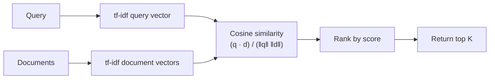

data mining!= just machine learning. we are not going to deal with LLM. here we deal with data without labels (unsupervised learning??) and just textual corpus (very big collection of corpus). given a query  i want to retrieve le document that i might be looking for: the idea is to transofrm a document into a vector document in a vector database

**document and quearies**
Sì, trasformi entrambi in vettori nello **stesso spazio**: un asse per ogni termine del vocabolario. Così puoi confrontarli con il coseno.

Le differenze:

- **Il documento** è il testo già presente nella collezione. Lo trasformi in vettore **una volta sola, quando costruisci l'indice**, e salvi la sua lunghezza (norma).
- **La query** è ciò che scrive l'utente. La trasformi **al momento della ricerca**. È cortissima (2–3 parole), quindi il suo vettore ha pochissime componenti diverse da zero.
- **I pesi possono essere diversi.** Con `lnc.ltc`, il documento usa log-tf **senza idf**, mentre la query usa log-tf **con idf**. Entrambi vengono normalizzati col coseno. L'idf si mette solo da una parte per non contarlo due volte e per non dover ricalcolare i vettori dei documenti quando cambia la collezione.

Poi calcoli il coseno tra il vettore della query e quello di ogni documento, e ordini i documenti per punteggio.

Buona lezione!
# Lecture 6 – Scoring, Term Weighting and the Vector Space Model

> [!abstract] What this lecture is about
> Up to now, retrieval has been **Boolean**: a document either matches the query or it doesn't. This lecture moves to **ranked retrieval**: every document gets a **score** that measures how well it matches the query, and the system returns documents *ordered* by that score.
>
> The path we follow is:
> 1. Why Boolean retrieval is not enough → **ranked retrieval**
> 2. A first naive scoring function → **Jaccard coefficient** (and why it fails)
> 3. How often a term appears in a document → **term frequency (tf)**
> 4. How rare a term is in the whole collection → **document frequency / idf**
> 5. Combining the two → **tf-idf weighting**
> 6. Representing documents and queries as vectors → **Vector Space Model**
> 7. Measuring similarity between vectors → **cosine similarity**
> 8. Implementing it efficiently, and the many **variants** (SMART notation)

**Topics covered (IIR Sections 6.2–6.4.3):**
- Ranked retrieval
- Scoring documents
- Term frequency
- Collection statistics
- Weighting schemes
- Vector space scoring

---

## 1. Ranked retrieval

### Limits of Boolean retrieval

So far, all our queries have been **Boolean** (e.g. `brutus AND caesar AND NOT calpurnia`). The result is a **set**: documents either match or don't — there is no notion of "matching better". We are not going to deal with that.

**Boolean search is good for:**
- **Expert users** who have a precise understanding of what they need *and* of the collection (e.g. lawyers, librarians, patent searchers). They can craft exact queries and want full control.
- **Applications**: a program can easily consume thousands of results (e.g. filtering, downstream processing), so the size of the result set isn't a problem.

**Boolean search is bad for the majority of users:**
- Most users are **incapable of writing Boolean queries**, or they could but consider it too much work.
- Most users **don't want to wade through thousands of results**.
- This is particularly true of **web search**, where users type a few words and look at the first page only.

Even tho a query can result ina multiple hit, i would tliek to rank the most relevant one given a specific ranking system, otherwise everything would be "FLAT". 

### The "feast or famine" problem

For instacne, if i'm searching "hiking books" i will recevie multiple results. how can i receive the most relevant one on top? So the key task is: give me the document give me the query and i'll result the number of the rank. 

Boolean queries tend to return either **too few** results (often 0) or **too many** (thousands).

| Query | Results |
|---|---|
| `standard user dlink 650` | ≈ 200,000 hits (feast) |
| `standard user dlink 650 no card found` | 0 hits (famine) |

Adding just a few terms (implicitly ANDed) takes us from an unmanageable number of results to none at all.

- **AND** gives too few results (every added term is a further constraint).
- **OR** gives too many results (every added term is a further way to match).

> [!note] Why this happens
> A Boolean query is a hard constraint. There is no way to say "documents that match *most* of these terms are still good". Getting a manageable number of hits requires a lot of skill in tuning the query.

### Ranked retrieval models

In **ranked retrieval**, instead of returning a *set* of documents satisfying a query expression, the system returns an **ordering** over the (top) documents in the collection with respect to the query.

This is usually paired with **free text queries**: instead of a query language with operators and expressions, the user's query is just **one or more words in a human language**.

> [!info] Two separate choices
> In principle, "ranked vs. Boolean results" and "free text vs. query language" are **independent** design choices: you could rank the results of a Boolean query, or return an unranked set for a free-text query. In practice, ranked retrieval has almost always been associated with free text queries, and vice versa.

### Feast or famine is not a problem in ranked retrieval

When the system produces a **ranked** result set, a large result set is no longer an issue:
- The size of the result set simply doesn't matter.
- We just show the **top $k$** results (typically $k \approx 10$).
- The user is not overwhelmed: if the first results are good, they never look further.

> [!warning] Premise
> All of this works **only if the ranking algorithm works**, i.e. if the most relevant documents really end up at the top. The rest of the lecture is about building a good ranking function.

### Scoring as the basis of ranked retrieval

Goal: return, **in order**, the documents most likely to be **useful** to the searcher.

How do we rank-order the documents in the collection with respect to a query?
- Assign a **score** to each document — say a number in $[0, 1]$.
- The score measures **how well the document and the query "match"**.
- Rank by decreasing score.

So the whole problem reduces to designing a good function $\text{score}(q, d)$.

---

## 2. Take 1: the Jaccard coefficient

JACCARD SIMILIARITY: given sets A, B (where A and B contains thee exact same domain types values) then we can define the jaccard coefficient. see below. 

A first, simple idea: treat both query and document as **sets of words** and measure their overlap.

The **Jaccard coefficient** is a common measure of overlap of two sets $A$ and $B$:

$$
\text{jaccard}(A, B) = \frac{|A \cap B|}{|A \cup B|}
$$

Properties:
- $\text{jaccard}(A, A) = 1$ (identical sets → maximal similarity)
- $\text{jaccard}(A, B) = 0$ if $A \cap B = \emptyset$ (no shared elements)
- $A$ and $B$ **don't have to be the same size**.
- It always assigns a number between $0$ and $1$.

### Scoring example

- **Query:** *ides of march* → $Q = \{\text{ides}, \text{of}, \text{march}\}$
- **Document 1:** *caesar died in march* → $D_1 = \{\text{caesar}, \text{died}, \text{in}, \text{march}\}$
- **Document 2:** *the long march* → $D_2 = \{\text{the}, \text{long}, \text{march}\}$

Computation:
- $Q \cap D_1 = \{\text{march}\}$, $\;Q \cup D_1 = \{\text{ides}, \text{of}, \text{march}, \text{caesar}, \text{died}, \text{in}\}$ → $\text{jaccard}(Q, D_1) = 1/6 \approx 0.167$
- $Q \cap D_2 = \{\text{march}\}$, $\;Q \cup D_2 = \{\text{ides}, \text{of}, \text{march}, \text{the}, \text{long}\}$ → $\text{jaccard}(Q, D_2) = 1/5 = 0.2$

> [!example] Observation
> Document 2 scores higher, even though Document 1 (about Caesar dying in March — i.e. the Ides of March) is clearly more relevant. Document 2 wins only because it is **shorter**, so its union with the query is smaller.

### Issues with Jaccard for scoring

1. **It doesn't consider term frequency** — how many times a term occurs in a document. A document mentioning "march" 20 times is treated the same as one mentioning it once (sets have no multiplicity).
2. **It ignores how informative a term is.** Rare terms in a collection are more informative than frequent ones (e.g. "ides" vs. "of"), but Jaccard treats every term equally. Notice that "of" and "in" are **stopwords**: they have no meaning so theoretically should not threated in the exact same way  of "march". this is the problem of boolean matches. 
3. **Length normalization is crude.** Dividing by $|A \cup B|$ penalizes long documents in an ad-hoc way; we need a more sophisticated way of normalizing for length.

> [!tip] Side note (from IIR)
> Later in the chapter a better normalization is suggested: $|A \cap B| / \sqrt{|A \cup B|}$. This idea of normalizing with a square root anticipates the cosine normalization we'll see below.

How do we address those issues?
The rest of the lecture fixes each of these three problems in turn: **tf** fixes (1), **idf** fixes (2), **cosine normalization** fixes (3).

---
1)  transofrm documents and queries into vectors
2) Most relevant document -> closest vector: we wnat to transofrm every document/query into a vector. when i execute a query, i want to transform them into vector and then i apply the distance fucntion and calculate the function. So in this way we are transofrming the qualitative problem (the normal text/query/document) into a quantitative (vectors). 

notice that if i query "ceasar" i would like to receive a document on top in which appears ceaser 1000 times on top of a tdocument in which there exists 10 times ceasar in it. 
## 3. Query–document matching scores and term frequency

We need a way of assigning a score to a query/document pair. Let's start simple, with a **one-term query**:
- If the query term **does not occur** in the document → score should be **0**.
- The **more frequent** the query term in the document, the **higher** the score should be.

There are several alternatives to implement this; let's build up to them.

### Recall: binary term–document incidence matrix

From Lecture 2 (Boolean retrieval): rows are terms, columns are documents (here, Shakespeare plays), and an entry is **1** if the term occurs in the play, **0** otherwise.

| | Antony and Cleopatra | Julius Caesar | The Tempest | Hamlet | Othello | Macbeth |
|---|---|---|---|---|---|---|
| **Antony** | 1 | 1 | 0 | 0 | 0 | 1 |
| **Brutus** | 1 | 1 | 0 | 1 | 0 | 0 |
| **Caesar** | 1 | 1 | 0 | 1 | 1 | 1 |
| **Calpurnia** | 0 | 1 | 0 | 0 | 0 | 0 |
| **Cleopatra** | 1 | 0 | 0 | 0 | 0 | 0 |
| **mercy** | 1 | 0 | 1 | 1 | 1 | 1 |
| **worser** | 1 | 0 | 1 | 1 | 1 | 0 |

Each document (a column) is represented by a **binary vector** $\in \{0,1\}^{|V|}$, where $|V|$ is the vocabulary size.

### Term–document count matrices

Instead of just presence/absence, consider the **number of occurrences** of a term in a document. Each document is now a **count vector** in $\mathbb{N}^{|V|}$ (a column below):

| | Antony and Cleopatra | Julius Caesar | The Tempest | Hamlet | Othello | Macbeth |
|---|---|---|---|---|---|---|
| **Antony** | 157 | 73 | 0 | 0 | 0 | 0 |
| **Brutus** | 4 | 157 | 0 | 1 | 0 | 0 |
| **Caesar** | 232 | 227 | 0 | 2 | 1 | 1 |
| **Calpurnia** | 0 | 10 | 0 | 0 | 0 | 0 |
| **Cleopatra** | 57 | 0 | 0 | 0 | 0 | 0 |
| **mercy** | 2 | 0 | 3 | 5 | 5 | 1 |
| **worser** | 2 | 0 | 1 | 1 | 1 | 0 |

This matrix already carries much more information: e.g. "Brutus" appears in both *Antony and Cleopatra* and *Julius Caesar*, but it's clearly central only to the latter (4 vs. 157).

notice that in that case it is called "frequency" but in practice is a "count". frequency is how frequent that value appeaars over time

Vocaboulaary: ser of term appearing in >= 1 docs of collection. notice that we could possibly represent that table as a cartesian graph in which term1= antony term2= brutus term3=caesar and each term is a dimension in that graph. in this way, each column is actually a vector. 
### The bag-of-words model

This vector representation **does not consider the order** of words in a document:
- *"John is quicker than Mary"* and *"Mary is quicker than John"* have **exactly the same vector**.
- This is called the **bag of words** model: a document is just a multiset (bag) of its words.

the meaning of those documents are completelly opposite, but in that way have the exact vector value

> [!note] A step back?
> In a sense this is a step backwards: the **positional index** (seen in earlier lectures) *was* able to distinguish these two documents (e.g. for phrase queries). The bag-of-words simplification is accepted because it makes scoring simple and works surprisingly well; positional information can be recovered later (e.g. proximity scoring).

### Term frequency (tf)

The **term frequency** $\text{tf}_{t,d}$ of term $t$ in document $d$ is the **number of times** $t$ occurs in $d$.

> [!info] Terminology
> In IR, **"frequency" means "count"**, not a normalized rate.

We want to use tf when computing query–document match scores. But how? **Raw term frequency is not what we want:**
- A document with 10 occurrences of the term is **more relevant** than a document with 1 occurrence…
- …but **not 10 times more relevant**.

**Relevance does not increase proportionally with term frequency.** Going from 0 to 1 occurrence is a big jump (the document is now about the topic at all); going from 100 to 101 occurrences is essentially meaningless. We need a **sublinear** function of tf.

### Log-frequency weighting

The **log-frequency weight** of term $t$ in $d$ is:

$$
w_{t,d} =
\begin{cases}
1 + \log_{10} \text{tf}_{t,d} & \text{if } \text{tf}_{t,d} > 0 \\
0 & \text{otherwise}
\end{cases}
$$

Some values:

| $\text{tf}_{t,d}$ | 0 | 1 | 2 | 10 | 1000 |
|---|---|---|---|---|---|
| $w_{t,d}$ | 0 | 1 | 1.3 | 2 | 4 |

- The logarithm **dampens** large counts: 1000 occurrences only weigh 4× one occurrence, not 1000×.
- The "$1 +$" ensures that a single occurrence gets weight 1 (since $\log 1 = 0$), clearly separating it from absence (weight 0).

**Score for a document–query pair:** sum over the terms $t$ that appear in **both** $q$ and $d$:

$$
\text{score}(q, d) = \sum_{t \in q \cap d} \left(1 + \log \text{tf}_{t,d}\right)
$$

The score is **0 if none of the query terms is present** in the document — exactly what we wanted.

This fixes Jaccard's problem (1). But every term still counts the same, regardless of how informative it is.

an example id: $$q=\{via,merulana,restauratns\}$$
for each document d: $$score(d)= \sum_{t \in q} w_{t,q}$$

---

## 4. Collection statistics: document frequency and idf

### Rare terms are more informative

Rare terms are **more informative** than frequent terms.
- Recall **stop words** (*the, of, a, …*): they appear everywhere, so they tell us almost nothing about what a document is about.
- Consider a query term that is **rare** in the collection, e.g. **arachnocentric**.
- A document containing this term is **very likely to be relevant** to the query *arachnocentric*.
- → We want a **high weight** for rare terms like *arachnocentric*.

Conversely, frequent terms (e.g. *high, increase, line*) are still somewhat useful — a document containing them is more likely to be relevant than one that doesn't — but they deserve **lower** (positive) weights than rare terms.

so some terms should have an extra value in compare to stop words for instace. 

### Collection frequency vs. document frequency

There are two natural ways to measure how "common" a term is:
- **Collection frequency** $\text{cf}_t$: the total number of **occurrences** of $t$ in the whole collection (counting multiple occurrences per document).
- **Document frequency** $\text{df}_t$: the number of **documents** in which $t$ occurs.

Example:

| Word | Collection frequency | Document frequency |
|---|---|---|
| **insurance** | 10440 | 3997 |
| **try** | 10422 | 8760 |

Which word is better for search (should get a higher weight)?

> [!example] Answer
> The two words have almost the **same collection frequency**, so cf can't distinguish them. But their **document frequencies** are very different:
> - *insurance* occurs in far fewer documents, and when it occurs it occurs **many times** (≈ 2.6 times per document) → it is **concentrated** in documents that are really about insurance.
> - *try* is **spread** across many documents, roughly once each → it is a generic word.
>
> So **insurance** should get the higher weight, and **df** is the statistic that captures this. That's why document frequency, not collection frequency, is used for weighting.

### idf weight
if you remember the toy example of before, ![[Pasted image 20260928172841.png]]cleopatra appears only in one document. this means that we should give to that term an extra value probably

$\text{df}_t$ is the document frequency of $t$: the number of documents that contain $t$.
- $\text{df}_t$ is an **inverse** measure of the informativeness of $t$ (high df → low information).
- $\text{df}_t \le N$, where $N$ is the number of documents in the collection.

We define the **idf (inverse document frequency)** of $t$ as:

$$
\text{idf}_t = \log_{10}\left(\frac{N}{\text{df}_t}\right)
$$

- We use $\log(N/\text{df}_t)$ instead of $N/\text{df}_t$ to **"dampen"** the effect of idf: without the log, a term in 1 document would weigh a million times more than a term in every document, which is far too extreme.
- The base of the logarithm is **immaterial** for ranking (changing base multiplies all weights by the same constant).

it is extremelly important value because we may want to use (not sure about the formula that i'm going to write)$$w_{t,d}=tf_{t,d}\ *\ idf_r$$ basically we are using $idf_r$ as a weight. 

### idf example, with $N = 1{,}000{,}000$

| Term | $\text{df}_t$ | $\text{idf}_t$ |
|---|---|---|
| calpurnia | 1 | 6 |
| animal | 100 | 4 |
| sunday | 1,000 | 3 |
| fly | 10,000 | 2 |
| under | 100,000 | 1 |
| the | 1,000,000 | 0 |

- A term appearing in **every** document (like *the*) gets $\text{idf} = \log 1 = 0$: it is useless for discriminating documents.
- Each factor of 10 in rarity adds 1 to the idf.

> [!important]
> There is **one idf value per term** $t$ in the collection — it is a property of the term and the collection, **not** of a specific document. It's computed once at indexing time.

### Effect of idf on ranking

Does idf have an effect on ranking for **one-term queries**, like *iPhone*?
- **No.** For a one-term query, every document's score is multiplied by the **same** constant $\text{idf}_t$, so the relative ordering doesn't change.
- idf affects the ranking only for queries with **at least two terms**.

Example: for the query **capricious person**, idf weighting makes occurrences of *capricious* (rare) count for **much more** in the final ranking than occurrences of *person* (very common). A document mentioning *capricious* once will tend to beat a document mentioning *person* many times.

---

## 5. tf-idf weighting

The **tf-idf weight** of a term in a document is the **product** of its tf weight and its idf weight:

$$
w_{t,d} = \left(1 + \log_{10} \text{tf}_{t,d}\right) \times \log_{10}\left(\frac{N}{\text{df}_t}\right)
$$

> [!note] About the formula on the slide
> The slide writes the tf part as $\log(1 + \text{tf}_{t,d})$. The standard form (used in IIR and in all the examples of this lecture) is $1 + \log \text{tf}_{t,d}$ for $\text{tf} > 0$ (and 0 otherwise). Both are sublinear, dampened versions of tf; the idea is the same.

- It's the **best known weighting scheme** in information retrieval.
- The "-" in *tf-idf* is a **hyphen, not a minus sign**! Alternative names: **tf.idf**, **tf × idf**.
- The weight **increases with the number of occurrences** of the term within the document (tf component).
- The weight **increases with the rarity** of the term in the collection (idf component).

Intuition: a term is a good descriptor of a document if it appears **often in that document** but **rarely in the others**.

there also more complex ways to assign weights with neural networks. 

### Score for a document given a query

$$
\text{Score}(q, d) = \sum_{t \in q \cap d} \text{tf.idf}_{t,d}
$$

There are **many variants** of this:
- How "tf" is computed (with or without logs, normalized by the max tf, …)
- Whether the terms in the query are also weighted
- How (and whether) lengths are normalized
- …

We'll see a systematic way to name these variants (SMART notation) at the end.

### From binary → count → weight matrix

Applying tf-idf to the Shakespeare matrix, each entry becomes a real number:

| | Antony and Cleopatra | Julius Caesar | The Tempest | Hamlet | Othello | Macbeth |
|---|---|---|---|---|---|---|
| **Antony** | 5.25 | 3.18 | 0 | 0 | 0 | 0.35 |
| **Brutus** | 1.21 | 6.1 | 0 | 1 | 0 | 0 |
| **Caesar** | 8.59 | 2.54 | 0 | 1.51 | 0.25 | 0 |
| **Calpurnia** | 0 | 1.54 | 0 | 0 | 0 | 0 |
| **Cleopatra** | 2.85 | 0 | 0 | 0 | 0 | 0 |
| **mercy** | 1.51 | 0 | 1.9 | 0.12 | 5.25 | 0.88 |
| **worser** | 1.37 | 0 | 0.11 | 4.15 | 0.25 | 1.95 |

Each document is now represented by a **real-valued vector of tf-idf weights** $\in \mathbb{R}^{|V|}$.

The evolution so far:
1. **Binary** vectors $\{0,1\}^{|V|}$ → presence only
2. **Count** vectors $\mathbb{N}^{|V|}$ → how many times
3. **Weight** vectors $\mathbb{R}^{|V|}$ → how many times *and* how informative

---

## 6. The Vector Space Model
before we have seen the cardinality of the dimension for this porpuse: which is the cardinality of the vocaboulaary, but sometimes it is hard to define it and we have more problems.

Okay in this way we know ho to transofrm queries/documents into vectors. 

### Documents as vectors

- We now have a **$|V|$-dimensional vector space**.
- **Terms are the axes** of the space.
- **Documents are points** (or vectors from the origin) in this space.
- The space is **very high-dimensional**: tens of millions of dimensions for a web search engine (one per distinct term).
- The vectors are **very sparse**: most entries are zero, since each document uses only a tiny fraction of the vocabulary.

> [!tip] Why sparsity matters
> Sparsity is what makes the whole approach practical: we never materialize full vectors. The inverted index already stores, for each term, only the documents where it appears — i.e. exactly the non-zero entries. Linear products can be very close to 0 so many vectors can be considered as ortogonal. if we have many 0 in terms because the vocaboulary cardinality is giant, and the linear product may be close to 0.

### Queries as vectors

- **Key idea 1:** do the same for **queries** — represent them as vectors in the same space. A query is just a (very short) document.
- **Key idea 2:** **rank documents according to their proximity to the query** in this space.
- proximity = **similarity** of vectors
- proximity ≈ **inverse of distance**

This lets us move away from the "you're either in or out" Boolean model: documents that are *closer* to the query rank higher, even if they don't contain all the query terms.

professor explainantion: Now we have for instance multiple documents vectorized, a query vectorized, we can apply a distance fucntion. for instance the euclidean distance: 
Assume $x,q\in R^d$ where d is the cardinality of the vocaboulary, then we define euclidean distance as $$||x-q||_2= \sum_{i=1}^d\sqrt(c_i-q_i)^2$$
Now we define other distances, like the p-norm. Guven $z \in R^d$, we define p-norm of z: $$||z||_p=(\sum _{i=1}^d |z_i^p|)^{1/p}$$
if p-> infinite then $$||z||_p=max_{i=1,...,d}|z_i|$$
#### Example
we have 2 documetns, D1 and D2 where:
D1= {"the catcher in the eye"}
D2 = {"the catcher in the eye",
		"the catcher in the eye"
			"the catcher in the eye"
							...
									"the catcher in the eye"}
D2 has 10 times "the catcher in the eye" basically. in practice ![[Pasted image 20260928181606.png]]
So the angle is 0, so rather to take the euclidean distance, we shoiuldn't consider the euclidean distance. Let's consider the the cosine distance:
![[Pasted image 20260928182033.png]]

### Formalizing vector space proximity

**First cut:** use the distance between two points (= the distance between the end points of the two vectors).

**Euclidean distance?** It's a **bad idea**, because Euclidean distance is **large for vectors of different lengths**, even when they point in the same direction.

### Why distance is a bad idea

Consider a 2-dimensional space with axes **JEALOUS** and **GOSSIP**, a query $\vec{q}$ and three documents:
- $\vec{d_1}$: almost entirely about *gossip*
- $\vec{d_3}$: almost entirely about *jealous*
- $\vec{d_2}$: points in almost **the same direction** as $\vec{q}$ (a balanced mix of both terms), but is **much longer** (e.g. a long document)

The Euclidean distance between $\vec{q}$ and $\vec{d_2}$ is **large**, even though the **distribution of terms** in $q$ and in $d_2$ is **very similar**. Euclidean distance would wrongly rank $d_2$ as dissimilar — it is fooled by vector *length*, which mostly reflects document *length*, not topic.

### Use angle instead of distance

**Thought experiment:** take a document $d$ and **append it to itself**. Call this document $d'$.
- "Semantically", $d$ and $d'$ have **the same content**.
- The **Euclidean distance** between the two documents can be **quite large** (every tf is doubled, so $\vec{d'}$ is much longer).
- The **angle** between the two documents is **0**, corresponding to **maximal similarity**.

> [!important] Key idea
> **Rank documents according to the angle with the query.** The angle captures the *direction* of a vector (the relative proportions of terms, i.e. what the document is about), independently of its *length*.

### From angles to cosines

The following two notions are **equivalent**:
- Rank documents in **decreasing** order of the **angle** between query and document;
- Rank documents in **increasing** order of $\cos(\text{query}, \text{document})$.

Why? **Cosine is a monotonically decreasing function on the interval $[0°, 180°]$**: $\cos 0° = 1$, $\cos 90° = 0$, $\cos 180° = -1$. A smaller angle always corresponds to a larger cosine, so sorting by one is equivalent to sorting by the other (in reverse).

> [!note] In practice
> Since tf-idf weights are **non-negative**, all vectors lie in the positive orthant and the angle between any two of them is in $[0°, 90°]$. Therefore the cosine is always in $[0, 1]$ — exactly the score range we wanted.

Cosine is preferred to the angle because it's **cheap to compute** (no arccos needed) — but how exactly should we compute it?

### Length normalization

A vector can be **(length-)normalized** by dividing each of its components by its length. For the length we use the **$L_2$ norm**:

$$
\|\vec{x}\|_2 = \sqrt{\sum_i x_i^2}
$$

- Dividing a vector by its $L_2$ norm makes it a **unit (length) vector**, i.e. a point on the **surface of the unit hypersphere**.
- Effect on $d$ and $d'$ ($d$ appended to itself): they have **identical vectors** after length normalization (since $\vec{d'} = 2\vec{d}$, and $2\vec{d}/\|2\vec{d}\| = \vec{d}/\|\vec{d}\|$).
- **Long and short documents now have comparable weights.**

This fixes Jaccard's problem (3) in a principled way.

### cosine(query, document)

$$
\cos(\vec{q}, \vec{d})
= \underbrace{\frac{\vec{q} \cdot \vec{d}}{|\vec{q}|\,|\vec{d}|}}_{\text{dot product over lengths}}
= \underbrace{\frac{\vec{q}}{|\vec{q}|} \cdot \frac{\vec{d}}{|\vec{d}|}}_{\text{dot product of unit vectors}}
= \frac{\sum_{i=1}^{|V|} q_i d_i}{\sqrt{\sum_{i=1}^{|V|} q_i^2}\;\sqrt{\sum_{i=1}^{|V|} d_i^2}}
$$

where:
- $q_i$ is the (tf-idf) weight of term $i$ in the **query**;
- $d_i$ is the (tf-idf) weight of term $i$ in the **document**.

$\cos(\vec{q}, \vec{d})$ is the **cosine similarity** of $\vec{q}$ and $\vec{d}$ — or, equivalently, the **cosine of the angle** between $\vec{q}$ and $\vec{d}$.

Reading the formula: the numerator (dot product) rewards terms shared by query and document, weighted by how important they are in both; the denominator removes the effect of vector lengths.

if we normilize vector, the vectors have lenght=1 so the cosine is easier to compute.
### Cosine for length-normalized vectors

If $\vec{q}$ and $\vec{d}$ are **already length-normalized**, cosine similarity is simply the **dot product** (scalar product):

$$
\cos(\vec{q}, \vec{d}) = \vec{q} \cdot \vec{d} = \sum_{i=1}^{|V|} q_i d_i
\qquad \text{for } \vec{q}, \vec{d} \text{ length-normalized}
$$

> [!tip] Practical consequence
> Document vectors can be normalized **once, at indexing time**. At query time, scoring is then just a sum of products over the shared terms — which fits perfectly with traversing postings lists.

computing the cosine is simple, but computing the angle given the cosing is doing the inverse of the cusine, which is not trivial. how can avoid to compute such a calculus?
### Cosine similarity illustrated

Picture a 2D space with axes **RICH** and **POOR**. After normalization, all vectors $\vec{v}(q), \vec{v}(d_1), \vec{v}(d_2), \vec{v}(d_3)$ end on the **unit circle** (the dashed arc). Now length plays no role at all: the only thing that matters is the **angle $\theta$** between each document and the query.
- $\vec{v}(d_2)$ has the smallest angle with $\vec{v}(q)$ → highest cosine → ranked first.
- $\vec{v}(d_1)$ (mostly *poor*) and $\vec{v}(d_3)$ (mostly *rich*) form larger angles → lower scores.

basicalli **cos(x,q) > cos(y,q) if and only if arcos(x,q) < arcos(y,q)**
so the smaller the cosuine distance is , the higher is the cusine SIMILIARITY.

so we finally have a nice way to measure the distacne ebtween to vectors. now we have the following situation:

- we have a textual corpus
- given a query: return docuemtns that are most relevant for the query
	- Given collection of n points x1_...,xn in S^(d-1), where S is a sphere of d-1 dimension, and q in S^(d-1), return k points (points in data mining means vectos) that have thifghest cosine SIMILIARITY (smallest cosine/angular distance) with q
		- $O(n*d*k)$  this because i have to compute $x^Tq = \sum_{i=1}^d q_i$ , n-times. now we have 

what is an **statistical significance**? "how unlikelly is probable to find this thing"?

---

## 7. Worked example: cosine similarity amongst 3 documents

How similar are the novels **SaS** (*Sense and Sensibility*), **PaP** (*Pride and Prejudice*) and **WH** (*Wuthering Heights*)?

**Term frequencies (counts):**

| term | SaS | PaP | WH |
|---|---|---|---|
| affection | 115 | 58 | 20 |
| jealous | 10 | 7 | 11 |
| gossip | 2 | 0 | 6 |
| wuthering | 0 | 0 | 38 |

> [!note]
> To simplify this example, **we don't do idf weighting** (only log-tf + normalization). Here we compare documents with documents, but the procedure is identical for query vs. document.

### Step 1 – Log frequency weighting ($1 + \log_{10}\text{tf}$)

| term | SaS | PaP | WH |
|---|---|---|---|
| affection | 3.06 | 2.76 | 2.30 |
| jealous | 2.00 | 1.85 | 2.04 |
| gossip | 1.30 | 0 | 1.78 |
| wuthering | 0 | 0 | 2.58 |

E.g. $1 + \log_{10} 115 = 1 + 2.06 = 3.06$; $\;1 + \log_{10} 10 = 2.00$.

### Step 2 – Length normalization

Length of SaS: $\sqrt{3.06^2 + 2.00^2 + 1.30^2 + 0^2} = \sqrt{9.36 + 4 + 1.69} \approx 3.88$, then divide each component by 3.88 (e.g. $3.06 / 3.88 \approx 0.789$). Same for the others:

| term | SaS | PaP | WH |
|---|---|---|---|
| affection | 0.789 | 0.832 | 0.524 |
| jealous | 0.515 | 0.555 | 0.465 |
| gossip | 0.335 | 0 | 0.405 |
| wuthering | 0 | 0 | 0.588 |

### Step 3 – Compare: raw dot products vs. cosines

| Pair | dot (unnormalized log-tf) | cosine (normalized) |
|---|---|---|
| SaS, PaP | ≈ 12.1 | **≈ 0.94** |
| SaS, WH | ≈ 13.4 | ≈ 0.79 |
| PaP, WH | ≈ 10.1 | ≈ 0.69 |

E.g. $\cos(\text{SaS}, \text{PaP}) \approx 0.789 \times 0.832 + 0.515 \times 0.555 + 0.335 \times 0 + 0 \times 0 \approx 0.94$.

> [!example] Why this example matters
> - With the **unnormalized dot product**, SaS looks most similar to **WH** (13.4) — simply because WH has more non-zero, large components (a "longer" vector).
> - With **cosine**, SaS is by far most similar to **PaP** (0.94). This is the sensible answer: both are **Jane Austen** novels with a very similar term distribution, while *Wuthering Heights* (Emily Brontë) has its own distinctive term *wuthering*.
>
> Normalization changes the ranking — and makes it correct.

---

## 8. Computing cosine scores efficiently

### The CosineScore algorithm

```
CosineScore(q)
 1  float Scores[N] = 0
 2  float Length[N]
 3  for each query term t
 4  do calculate w_{t,q} and fetch postings list for t
 5     for each pair (d, tf_{t,d}) in postings list
 6     do Scores[d] += w_{t,d} × w_{t,q}
 7  Read the array Length
 8  for each d
 9  do Scores[d] = Scores[d] / Length[d]
10  return Top K components of Scores[]
```

Line by line:
- **Line 1:** `Scores` is an array of **accumulators**, one per document ($N$ = number of documents), initialized to 0.
- **Line 2:** `Length` holds the precomputed length (L2 norm) of each document vector — computed at indexing time.
- **Lines 3–6:** for each query term, compute its weight in the query $w_{t,q}$, walk its **postings list**, and for every document $d$ containing $t$ add the contribution $w_{t,d} \times w_{t,q}$ to $d$'s accumulator. After this loop, `Scores[d]` holds the **dot product** $\vec{q} \cdot \vec{d}$ (restricted to shared terms — all others contribute 0 anyway).
- **Lines 7–9:** divide by the document length → **length normalization** of the document. (The query length is not needed: it is the same for all documents, so it doesn't change the ranking.)
- **Line 10:** return the $K$ documents with the highest scores.

Documents that share **no** term with the query are never touched and keep score 0 — this is where sparsity and the inverted index pay off.

### Implementation notes

- The algorithm above scores **term-at-a-time (TAAT)**: it processes one postings list completely before moving to the next, accumulating partial scores for all documents.
- It can be adapted to score **document-at-a-time (DAAT)**: traverse all query terms' postings lists in parallel (they're sorted by docID) and compute each document's full score in one go. This needs fewer accumulators and enables early-termination tricks.
- **Storing $w_{t,d}$ in each posting could be expensive**, because we'd have to store a **floating-point number** for every posting (lots of space, poor compression).
  - For tf-idf scoring, it suffices to store **$\text{tf}_{t,d}$ in the posting** (a small integer, compresses well) and **$\text{idf}_t$ in the head of the postings list** (once per term). $w_{t,d}$ is then computed on the fly.
- **Extracting the top $K$** items can be done with a **priority queue** (e.g. a **heap**): building a heap over $N$ scores costs $O(N)$ and extracting the top $K$ costs $O(K \log N)$ — much cheaper than fully sorting all $N$ scores ($O(N \log N)$) when $K \ll N$.

---

## 9. Variants of tf-idf and SMART notation

### tf-idf weighting has many variants

Each weighting is a combination of three independent choices: how to compute **term frequency**, **document frequency** and **normalization**. Each option has a one-letter code:

| **Term frequency** | | **Document frequency** | | **Normalization** | |
|---|---|---|---|---|---|
| **n** (natural) | $\text{tf}_{t,d}$ | **n** (no) | $1$ | **n** (none) | $1$ |
| **l** (logarithm) | $1 + \log(\text{tf}_{t,d})$ | **t** (idf) | $\log \frac{N}{\text{df}_t}$ | **c** (cosine) | $\frac{1}{\sqrt{w_1^2 + w_2^2 + \dots + w_M^2}}$ |
| **a** (augmented) | $0.5 + \frac{0.5 \times \text{tf}_{t,d}}{\max_t(\text{tf}_{t,d})}$ | **p** (prob idf) | $\max\{0, \log \frac{N - \text{df}_t}{\text{df}_t}\}$ | **u** (pivoted unique) | $1/u$ |
| **b** (boolean) | $1$ if $\text{tf}_{t,d} > 0$, else $0$ | | | **b** (byte size) | $1/\text{CharLength}^\alpha,\ \alpha < 1$ |
| **L** (log ave) | $\frac{1 + \log(\text{tf}_{t,d})}{1 + \log(\text{ave}_{t \in d}(\text{tf}_{t,d}))}$ | | | | |

- The first row (**n, n, n**) is the "do nothing" option: raw tf, no idf, no normalization.
- The options in the **l / t / c** row are the ones we've studied in this lecture (log tf, idf, cosine normalization).
- **augmented** tf normalizes by the maximum tf in the document, to reduce the bias towards long documents.
- **prob idf** comes from probabilistic retrieval models.

### Weighting may differ in queries vs. documents

Many search engines allow **different weightings for queries and for documents**.

**SMART notation** denotes the combination in use in an engine as **`ddd.qqq`**: three letters for the document weighting, a dot, three letters for the query weighting, using the acronyms from the table above (tf letter, df letter, normalization letter).

A very standard weighting scheme is **`lnc.ltc`**:
- **Document (lnc):** **l**ogarithmic tf, **n**o idf, **c**osine normalization.
- **Query (ltc):** **l**ogarithmic tf, **t** = idf, **c**osine normalization.

> [!question] Why no idf on documents?
> Applying idf on *both* sides would count it twice (idf²). Putting it only on the query side is enough to down-weight common terms, and it keeps the document vectors independent of collection statistics — so they don't have to be recomputed whenever df values change as documents are added.

### tf-idf example: `lnc.ltc`

- **Document:** *car insurance auto insurance*
- **Query:** *best car insurance*
- (Collection size $N = 1{,}000{,}000$, consistent with the idf values below.)

| Term | **Q** tf-raw | tf-wt | df | idf | wt | n'lize | **D** tf-raw | tf-wt | wt | n'lize | **Prod** |
|---|---|---|---|---|---|---|---|---|---|---|---|
| auto | 0 | 0 | 5000 | 2.3 | 0 | 0 | 1 | 1 | 1 | 0.52 | 0 |
| best | 1 | 1 | 50000 | 1.3 | 1.3 | 0.34 | 0 | 0 | 0 | 0 | 0 |
| car | 1 | 1 | 10000 | 2.0 | 2.0 | 0.52 | 1 | 1 | 1 | 0.52 | 0.27 |
| insurance | 1 | 1 | 1000 | 3.0 | 3.0 | 0.78 | 2 | 1.3 | 1.3 | 0.68 | 0.53 |

**Query side (ltc):**
1. tf-wt = $1 + \log \text{tf}$ → 1 for each present term.
2. idf = $\log_{10}(N/\text{df})$ → e.g. insurance: $\log_{10}(10^6/10^3) = 3.0$.
3. wt = tf-wt × idf → $(0, 1.3, 2.0, 3.0)$.
4. Normalize: query length $= \sqrt{1.3^2 + 2.0^2 + 3.0^2} = \sqrt{14.69} \approx 3.83$ → $(0, 0.34, 0.52, 0.78)$.

**Document side (lnc):**
1. tf-wt = $1 + \log \text{tf}$ → insurance appears twice: $1 + \log 2 \approx 1.3$.
2. No idf → wt = tf-wt.
3. Normalize: 
$$\text{Doc length} = \sqrt{1^2 + 0^2 + 1^2 + 1.3^2} \approx 1.92$$ 
→ $(0.52, 0, 0.52, 0.68)$.

**Score** = sum of the products of the normalized weights:

$$
\text{Score} = 0 + 0 + 0.27 + 0.53 = 0.8
$$

Observations:
- *auto* is in the document but not in the query → contributes 0.
- *best* is in the query but not in the document → contributes 0.
- *insurance* contributes the most: it is the rarest query term (highest idf) **and** it occurs twice in the document.

---

## 10. Summary – vector space ranking



1. Represent the **query** as a weighted **tf-idf vector**.
2. Represent **each document** as a weighted **tf-idf vector**.
3. Compute the **cosine similarity** score between the query vector and each document vector.
4. **Rank** documents with respect to the query by score.
5. Return the **top $K$** (e.g. $K = 10$) to the user.

> [!summary] The big picture
> | Problem | Solution |
> |---|---|
> | Boolean retrieval: feast or famine, hard for users | **Ranked retrieval** with free-text queries |
> | Jaccard ignores how often a term occurs | **Term frequency**, dampened with a log |
> | All terms count the same | **idf**: rare terms weigh more |
> | Combining the two | **tf-idf** weight $w_{t,d} = (1 + \log \text{tf}_{t,d}) \cdot \log(N/\text{df}_t)$ |
> | How to compare query and document | **Vector space model**: both are vectors in $\mathbb{R}^{V}$ (one axis per vocabulary term) |
> | Euclidean distance is fooled by document length | **Cosine similarity** (angle) + **L2 length normalization** |
> | Efficiency | Accumulators over postings (TAAT/DAAT), store tf + idf, heap for top-K |
> | Many possible choices | **SMART notation**, e.g. `lnc.ltc` |

---

## Resources

- **IIR** (Manning, Raghavan, Schütze – *Introduction to Information Retrieval*), Sections **6.2 – 6.4.3**
- Term weighting and cosine similarity tutorial (written for SEO folks): http://www.miislita.com/information-retrieval-tutorial/cosine-similarity-tutorial.html
