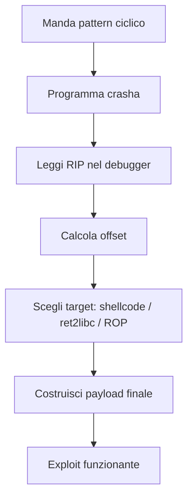

# Buffer Overflow

> [!info] TL;DR Un **buffer overflow** è una vulnerabilità di corruzione della memoria che si verifica quando un programma scrive più dati in un buffer di quanti questo possa contenerne, sovrascrivendo aree di memoria adiacenti. Nei casi gravi consente all'attaccante di **dirottare il flusso di esecuzione** e ottenere RCE (Remote Code Execution).

---
![[Pasted image 20260520155418.png]]![[Pasted image 20260520155431.png]]![[Pasted image 20260520154941.png]]![[Pasted image 20260520155452.png]]![[Pasted image 20260520155511.png]]![[Pasted image 20260520155646.png]]

## 📚 Indice

- [[#1. Fondamenti di memoria]]
- [[#2. Anatomia dello stack frame]]
- [[#3. Il meccanismo della vulnerabilità]]
- [[#4. Processo di exploitation]]
- [[#5. Tipologie di buffer overflow]]
- [[#6. Casi storici famosi]]
- [[#7. Mitigazioni moderne]]
- [[#8. Tecniche di bypass]]
- [[#9. Difesa nel codice]]
- [[#10. Tool e risorse]]

---

## 1. Fondamenti di memoria

Per capire un BOF bisogna prima capire come è organizzata la memoria di un processo:

```
Indirizzi alti
┌──────────────────────┐
│       STACK          │  ← variabili locali, indirizzi di ritorno (cresce ↓)
├──────────────────────┤
│         ↕            │
├──────────────────────┤
│       HEAP           │  ← memoria dinamica (malloc/new) (cresce ↑)
├──────────────────────┤
│       BSS            │  ← variabili globali non inizializzate
├──────────────────────┤
│       DATA           │  ← variabili globali inizializzate
├──────────────────────┤
│       TEXT           │  ← codice eseguibile (read-only)
└──────────────────────┘
Indirizzi bassi
```


> [!note] Direzione di crescita Lo **stack cresce verso il basso** (indirizzi decrescenti), mentre la **scrittura nei buffer avviene verso l'alto** (indirizzi crescenti). Da qui il "trabocco" che sovrascrive ciò che logicamente viene _dopo_ nello stack frame.

Vedi anche: [[Memoria virtuale]], [[Segmentazione]], [[Calling convention]]

---

## 2. Anatomia dello stack frame

Quando una funzione viene chiamata, viene creato un **stack frame** che contiene:

```
Indirizzi alti
┌──────────────────────────┐
│ Argomenti della funzione │
├──────────────────────────┤
│ Return Address (RIP/EIP) │  ← TARGET dell'attaccante
├──────────────────────────┤
│ Saved Base Pointer (RBP) │
├──────────────────────────┤
│ Variabili locali         │
│   buffer[16]             │  ← qui scriviamo
│   ...                    │
└──────────────────────────┘
Indirizzi bassi (RSP)
```

> [!tip] Perché il return address è il bersaglio? Quando la funzione termina, l'istruzione `ret` preleva l'indirizzo di ritorno dallo stack e ci salta. Se l'attaccante lo sovrascrive, **controlla il prossimo `RIP`** → controlla il flusso del programma.

---

## 3. Il meccanismo della vulnerabilità

### Esempio classico in C

```c
#include <string.h>
#include <stdio.h>

void vulnerabile(char *input) {
    char buffer[16];
    strcpy(buffer, input);  // ⚠️ nessun bounds check
    printf("Buffer: %s\n", buffer);
}

int main(int argc, char **argv) {
    vulnerabile(argv[1]);
    return 0;
}
```

### Cosa succede con input lungo

|Input length|Effetto|
|---|---|
|≤ 15 byte|✅ Normale|
|16-23 byte|Sovrascrive saved RBP → comportamento errato|
|24+ byte|Sovrascrive return address → 💥 crash o hijacking|

> [!danger] Funzioni storicamente pericolose in C `strcpy`, `strcat`, `gets`, `sprintf`, `scanf("%s")`, `memcpy` con size non controllata. Le versioni "n" (`strncpy`, `snprintf`) sono **più sicure ma non automaticamente safe** — vanno usate correttamente.

---

## 4. Processo di exploitation

### 4.1 — Trovare l'offset esatto

Il primo step è capire **dopo quanti byte** inizia il return address. Si usa un **pattern ciclico (De Bruijn sequence)**:

```python
from pwn import *

# Genera pattern dove ogni 4-tuple è unica
payload = cyclic(200)
# Aa0Aa1Aa2Aa3Aa4...
```

Si invia al programma, si guarda il valore in `RIP` dopo il crash:

```python
# Se RIP = 0x6161617a ("aaaz" in ASCII):
offset = cyclic_find(0x6161617a)
print(f"Offset: {offset}")  # es. 24
```

### 4.2 — Analisi nel debugger

```bash
gdb ./vulnerabile
(gdb) run $(python3 -c "print('A'*100)")
# Program received signal SIGSEGV
(gdb) info registers
# rip            0x4141414141414141   ← controllo totale di RIP
```

Tool consigliati: **pwndbg**, **GEF**, **peda** (estensioni di GDB che mostrano stack, registri, disasm automaticamente).

### 4.3 — Reverse engineering del binario

Con **Ghidra** o **IDA Pro** si recupera lo pseudo-C dal binario:

```c
// Decompilato da Ghidra
void vulnerabile(char *input) {
    char buffer [16];     // ← dimensione visibile
    strcpy(buffer, input);
}
```

### 4.4 — Costruzione del payload

```
┌─────────────────┬──────────────┬─────────────────────┐
│ padding (24 B)  │ new RIP (8B) │ shellcode / ROP ... │
└─────────────────┴──────────────┴─────────────────────┘
```

```python
from pwn import *

offset = 24
new_ret = p64(0xdeadbeef)        # indirizzo target
payload = b"A" * offset + new_ret + shellcode
```



---

## 5. Tipologie di buffer overflow

### 5.1 Stack-based BOF

Il più classico. Sovrascrive variabili locali, saved RBP, return address.

### 5.2 Heap-based BOF

Avviene in memoria allocata con `malloc`. Sovrascrive **metadati dei chunk** (size, fwd/bck pointers) → tecniche come _unlink attack_, _House of Force_, _tcache poisoning_. Vedi: [[Heap Exploitation]], [[ptmalloc internals]]

### 5.3 Off-by-one

Un solo byte oltre il buffer. Sembra innocuo ma può sovrascrivere il LSB del saved RBP → controllo parziale dello stack frame del chiamante.

### 5.4 Integer overflow → BOF

```c
short len = user_input;          // se user_input = 65536, len = 0
char *buf = malloc(len + 1);     // alloca 1 byte
memcpy(buf, data, user_input);   // copia 65536 byte → BOF
```

### 5.5 Format string (correlato)

Tecnicamente non un BOF, ma `printf(user_input)` permette letture/scritture arbitrarie con `%n`. Vedi: [[Format String Vulnerability]]

---

## 6. Casi storici famosi

> [!quote] Worm Morris (1988) Primo worm internet, sfruttava un BOF in `fingerd`. Infettò ~6000 macchine (10% di internet allora).

|CVE / Nome|Anno|Target|Note|
|---|---|---|---|
|Morris Worm|1988|`fingerd`|Primo worm storico|
|Code Red|2001|IIS (Microsoft)|359.000 host in 14 ore|
|Slammer|2003|MS SQL Server|Internet down in 10 minuti|
|Blaster|2003|Windows RPC|~25 milioni di sistemi|
|Heartbleed|2014|OpenSSL|Tecnicamente buffer over-read|
|EternalBlue|2017|SMBv1 Windows|Usato da WannaCry, NotPetya|
|BlueKeep|2019|RDP Windows|CVE-2019-0708|

---

## 7. Mitigazioni moderne

### 7.1 Stack Canaries (`-fstack-protector`)

Valore "sentinella" tra variabili locali e return address. Se viene alterato, il programma termina.

```
[ buffer ][ CANARY ][ saved RBP ][ return ]
```

Se l'attaccante non conosce il valore del canary, lo sovrascrive con dati arbitrari → il check fallisce → `__stack_chk_fail()`.

### 7.2 DEP / NX bit (Data Execution Prevention)

Marca le pagine di memoria come non-eseguibili. Anche se inietti shellcode nello stack, la CPU si rifiuta di eseguirlo.

### 7.3 ASLR (Address Space Layout Randomization)

Randomizza gli indirizzi base di stack, heap, librerie e (con PIE) del binario stesso ad ogni esecuzione → l'attaccante non sa dove saltare.

### 7.4 PIE (Position Independent Executable)

Estende ASLR al codice del binario stesso, non solo alle librerie.

### 7.5 RELRO (Relocation Read-Only)

Rende read-only la GOT (Global Offset Table) dopo il caricamento, prevenendo GOT overwrite.

### 7.6 FORTIFY_SOURCE

Compilatore sostituisce funzioni pericolose con versioni "checked" quando la dimensione è nota a compile-time.

### 7.7 Control Flow Integrity (CFI)

Verifica a runtime che i salti indiretti vadano solo verso target validi (es. Intel CET, Microsoft CFG).

> [!tip] Verifica protezioni di un binario
> 
> ```bash
> checksec --file=./binary
> # mostra: RELRO, Canary, NX, PIE, RPATH, RUNPATH
> ```

---

## 8. Tecniche di bypass

### 8.1 Return-Oriented Programming (ROP)

Bypassa NX riutilizzando piccoli frammenti di codice esistente (**gadget**) terminati da `ret`. Concatenandoli si costruisce una logica arbitraria senza iniettare nuovo codice.

```python
rop = ROP(binary)
rop.raw(pop_rdi_gadget)
rop.raw(binsh_address)
rop.raw(system_address)
```

Vedi: [[ROP Chain]], [[ropper]], [[ROPgadget]]

### 8.2 [[ret2libc]]

Salta direttamente a una funzione della libc (es. `system("/bin/sh")`). Richiede di conoscere gli indirizzi della libc.

### 8.3 Info Leak

Sfrutta vulnerabilità come format string o partial overwrite per **leakare** un indirizzo runtime, da cui calcolare la base randomizzata → sconfigge ASLR.

### 8.4 Brute force (su 32-bit)

Su sistemi 32-bit l'entropia di ASLR è bassa (~16 bit di randomness) → fattibile brute-forzare in alcuni contesti (es. fork servers).

### 8.5 Stack Pivoting

Quando lo spazio per il payload è limitato, si "pivota" `RSP` su un'area controllata (es. heap) per eseguire una ROP chain più lunga.

### 8.6 SROP (Sigreturn-Oriented Programming)

Sfrutta la syscall `sigreturn` per ripristinare un contesto fittizio → potente "mega-gadget".

### 8.7 JOP / COP

Jump-Oriented / Call-Oriented Programming: varianti di ROP che usano `jmp`/`call` invece di `ret`.

---

## 9. Difesa nel codice

### Funzioni safe in C

|⚠️ Da evitare|✅ Da preferire|
|---|---|
|`strcpy`|`strncpy`, `strlcpy`|
|`strcat`|`strncat`, `strlcat`|
|`sprintf`|`snprintf`|
|`gets`|`fgets`|
|`scanf("%s")`|`scanf("%Ns")` con N fisso|

### Linguaggi memory-safe

- **[[Rust]]** — bounds checking + ownership a compile time, zero overhead
- **[[Go]]** — garbage collector, slice con bounds check
- **Java/C#** — VM con controllo automatico
- **Python/Ruby** — interpretati, memoria gestita

> [!success] Statistica chiave Microsoft e Google hanno entrambi pubblicato studi indicando che **~70% delle vulnerabilità critiche nei loro prodotti** sono dovute a errori di memory safety in C/C++. Da qui la spinta verso Rust.

### Best practices generali

- ✅ Validare sempre lunghezze degli input
- ✅ Compilare con `-fstack-protector-all -D_FORTIFY_SOURCE=2 -fPIE -pie -Wl,-z,now,-z,relro`
- ✅ Usare strumenti di analisi statica (Coverity, clang-analyzer, cppcheck)
- ✅ Fuzzing (AFL++, libFuzzer, honggfuzz)
- ✅ Sanitizer in development: `-fsanitize=address` (ASan), `-fsanitize=memory` (MSan)

---

## 10. Tool e risorse

### Tool offensivi

- **[[pwntools]]** — framework Python per exploit development
- **[[GDB]]** + **pwndbg** / **GEF** / **peda** — debugging
- **[[Ghidra]]** / **IDA Pro** / **radare2** / **Binary Ninja** — reverse engineering
- **ROPgadget** / **ropper** — ricerca di gadget ROP
- **one_gadget** — trova `execve("/bin/sh")` one-shot nella libc
- **patchelf** — modifica RPATH/interpreter di binari ELF

### Tool difensivi

- **checksec** — verifica protezioni di un binario
- **AFL++** / **libFuzzer** — fuzzing
- **AddressSanitizer (ASan)** — detection runtime
- **Valgrind** — memory error detection

### Risorse per imparare

- 📘 _Hacking: The Art of Exploitation_ — Jon Erickson
- 📘 _The Shellcoder's Handbook_ — Anley et al.
- 🎓 [pwn.college](https://pwn.college) — corso gratuito completo
- 🎓 [LiveOverflow YouTube](https://www.youtube.com/@LiveOverflow) — serie BOF
- 🏴 CTF: **picoCTF**, **HackTheBox**, **pwnable.kr**, **ROP Emporium**
- 📄 _Smashing the Stack for Fun and Profit_ — Aleph One (1996), il paper seminale

---

## 🔗 Note correlate

- [[ROP Chain]]
- [[Heap Exploitation]]
- [[Format String Vulnerability]]
- [[Use After Free]]
- [[Shellcode]]
- [[ASLR]]
- [[Calling convention]]
- [[Memory virtuale]]
- [[CTF Methodology]]
- [[Rust memory safety]]

---

## 🏷️ Tags

#cybersecurity #binary-exploitation #memory-corruption #vulnerability #pwn #reverse-engineering #exploit-development