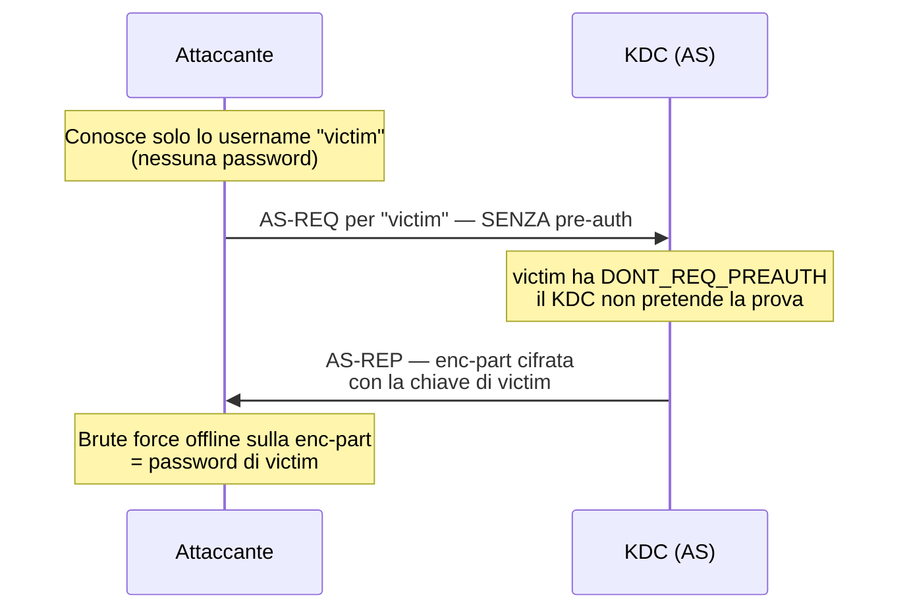

# AS-REP Roasting

> [!abstract] Di cosa parla la nota 
> Attacco Kerberos che recupera **offline la password di un utente** sfruttando gli account a cui è stata **disabilitata la pre-autenticazione**. Vive nella fase AS del flusso Kerberos (la richiesta del TGT). È il cugino del Kerberoasting, ma pesca in un punto diverso del protocollo e prende una preda diversa: la password dell'**utente**, non del servizio. Filo rosso col resto del capitolo: ancora una volta è _materiale cifrato con una chiave derivata da una password_ → brute force offline dove l'unico muro è la forza della password.

---

## Il ruolo della pre-autenticazione

> [!info] Perché esiste la pre-auth 
> Nel normale scambio AS (AS-REQ → AS-REP), per farsi dare il TGT il client deve prima **dimostrare di conoscere la password**: allega alla AS-REQ un **timestamp cifrato con la propria chiave** (derivata dalla password). Il KDC lo decifra con la chiave che ha nel suo DB; se ne esce un orario sensato, il client è autentico e riceve la AS-REP. Questo passaggio esiste apposta per **impedire l'attacco offline**: senza pre-auth, chiunque potrebbe chiedere al KDC del materiale cifrato con la chiave di un utente e craccarlo con calma. La pre-auth è il lucchetto; AS-REP roasting è ciò che succede quando quel lucchetto è tolto.

> [!warning] La flag colpevole
>  L'attacco è possibile solo contro account con la flag **"Non richiedere la pre-autenticazione Kerberos"** attiva — in `userAccountControl` è il bit `DONT_REQ_PREAUTH` (`0x400000` = 4194304). Perché un account la ha? Retrocompatibilità con client Kerberos non-Windows, appliance/servizi legacy, o pura misconfigurazione. È il solito pattern del capitolo: **retrocompatibilità = buco**.

---

## Come funziona l'attacco

> [!info] Il meccanismo 
> Se `victim` ha la pre-auth disabilitata, l'attaccante manda una **AS-REQ a nome di `victim` senza pre-auth**, cioè senza dover conoscere la password. Il KDC non pretende la prova e risponde con una **AS-REP** la cui parte cifrata (`enc-part`) è **cifrata con la chiave di `victim`** (derivata dalla sua password). L'attaccante estrae quel blob e lo cracca **offline**: prova una password → deriva la chiave → decifra → è venuto fuori qualcosa di valido? sì = password trovata. Non si è mai messo in mezzo al traffico: ha _chiesto lui_ al KDC.



> [!info] Cosa si cracca davvero 
> La preda è la **parte cifrata della AS-REP** (`enc-part`), cifrata con la chiave a lungo termine dell'utente. Con l'encryption type **RC4 (etype 23)** quella chiave Kerberos **è letteralmente l'hash NT** dell'utente — lo stesso hash NT visto nella nota NTLM. Formato hashcat: `$krb5asrep$23$user@DOMAIN:<hash>`. Con AES (etype 17/18) la chiave è derivata diversamente (salata con user/dominio) e il crack è più lento, motivo per cui gli attaccanti preferiscono richiedere RC4.

---

## Trovare gli account vulnerabili

> [!info] Query LDAP 
> Servono gli account con il bit `DONT_REQ_PREAUTH`. In LDAP si filtra con la bitmask: `(&(objectClass=user)(userAccountControl:1.2.840.113556.1.4.803:=4194304))` È lo stesso tipo di enumerazione autoritativa via LDAP visto nel Cap. 3 — qui non cerchi utenti generici, ma quelli con la configurazione debole.

> [!info] Autenticato vs non autenticato 
> Punto che rende l'attacco temuto: **non serve necessariamente una credenziale**. Con un account di dominio valido enumeri direttamente gli account roastable. Ma anche **senza credenziali**, se possiedi (o indovini) una lista di username, puoi tentare la richiesta AS-REP per ciascuno: quelli con pre-auth disabilitata risponderanno col blob craccabile. È uno dei pochi attacchi AD eseguibili da posizione totalmente non autenticata.

---

## Tool e comandi

> [!info] [[Impacket]] — GetNPUsers 
> Il tool di riferimento lato Linux (attenzione al nome: `GetNPUsers` = "get Non-Preauth users").

```bash
# Autenticato: enumera e richiede gli hash degli account roastable
GetNPUsers.py DOMINIO/utente:password -dc-ip <IP-DC> -request -format hashcat

# Non autenticato: prova una lista di username, senza password
GetNPUsers.py DOMINIO/ -dc-ip <IP-DC> -usersfile users.txt -no-pass
```

> [!info] Rubeus — lato Windows Da un host Windows in dominio, Rubeus automatizza la scoperta e la richiesta.

```powershell
Rubeus.exe asreproast /format:hashcat /outfile:asrep.txt
```

> [!info] Cracking offline Il blob si cracca con [[Hashcat]] (modalità **18200** per AS-REP RC4) o John.

```bash
hashcat -m 18200 asrep.txt wordlist.txt
```

---

## AS-REP Roasting vs [[Kerberoasting]]

> [!info] Due cugini, prede diverse Stessa logica ("materiale cifrato con chiave-da-password → crack offline"), ma fase del protocollo, cifratura e preda sono diverse. Da tenere ben distinti.

| |AS-REP Roasting|Kerberoasting|
|---|---|---|
|Fase Kerberos|AS (AS-REP)|TGS (TGS-REP)|
|Cosa richiedi|AS-REP per un utente|Service ticket per un SPN|
|Cifrato con la chiave di|**utente**|**service account (SPN)**|
|Preda|password dell'**utente**|password del **servizio**|
|Precondizione|account con pre-auth disabilitata|un qualsiasi utente di dominio **autenticato**|
|Serve una credenziale?|No (basta lo username)|Sì|
|Modalità hashcat|18200 (RC4)|13100 (RC4)|

> [!tip] La linea che le separa La domanda che smista sempre: _con quale chiave è cifrato il materiale?_ Se è la chiave dell'**utente** e viene dalla **AS-REP** → AS-REP roasting. Se è la chiave del **servizio** e viene dalla **TGS-REP** → Kerberoasting. Il Kerberoasting richiede però di essere già dentro (utente autenticato); l'AS-REP roasting può partire da fuori.

---

## Contromisure e detection

> [!warning] Come difendersi **Non disabilitare la pre-autenticazione** — la difesa numero uno è togliere la flag `DONT_REQ_PREAUTH` dove non serve, e auditarla periodicamente (query LDAP sopra). Sugli account che _devono_ averla disabilitata per compatibilità: **password lunghe e casuali**, perché l'attacco collassa in un brute force offline e la forza della password è l'unico muro. **Forzare AES** invece di RC4 rende il crack molto più lento. Preferire, dove possibile, account gestiti (gMSA) con password gestite dal sistema.

> [!info] Segnali nei log Sul domain controller, l'**Event ID 4768** (richiesta di un TGT) con **pre-authentication type = 0** e **encryption type RC4** è l'impronta tipica di un AS-REP roast: qualcuno sta richiedendo TGT senza pre-auth e in RC4. Un volume anomalo di 4768 di questo tipo, o richieste per molti utenti diversi in poco tempo, merita un alert.

---

## Fili rossi

> [!tip] Come si lega al resto **Materiale cifrato con chiave-da-password**: identico schema di pre-auth Kerberos (versione sniffata), NetNTLM sniffato, hash LM/NT — tutti finiscono in brute force offline. **Hash NT = chiave RC4 Kerberos**: il ponte diretto con la nota NTLM (con etype 23 la chiave _è_ l'hash NT). **Retrocompatibilità = buco**: la flag esiste per client Kerberos legacy, stesso pattern di LM, NetBIOS, RestrictAnonymous. **LDAP autoritativo**: l'enumerazione degli account vulnerabili è la stessa fonte autoritativa vista nel Cap. 3.

---

## Punti aperti

> [!question] Da verificare Quanto l'esame entra nel dettaglio del formato `$krb5asrep$` e delle modalità hashcat (18200 vs 13100) rispetto al solo concetto. Da confermare se il corso tratta anche il caso AES (etype 17/18) e le sue implicazioni sul tempo di cracking, o si ferma a RC4. Resta da fare la nota Kerberos completa (flusso AS/TGS + i tre attacchi mappati sulle fasi) per chiudere il terzetto LM → NTLM → Kerberos.