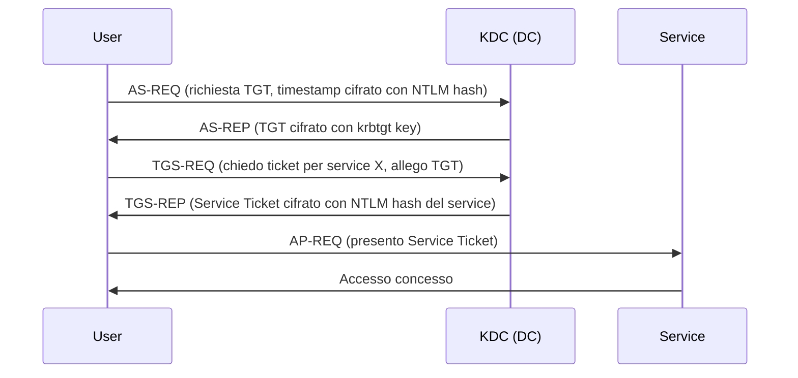

# Active Directory (AD)

> [!info] TL;DR **Active Directory** è il servizio di directory di Microsoft per reti Windows: gestisce identità (utenti, computer, gruppi), autenticazione, autorizzazione e policy in modo centralizzato all'interno di un _dominio_. Quando si parla di "**AD-related**" in cybersecurity, ci si riferisce a tutto ciò che riguarda attacchi, vulnerabilità, enumerazione, escalation e persistenza in ambienti Active Directory — un'area enorme del red teaming moderno perché AD è **lo standard de facto** nelle aziende.

---

## 📚 Indice

- [[#1. Cos'è Active Directory]]
- [[#2. Componenti fondamentali]]
- [[#3. Protocolli di autenticazione]]
- [[#4. Perché AD è un target critico]]
- [[#5. Attacchi AD-related]]
- [[#6. Tool offensivi]]
- [[#7. Mitigazioni e hardening]]
- [[#8. Risorse]]

---

## 1. Cos'è Active Directory

**Active Directory Domain Services (AD DS)** è il servizio di directory rilasciato da Microsoft con Windows 2000. Centralizza in un database gerarchico:

- **Identità**: utenti, computer, gruppi, service account
- **Autenticazione**: chi sei (tramite Kerberos / NTLM)
- **Autorizzazione**: cosa puoi fare (ACL, gruppi)
- **Policy**: configurazioni applicate via GPO (Group Policy Objects)
- **Risorse**: condivisioni, stampanti, applicazioni

> [!note] AD = LDAP + Kerberos + DNS + SMB Tecnicamente AD è un'**implementazione integrata** di standard aperti: LDAP per le query, Kerberos per l'autenticazione, DNS per il name resolution, SMB/RPC per la comunicazione. Tutto orchestrato da uno o più **Domain Controller**.

---

## 2. Componenti fondamentali

### 2.1 Gerarchia logica

```
Forest (foresta)
└── Domain Tree
    └── Domain (dominio)        ← unità amministrativa principale
        └── Organizational Unit (OU)
            └── Objects (User, Computer, Group, ...)
```

|Termine|Significato|
|---|---|
|**Forest**|Insieme di domini con schema comune; security boundary massimo|
|**Domain**|Confine amministrativo (es. `corp.acme.local`)|
|**OU**|Contenitore per organizzare oggetti e applicare GPO|
|**Domain Controller**|Server che ospita AD DS e autentica gli utenti|
|**Global Catalog (GC)**|Indice cross-domain di tutta la foresta|
|**Trust**|Relazione di fiducia tra domini/forest|

### 2.2 Oggetti principali

- **User** — account utente con SID, SamAccountName, UPN
- **Computer** — workstation/server joinati al dominio (sono "utenti" speciali, con account che termina con `$`)
- **Group** — Security Group (per ACL) o Distribution Group (per email)
- **GPO** — Group Policy Object, configurazioni applicate a OU
- **Service Principal Name (SPN)** — identifica un servizio (es. `MSSQLSvc/db01.corp.local:1433`)

### 2.3 Gruppi privilegiati ad alto valore

> [!danger] Gruppi che valgono il dominio
> 
> - **Domain Admins** — controllo totale del dominio
> - **Enterprise Admins** — controllo dell'intera foresta
> - **Schema Admins** — può modificare lo schema AD
> - **Administrators** (built-in)
> - **Account Operators**, **Backup Operators**, **Print Operators**, **Server Operators** — possono essere abusati per privesc
> - **DNSAdmins** — storicamente sfruttabile per code execution sul DC

---

## 3. Protocolli di autenticazione

### 3.1 Kerberos (il default moderno)

Protocollo a ticket basato su un Key Distribution Center (KDC) che vive sul DC.



**Termini chiave**:

- **TGT** (Ticket Granting Ticket) — il "biglietto master"
- **TGS / Service Ticket** — ticket per un servizio specifico
- **krbtgt** — account speciale la cui hash cifra tutti i TGT del dominio → **chiave del regno**

### 3.2 NTLM (legacy ma ancora ovunque)

Sistema challenge-response basato sull'hash NT della password. Più vecchio, più debole, ma supportato per retrocompatibilità.

```
1. Client → Server : NEGOTIATE
2. Server → Client : CHALLENGE (nonce random)
3. Client → Server : AUTHENTICATE (response = HMAC(NT_hash, challenge))
4. Server → DC     : verifica (Netlogon)
```

> [!warning] NTLM è la fonte di metà degli attacchi AD Pass-the-Hash, NTLM Relay, Responder poisoning — tutti sfruttano debolezze di NTLM. Best practice: **disabilitare NTLM ovunque possibile**.

---

## 4. Perché AD è un target critico

> [!quote] "Se l'attaccante prende il DA, ha vinto" Compromettere un Domain Admin = controllo di **tutti** i sistemi del dominio. Per questo gli attaccanti dedicano l'80% del tempo a muoversi dentro AD una volta entrati.

Motivi per cui AD è un bersaglio enorme:

- 📈 **Pervasività**: ~90% delle aziende Fortune 1000 usa AD
- 🕸️ **Complessità**: facile sbagliare configurazione (misconfigurations > exploit)
- 🏚️ **Debito tecnico**: protocolli legacy (NTLM, SMBv1) ancora attivi
- 🔗 **Trust transitivi**: una breccia in un dominio può propagarsi
- 🎫 **Kerberos design quirks**: alcune feature legittime sono abusabili (delegation, SPN)
- 👤 **Service account**: spesso con password deboli, mai cambiate, privilegi alti

> [!tip] Filosofia red team su AD "**Assume breach**" — l'attaccante presume di essere già dentro come utente non privilegiato e cerca di scalare. Il problema raramente è il "come entrare", è il "come arrivare al DA da utente normale".

---

## 5. Attacchi AD-related

### 5.1 Recon ed Enumeration

Da utente low-priv si possono **leggere quasi tutti gli oggetti AD via LDAP** (è feature, non bug).

```powershell
# PowerView
Get-DomainUser -SPN                    # utenti con SPN (Kerberoastable)
Get-DomainUser -PreauthNotRequired     # AS-REP Roastable
Get-DomainComputer -Unconstrained      # delegation senza vincoli
Get-DomainGroupMember "Domain Admins"
```

```bash
# da Linux con Impacket
ldapsearch -x -H ldap://dc.corp.local -b "dc=corp,dc=local"
GetUserSPNs.py corp.local/user:pass    # Kerberoasting
```

### 5.2 Kerberoasting

> [!example] Funziona perché... Qualsiasi utente autenticato può richiedere un TGS per un account con SPN. Il TGS è cifrato con l'**hash NTLM del service account** → si porta offline e si cracka con hashcat.

```bash
# 1. Estrai TGS
GetUserSPNs.py -request corp.local/user:pass

# 2. Cracka offline
hashcat -m 13100 hashes.txt rockyou.txt
```

Mitigazione: service account con password lunghe e random (≥25 char) o **gMSA / dMSA** (gestiti automaticamente).

### 5.3 AS-REP Roasting

Utenti con flag `DONT_REQ_PREAUTH` ricevono AS-REP senza pre-autenticazione → il blob è craccabile offline.

```bash
GetNPUsers.py corp.local/ -usersfile users.txt -no-pass
hashcat -m 18200 hashes.txt rockyou.txt
```

### 5.4 Pass-the-Hash (PtH)

NTLM non richiede la password in chiaro, solo l'**hash NT**. Se rubo l'hash, autentico come l'utente senza craccarla.

```bash
psexec.py -hashes :NTLM_HASH user@target
crackmapexec smb target -u user -H NTLM_HASH
```

### 5.5 Pass-the-Ticket (PtT)

Stessa idea ma con ticket Kerberos. Si esporta un TGT/TGS dalla memoria di una macchina compromessa e lo si inietta altrove.

```bash
# Estrai ticket
mimikatz # sekurlsa::tickets /export

# Inietta
mimikatz # kerberos::ptt ticket.kirbi
```

### 5.6 Golden Ticket 🏆

> [!danger] Il sacro graal Se ottengo l'hash NTLM dell'account `krbtgt`, posso **forgiare TGT arbitrari** per qualunque utente, gruppo, scadenza. Persistenza eterna nel dominio.

```bash
mimikatz # kerberos::golden /user:Administrator /domain:corp.local \
         /sid:S-1-5-21-... /krbtgt:HASH /ptt
```

Cura: ruotare la password di krbtgt **due volte** (per invalidare anche il vecchio hash).

### 5.7 Silver Ticket

Variante: forgio un TGS per un singolo servizio usando l'hash di quel service account. Più stealth (non passa dal DC) ma limitato a un servizio.

### 5.8 DCSync

Abuso della replica AD: chi ha i permessi `Replicating Directory Changes` (DA, EA, account di replica) può chiedere al DC **gli hash di tutti gli utenti**, incluso krbtgt.

```bash
secretsdump.py -just-dc corp.local/admin:pass@dc.corp.local
```

### 5.9 DCShadow

L'attaccante registra un DC fittizio e pusha modifiche al dominio bypassando i log standard. Stealth persistence.

### 5.10 Unconstrained / Constrained Delegation

- **Unconstrained**: una macchina può conservare i TGT degli utenti che la contattano → se un DA ci si autentica, il suo TGT è mio.
- **Constrained**: simile ma vincolata a servizi specifici; abusabile con S4U2Self/S4U2Proxy.
- **Resource-Based Constrained Delegation (RBCD)**: spesso il vettore di scelta per privesc moderno.

### 5.11 ACL abuse

Permessi mal configurati su oggetti AD permettono privesc:

- `GenericAll`, `GenericWrite` su un utente → reset password
- `WriteDacl` → mi do io stesso ogni diritto
- `WriteOwner` → mi rendo owner dell'oggetto
- `AddMember` su un gruppo → mi aggiungo a Domain Admins

**BloodHound** è il tool che mappa visualmente queste relazioni come grafo → "shortest path to Domain Admin".

### 5.12 Altri attacchi notevoli

|Attacco|Cosa sfrutta|
|---|---|
|**NTLM Relay**|Inoltro auth NTLM verso target che non richiede SMB signing|
|**PetitPotam**|Forza un DC ad autenticarsi al mio host (poi relay verso AD CS)|
|**PrintNightmare**|RCE via Print Spooler (CVE-2021-34527)|
|**ZeroLogon**|CVE-2020-1472: reset password DC con Netlogon|
|**noPac / sAMTheSpy**|CVE-2021-42278/42287: da user a DA in 1 comando|
|**AD CS abuse**|Certificate Services mal configurato → ESC1-ESC11 (vedi Certified Pre-Owned)|
|**LAPS abuse**|Lettura password admin locali se permessi LAPS troppo aperti|
|**GPO abuse**|Scrivere su GPO applicate a host privilegiati → code exec come SYSTEM|

---

## 6. Tool offensivi

### 6.1 Recon e graph

- **[[BloodHound]]** / **SharpHound** — grafo delle relazioni AD, query attack path
- **PowerView** — modulo PowerShell di PowerSploit
- **ADRecon** / **PingCastle** — report di sicurezza AD

### 6.2 Credential dumping

- **[[Mimikatz]]** — il coltellino svizzero (sekurlsa, lsadump, kerberos::*)
- **secretsdump.py** (Impacket) — dump remoto SAM/LSA/NTDS
- **lsassy** — dump LSASS remoto stealth

### 6.3 Movimento laterale

- **[[Impacket]]** suite — psexec, wmiexec, smbexec, dcomexec, getST, ticketer
- **CrackMapExec / NetExec** — swiss army per pentest AD
- **Rubeus** — Kerberos abuse in .NET (asktgt, kerberoast, ptt, s4u, ...)
- **Certify** / **Certipy** — abuse di AD CS

### 6.4 Cracking

- **hashcat** — modalità 1000 (NTLM), 5600 (NetNTLMv2), 13100 (Kerberos TGS), 18200 (AS-REP)
- **John the Ripper**

---

## 7. Mitigazioni e hardening

### 7.1 Identity hygiene

- ✅ **Tiered admin model**: separare admin Tier 0 (DC), Tier 1 (server), Tier 2 (workstation)
- ✅ Password lunghe per service account, meglio **gMSA**
- ✅ LAPS per password admin locali (mai stesse password ovunque)
- ✅ MFA su account amministrativi
- ✅ Disabilitare account inattivi, password policy robusta

### 7.2 Protocolli

- ✅ Disabilitare **NTLMv1** ovunque, restringere NTLMv2
- ✅ Abilitare **SMB signing** e **LDAP signing/channel binding** → blocca relay
- ✅ Disabilitare **Print Spooler** sui DC
- ✅ Patchare ZeroLogon, PetitPotam, PrintNightmare, noPac

### 7.3 Kerberos

- ✅ Rotazione **krbtgt** periodica (script Microsoft, due volte)
- ✅ Niente **unconstrained delegation** su account sensibili
- ✅ AES-only quando possibile (RC4 = badge di kerberoastable)

### 7.4 Monitoring

- ✅ Event log 4624 (logon), 4625 (failed), 4768/4769 (Kerberos), 4662 (ACL access)
- ✅ Alert su **DCSync** (event 4662 con GUID di Replicating Directory Changes)
- ✅ Honey objects: utenti finti con SPN per detection di Kerberoasting
- ✅ Honey tokens, canary accounts

### 7.5 Architettura

- ✅ **Privileged Access Workstations (PAW)** per admin
- ✅ **Red Forest / ESAE** o Microsoft Tier Model
- ✅ Riduzione superficie: meno DA possibili, JIT/JEA admin

> [!tip] Tool difensivo gratuito **PingCastle** dà uno score di rischio AD in 5 minuti — eccellente baseline per capire dove sta il rischio.

---

## 8. Risorse

### Libri & Whitepaper

- 📘 _The Hacker Playbook 3_ — Peter Kim
- 📘 _Advanced Penetration Testing_ — Wil Allsopp
- 📄 _Active Directory Security_ — Sean Metcalf (adsecurity.org)
- 📄 _Certified Pre-Owned_ — SpecterOps (AD CS abuse)
- 📄 _An ACE Up the Sleeve_ — Robbins & Schroeder

### Corsi & Lab

- 🎓 **HackTheBox Academy** — AD-focused paths
- 🎓 **TryHackMe** — Wreath, Holo, Throwback networks
- 🎓 **Altered Security** — CRTP, CRTE, CRTM (gold standard AD)
- 🎓 **Zero-Point Security** — CRTO
- 🎓 **OffSec** — OSEP, OSCP+ (AD components)
- 🧪 **GOAD** (Game of Active Directory) — lab AD vulnerabile self-hosted

### Reference

- 🌐 [adsecurity.org](https://adsecurity.org) — Sean Metcalf blog
- 🌐 [thehacker.recipes](https://www.thehacker.recipes) — AD cheat sheet
- 🌐 [HackTricks AD section](https://book.hacktricks.xyz)
- 🌐 [ired.team](https://www.ired.team) — Red team notes
- 📺 **IppSec** YouTube — walkthroughs HTB AD-heavy

---

## 🔗 Note correlate

- [[Kerberos]]
- [[NTLM]]
- [[BloodHound]]
- [[Mimikatz]]
- [[Impacket]]
- [[LDAP]]
- [[Group Policy Object (GPO)]]
- [[AD Certificate Services]]
- [[Pass-the-Hash]]
- [[Kerberoasting]]
- [[Golden Ticket]]
- [[DCSync]]
- [[Lateral Movement]]
- [[Privilege Escalation Windows]]
- [[Red Team Methodology]]

---

## 🏷️ Tags

#cybersecurity #active-directory #windows #kerberos #ntlm #red-team #pentesting #lateral-movement #privilege-escalation #identity