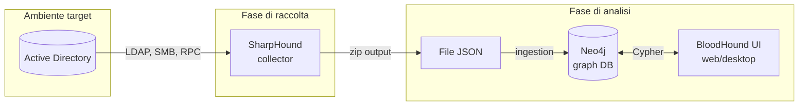

# BloodHound

> [!info] TL;DR **BloodHound** è uno strumento di analisi che applica la **teoria dei grafi** all'enumerazione di Active Directory (e Azure AD/Entra ID). Raccoglie informazioni su utenti, gruppi, computer, sessioni e ACL, le inserisce in un database a grafo (Neo4j) e permette di **visualizzare i percorsi di attacco** verso obiettivi sensibili come Domain Admin. Famoso per la query _"Shortest path to Domain Admin"_ — un singolo click che spesso rivela vulnerabilità che farebbero settimane di analisi manuale.

---

## 📚 Indice

- [[#1. L'idea geniale dietro BloodHound]]
- [[#2. Architettura]]
- [[#3. Versioni: Legacy vs Community Edition]]
- [[#4. Collector: SharpHound & co.]]
- [[#5. Nodi e relazioni (edges)]]
- [[#6. Query pre-built]]
- [[#7. Cypher: query custom]]
- [[#8. Attack path tipici]]
- [[#9. BloodHound per la difesa]]
- [[#10. Detection e OPSEC]]
- [[#11. Risorse]]

---

## 1. L'idea geniale dietro BloodHound

> [!quote] Andy Robbins, Will Schroeder, Rohan Vazarkar (2016) "Defenders think in lists. Attackers think in graphs. As long as this is true, attackers win."

Prima di BloodHound, capire chi poteva diventare Domain Admin in un AD complesso richiedeva mesi di analisi manuale di:

- Permessi ACL su migliaia di oggetti
- Membership annidate di gruppi
- Sessioni attive (chi è loggato dove)
- Diritti locali di amministrazione
- Relazioni di trust tra domini
- Delegation Kerberos

BloodHound trasforma tutto questo in un **grafo orientato**: nodi (utenti, gruppi, computer) connessi da archi (relazioni di abuso). Da qui basta un algoritmo classico di **shortest path** per trovare la catena più corta da `low-priv user` a `DOMAIN ADMINS`.

```
[user@corp]──MemberOf──→[IT-Support]──AdminTo──→[WS01]──HasSession──→[helpdesk-admin]──MemberOf──→[Domain Admins]
```

Risultato: 5 hop. Settimane di lavoro in 30 secondi.

---

## 2. Architettura



**Tre componenti**:

1. **Collector** (SharpHound, AzureHound, ecc.) — gira nell'ambiente target e raccoglie dati
2. **Database** — Neo4j, archivia il grafo
3. **UI** — interfaccia per esplorare il grafo ed eseguire query

---

## 3. Versioni: Legacy vs Community Edition

|Aspetto|**BloodHound Legacy** (≤4.x)|**BloodHound CE / 5.x+**|
|---|---|---|
|Mantenitore|SpecterOps (dismesso)|SpecterOps (attivo)|
|UI|Electron desktop app|Web app (browser)|
|Deploy|Locale standalone|Docker compose stack|
|API|Limitata|REST API completa|
|Multi-utente|❌|✅|
|Azure AD|Parziale|Integrato (ex AzureHound)|
|Edge custom|Difficile|Più semplice|
|Stato|Deprecato|**Standard attuale**|

> [!tip] Quale usare nel 2026 **BloodHound Community Edition** (BHCE) è la versione consigliata. La versione **Enterprise** aggiunge funzionalità per blue team / continuous monitoring.

### Deploy BloodHound CE

```bash
# Clone e avvio con Docker
curl -L https://ghst.ly/getbhce > docker-compose.yml
docker compose up

# UI raggiungibile su http://localhost:8080
# Credenziali iniziali nel log del primo avvio
```

---

## 4. Collector: SharpHound & co.

### 4.1 SharpHound (Windows AD)

Il collector ufficiale, scritto in C#. Esiste anche **bloodhound.py** (Python, da Linux).

```powershell
# Da host Windows joinato al dominio
.\SharpHound.exe -c All

# Collezione specifica
.\SharpHound.exe --CollectionMethods Group,LocalAdmin,Session,Trusts

# Stealth: niente sessioni, niente local admin enum
.\SharpHound.exe -c DCOnly
```

### 4.2 bloodhound.py (Python, da Linux)

```bash
bloodhound-python -d corp.local -u user -p 'Password!' \
                  -ns 10.0.0.1 -c All --zip
```

### 4.3 Metodi di collection

|Metodo|Cosa raccoglie|Rumoroso?|
|---|---|---|
|`Group`|Membership gruppi (LDAP)|🟢 Basso|
|`LocalAdmin`|Chi è admin locale su ogni macchina (SAMR)|🟡 Medio|
|`Session`|Sessioni utente attive (NetSessionEnum)|🟡 Medio|
|`LoggedOn`|Sessioni privilegiate (richiede admin remoto)|🔴 Alto|
|`Trusts`|Domain trusts|🟢 Basso|
|`ACL`|DACL su oggetti AD|🟡 Medio|
|`ObjectProps`|Proprietà degli oggetti|🟢 Basso|
|`SPNTargets`|SPN per Kerberoasting|🟢 Basso|
|`Container`|OU, GPO link|🟢 Basso|
|`GPOLocalGroup`|Mapping GPO → admin locali|🟢 Basso|
|`DCOnly`|Solo LDAP al DC, nessuna comunicazione coi host|🟢 Stealth|
|`All`|Tutti (escluso `LoggedOn`)|🟡-🔴|

### 4.4 AzureHound (Entra ID / Azure)

```bash
# Da Linux, OAuth o credenziali
azurehound -u user@tenant.onmicrosoft.com -p 'pass' list -o output.json
```

Raccoglie: utenti, gruppi, ruoli, service principal, subscription, resource group, application registration, ecc.

---

## 5. Nodi e relazioni (edges)

### 5.1 Tipi di nodo principali

|Nodo|Rappresenta|
|---|---|
|**User**|Account utente AD|
|**Computer**|Workstation/server|
|**Group**|Gruppo di sicurezza|
|**Domain**|Dominio AD|
|**GPO**|Group Policy Object|
|**OU**|Organizational Unit|
|**Container**|Container AD (es. CN=Users)|
|**AZUser**, **AZGroup**, **AZApp**, **AZServicePrincipal**, **AZRole**, **AZTenant**, ...|Equivalenti Azure|

### 5.2 Tipi di edge (le relazioni di attacco)

> [!example] La forza di BloodHound sta nelle edge Ogni edge rappresenta una **tecnica di abuso documentata**. Cliccando su un edge nel UI si apre un help con il payload esatto per sfruttarla.

#### Membership & ownership

- `MemberOf` — appartenenza a gruppo
- `Owns` — proprietà dell'oggetto

#### Sessions & admin rights

- `HasSession` — utente loggato su computer (target per credential theft)
- `AdminTo` — diritti di admin locale su computer
- `CanRDP`, `CanPSRemote`, `ExecuteDCOM` — accesso remoto

#### ACL abuse (i più importanti per privesc)

- `GenericAll` — controllo totale dell'oggetto
- `GenericWrite` — scrivere quasi tutti gli attributi
- `WriteDacl` — modificare le DACL (mi posso dare ogni diritto)
- `WriteOwner` — diventare owner
- `AllExtendedRights` — include reset password
- `ForceChangePassword` — reset password senza conoscere la vecchia
- `AddMember` — aggiungere membri al gruppo
- `AddSelf` — aggiungere se stesso al gruppo

#### Kerberos abuse

- `AllowedToDelegate` — constrained delegation
- `AllowedToAct` — Resource-Based Constrained Delegation (RBCD)
- `HasSPN` — utente Kerberoastable
- `DontReqPreAuth` — utente AS-REP Roastable

#### Domain & forest

- `DCSync` — diritti di replicazione → estrazione di tutti gli hash
- `GetChanges` + `GetChangesAll` — i due diritti che compongono DCSync
- `TrustedBy` — trust tra domini
- `SQLAdmin` — admin di SQL Server collegato

#### GPO & OU

- `GpLink` — GPO collegata a OU
- `Contains` — OU contiene oggetto
- `WriteGPLink` — può modificare il link
- `WriteSPN` — può scrivere SPN (→ targeted Kerberoasting)

#### AD CS (ESC1-ESC11)

- `ADCSESC1` … `ADCSESC11` — percorsi specifici di abuso di Certificate Services

---

## 6. Query pre-built

BloodHound include decine di query "Analysis" pronte all'uso, raggruppate per categoria:

### Domain Information

- _Find all Domain Admins_
- _Map domain trusts_
- _Find AS-REP Roastable Users (DontReqPreAuth)_
- _Find Kerberoastable Users_

### Dangerous Privileges

- _Find Principals with DCSync Rights_
- _Find Users with Unconstrained Delegation_
- _Find Computers with Unconstrained Delegation_
- _Find Constrained Delegation Outbound Object Control_

### Shortest Paths 🎯

- **Shortest Paths to Domain Admins**
- **Shortest Paths to Domain Admins from Kerberoastable Users** ← golden
- **Shortest Paths to Domain Admins from Owned Principals**
- **Shortest Paths to High Value Targets**
- **Shortest Paths from Domain Users to High Value Targets**

> [!tip] Il flusso d'oro del red teamer
> 
> 1. Marca come `Owned` tutti gli utenti compromessi (right-click → Mark User as Owned)
> 2. Marca come `High Value` gli obiettivi (DA, DC, server critici)
> 3. Lancia **Shortest Paths from Owned Principals to High Value Targets**
> 4. Studia il path e abusa di ogni edge

---

## 7. Cypher: query custom

Neo4j parla **Cypher**, un linguaggio di query a pattern matching. Sintassi base:

```cypher
MATCH (n:User)-[r:MemberOf*1..]->(g:Group {name: "DOMAIN ADMINS@CORP.LOCAL"})
RETURN n.name
```

### Esempi utili

```cypher
// Utenti Kerberoastable membri di gruppi privilegiati
MATCH (u:User {hasspn: true})-[:MemberOf*1..]->(g:Group)
WHERE g.highvalue = true
RETURN u.name, g.name

// Computer con unconstrained delegation che non sono DC
MATCH (c:Computer {unconstraineddelegation: true})
WHERE NOT c.name CONTAINS "DC"
RETURN c.name

// Tutti i path tra "Owned" e "High Value", max 5 hop
MATCH p = shortestPath((s {owned: true})-[*1..5]->(t {highvalue: true}))
RETURN p

// Utenti che possono resettare la password di un DA
MATCH (u:User)-[:ForceChangePassword|GenericAll|GenericWrite|AllExtendedRights]->
      (da:User)-[:MemberOf*1..]->(g:Group {name: "DOMAIN ADMINS@CORP.LOCAL"})
RETURN u.name, da.name

// Password mai cambiate da più di N giorni per utenti privilegiati
MATCH (u:User)-[:MemberOf*1..]->(g:Group {highvalue: true})
WHERE u.pwdlastset < (datetime().epochSeconds - (365*24*60*60))
RETURN u.name, u.pwdlastset
```

> [!note] Risorse Cypher
> 
> - [Neo4j Cypher reference](https://neo4j.com/docs/cypher-manual/)
> - **BloodHound Cypher Cheat Sheet** di hausec
> - **CypherDog** — wrapper PowerShell che genera Cypher

---

## 8. Attack path tipici

### Path 1: Kerberoasting → Domain Admin

```
[low-priv user]
    │ (autenticato al dominio)
    ▼
[GetUserSPNs → TGS di svc_sql]
    │ (offline cracking)
    ▼
[svc_sql password]
    │ MemberOf
    ▼
[SQL Admins] ──AdminTo──→ [SQL-SRV-01]
                                │ HasSession
                                ▼
                        [DA loggato]
                                │ credential dump
                                ▼
                        [Domain Admin]
```

### Path 2: ACL abuse

```
[user@corp]
    │ GenericWrite
    ▼
[Service Account] (gli scrivo lo SPN, lo kerberoasto)
    │ MemberOf
    ▼
[Backup Operators] (può leggere SAM/SYSTEM da remoto)
    │ AdminTo
    ▼
[DC01]
    │ DCSync → estrai krbtgt
    ▼
[Golden Ticket → DA persistente]
```

### Path 3: RBCD

```
[user con GenericWrite su Computer$]
    │ scrivo msDS-AllowedToActOnBehalfOfOtherIdentity
    ▼
[mia macchina può fare S4U2Self+S4U2Proxy verso Computer$]
    │ Rubeus s4u → ticket come DA su Computer$
    ▼
[admin su Computer$]
```

---

## 9. BloodHound per la difesa

BloodHound non è solo offensivo. I blue team lo usano per:

- 🔍 **Audit ACL**: trovare permessi anomali ed eccessivi
- 🧹 **Pulizia gruppi**: identificare membership obsolete in gruppi privilegiati
- 📉 **Riduzione superficie**: misurare quanti utenti possono raggiungere DA (idealmente → meno possibile)
- 🚨 **Pre-incident assessment**: simulare cosa farebbe un attaccante con un account compromesso
- 📊 **Reporting**: metriche di esposizione AD nel tempo

> [!success] BloodHound Enterprise Versione commerciale di SpecterOps che gira in continuous monitoring, calcola score di esposizione, suggerisce priorità di remediation. Pensato per blue team aziendali.

### Workflow blue team

```cypher
// Quanti utenti possono raggiungere DA?
MATCH (u:User) WHERE u.enabled = true
MATCH p = shortestPath((u)-[*1..]->(g:Group {name: "DOMAIN ADMINS@CORP.LOCAL"}))
RETURN count(distinct u)
```

Se il numero è alto → riprogettare il tier model.

---

## 10. Detection e OPSEC

### Come si rileva SharpHound

- **Event 4662** (Directory Service Access) — query LDAP massive su attributi inusuali
- **Event 5145** (Detailed File Share) — query SAMR/SRVS
- **NetSessionEnum** anomalo su molti host
- **Traffico LDAP** burst da un singolo host
- **EDR signature**: SharpHound default è firmato dagli AV → ricompilare / obfuscare

### OPSEC offensivo

```powershell
# Stealth: solo LDAP al DC, nessuna comunicazione coi computer
.\SharpHound.exe -c DCOnly

# Jitter e throttling
.\SharpHound.exe -c All --Throttle 1000 --Jitter 30

# Loop temporale per evitare detection
.\SharpHound.exe -c Session --Loop --LoopDuration 02:00:00
```

### Detection lato difensivo

- 🛡️ **Microsoft Defender for Identity (MDI)** — alert su recon LDAP anomalo
- 🛡️ **Honey objects** — utenti finti con SPN che, se enumerati/kerberoastati, scatenano alert
- 🛡️ Log SACL su oggetti sensibili (krbtgt, AdminSDHolder)
- 🛡️ Restringere chi può fare query SAMR remote (`Network access: Restrict clients allowed to make remote calls to SAM`)

---

## 11. Risorse

### Ufficiali

- 🌐 [bloodhound.specterops.io](https://bloodhound.specterops.io) — docs CE
- 🌐 [GitHub SpecterOps/BloodHound](https://github.com/SpecterOps/BloodHound)
- 🌐 [GitHub SharpHound](https://github.com/SpecterOps/SharpHound)
- 🌐 [bloodhoundenterprise.io](https://bloodhoundenterprise.io)

### Articoli fondamentali

- 📄 _Six Degrees of Domain Admin_ — Robbins, Vazarkar, Schroeder (DEFCON 24)
- 📄 _An ACE Up the Sleeve_ — Robbins & Schroeder (BH USA)
- 📄 _Death from Above: Lateral Movement from Azure to On-Prem AD_ — SpecterOps
- 📄 _Certified Pre-Owned_ (AD CS edges in BH)

### Cheat sheet & lab

- 📖 [BloodHound Cypher Cheatsheet — hausec](https://hausec.com)
- 📖 [The Hacker Recipes — BloodHound](https://www.thehacker.recipes)
- 🧪 **GOAD** (Game of Active Directory) — lab perfetto per allenarsi con BH
- 🧪 **HTB Pro Labs** (Offshore, Cybernetics, RastaLabs) — pesanti uso di BH
- 🎓 **Altered Security CRTP** — usa BloodHound come strumento principale

### Community

- 💬 **BloodHound Slack/Discord** (BloodHoundGang)
- 📺 SpecterOps YouTube — talk e demo

---

## 🔗 Note correlate

- [[Active Directory (AD)]]
- [[Cypher Query Language]]
- [[Neo4j]]
- [[Kerberoasting]]
- [[AS-REP Roasting]]
- [[DCSync]]
- [[ACL abuse AD]]
- [[Unconstrained Delegation]]
- [[Resource-Based Constrained Delegation]]
- [[Mimikatz]]
- [[Impacket]]
- [[Rubeus]]
- [[SharpHound collection methods]]
- [[BloodHound Custom Queries]]
- [[AD CS abuse (ESC1-ESC11)]]
- [[Red Team Methodology]]

---

## 🏷️ Tags

#cybersecurity #active-directory #bloodhound #red-team #blue-team #enumeration #attack-path #graph-theory #cypher #neo4j #pentesting