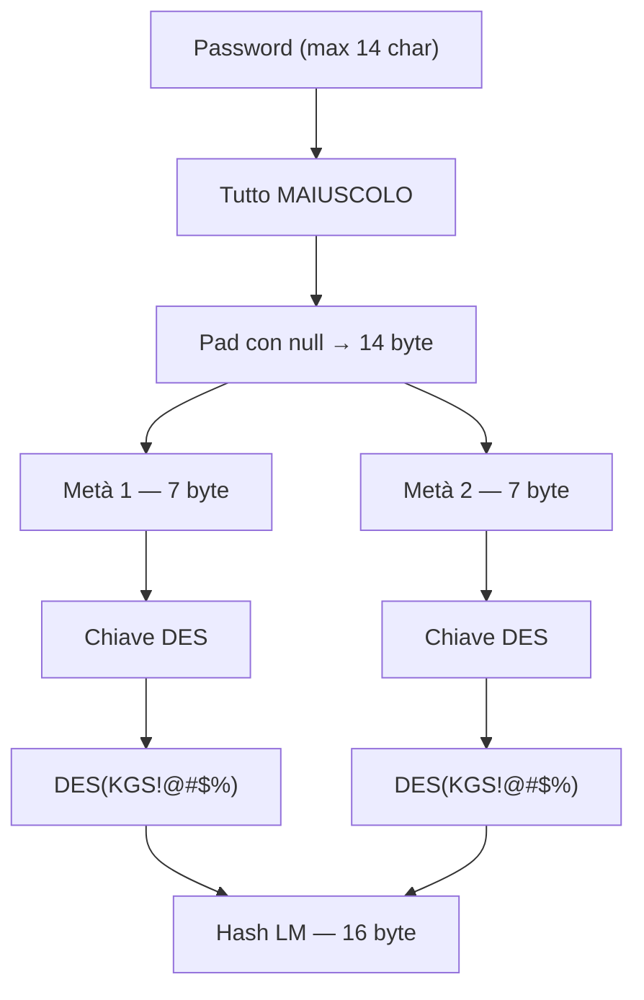
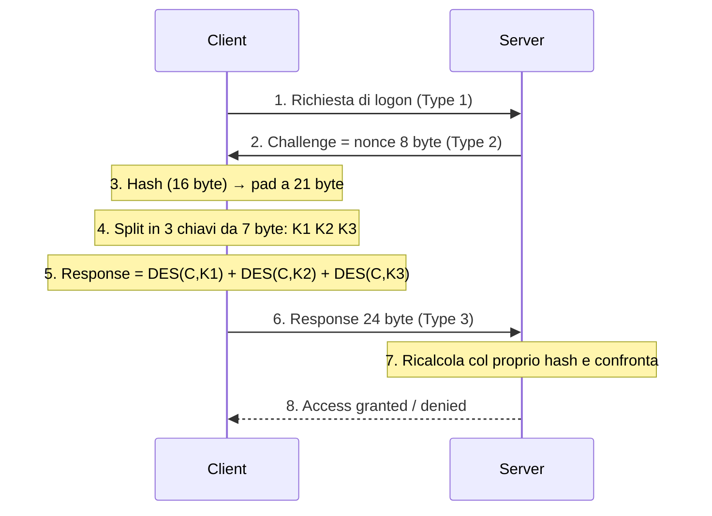

# ETHL — LAN Manager (LM) vs NTLM

> [!abstract] Di cosa parla la nota 
> Come funzionano davvero i due protocolli di autenticazione Windows più vecchi: **LM** (LAN Manager) e **NTLM**. Prima come è costruito l'hash memorizzato, poi come avviene lo scambio challenge-response sulla rete, infine il confronto punto per punto. È il tassello che spiega _perché_ nel Cap. 4 lo sniffing e il cracking funzionano, e perché la prima contromisura è sempre "disabilita LM".

---

## Due cose diverse chiamate uguali

> [!warning] Hash memorizzato ≠ response sul filo 
> Prima di tutto, la distinzione che genera più confusione. L'**hash** (LM o NT) è il valore _memorizzato_ nel SAM. La **response** è ciò che viaggia sulla rete durante il login, ed è una funzione dell'hash + una challenge casuale. Non sono la stessa cosa: l'hash memorizzato si riusa nel pass-the-hash, la response sul filo si cracka offline o si rilancia (relay). LM e NTLM hanno _ciascuno_ il proprio hash e il proprio schema di response.

---

## LAN Manager (LM)

> [!info] Cos'è e da dove viene 
> LM è lo schema di autenticazione dell'era OS/2 e Windows 9x, mantenuto per decenni per pura **retrocompatibilità** (il filo rosso di tutto il capitolo). Disabilitato di default da Vista/Windows 7, ma per anni attivo _in parallelo_ a NTLM: la stessa password veniva salvata sia come hash LM sia come hash NT, quindi bastava attaccare quello debole.

### Come si costruisce l'hash LM

> [!info] I cinque passaggi 
> La costruzione dell'hash LM è una collezione di errori di design: (1) la password viene troncata a **14 caratteri**; (2) convertita tutta in **MAIUSCOLO**; (3) riempita con null fino a 14 byte; (4) **spezzata in due metà da 7 byte**, trattate in modo indipendente; (5) ogni metà da 7 byte è usata come **chiave DES** per cifrare una costante fissa (`KGS!@#$%`). I due output da 8 byte si concatenano nell'hash LM da 16 byte. Nessun **salt**.

> [!danger] Perché è disastroso 
> Ogni difetto sopra apre un buco. **Maiuscolo** → l'alfabeto crolla, niente distinzione min/maiusc, keyspace ridotto. **Split in due metà da 7** → non attacchi una password da 14 caratteri ma _due indipendenti da 7_, crackabili in parallelo: la robustezza massima è quella di 7 caratteri, non 14. **Password ≤ 7 caratteri** → la seconda metà è l'hash della stringa vuota, un valore costante e riconoscibile (`AAD3B435B51404EE`): guardando l'hash sai già che la password è corta. **Niente salt** → due utenti con la stessa password hanno lo stesso hash → **rainbow table** precomputate. Il risultato è che gli hash LM si craccano in minuti.

Osservazione giusta e importante — DES è cifratura reversibile, non hashing. Il "trucco" dell'hash LM è proprio che usa un algoritmo reversibile **al contrario di come lo useresti normalmente**, e la risposta alla tua domanda è il cuore della faccenda.

**Chi è la chiave e chi è il testo, nella costruzione dell'hash.** Qui si invertono i ruoli rispetto all'autenticazione. Nella costruzione dell'hash LM:

- La **chiave DES** = i 7 byte della password (ogni metà).
- Il **testo in chiaro** = la costante fissa e pubblica `KGS!@#$%` (8 byte, uguale per tutti).
- Il **ciphertext prodotto** = gli 8 byte di hash (per ogni metà).

Quindi la password _non viene cifrata_: la password **è la chiave con cui cifri una costante nota**. È l'esatto opposto di quello che verrebbe da pensare.

**Perché questo rende DES un "hash" (a senso unico).** Normalmente DES è reversibile: se conosci la chiave, dal ciphertext torni al plaintext. Ma qui il plaintext lo conosci già — è la costante pubblica `KGS!@#$%`, non è un segreto. Il segreto è la **chiave**. E DES _non_ è progettato per farti risalire alla chiave partendo da (plaintext, ciphertext): quella direzione — recuperare la chiave — è computazionalmente dura. È proprio questa asimmetria che trasforma un cifrario simmetrico in una funzione a senso unico:

- Facile: password (chiave) + costante nota → hash. _Vai avanti._
- Difficile: costante nota + hash → password (chiave). _Non torni indietro banalmente._

In altre parole, l'irreversibilità dell'hash LM non viene da DES in sé (che è reversibile), ma dal fatto che il segreto è stato messo **nella posizione della chiave**, e recuperare una chiave DES da coppie plaintext/ciphertext è il problema difficile.

**Il collegamento con l'attacco, che chiude il cerchio.** Ecco perché l'hash LM si cracca così bene: "difficile recuperare la chiave" è vero _in generale_, ma la chiave DES è lunga 56 bit = 7 byte, e nell'LM quei 7 byte vengono da metà password **maiuscola e corta**. Lo spazio delle chiavi reali è minuscolo rispetto ai 56 bit teorici. Quindi l'attaccante non "inverte" DES: fa **brute force sulla chiave** — prova password candidate, le usa come chiave DES per cifrare la stessa costante `KGS!@#$%`, e confronta con l'hash. Lo stesso schema "provo la chiave finché non torna il risultato" che hai già visto nel cracking della challenge-response.

**Nota terminologica utile.** Un algoritmo di cifratura usato in questo modo — segreto come chiave, plaintext costante e pubblico, e ti interessa solo che sia dura da invertire verso la chiave — è tecnicamente una **one-way function costruita da un cifrario a blocchi**. È lo stesso principio dietro `crypt()` di UNIX classico (che usa DES ripetuto). Non è un abuso di terminologia chiamarlo "hash": è un hash _costruito_ con un cifrario, invece che con una primitiva di hashing dedicata come MD4 (che è quello che fa invece l'hash NT).

Quel passaggio (5) della nota, quindi, è tecnicamente corretto ma il verbo "cifrare" nasconde proprio l'inversione di ruoli che ti ha insospettito. Vuoi che nella nota `LAN Manager vs NTLM` aggiunga un callout `[!info]` corto — tipo titolo "Chiave e testo invertiti" — che chiarisce esattamente questo (password = chiave, costante = plaintext, e da lì l'irreversibilità)? Mi pare esattamente il tipo di meccanismo implicito che le note del corso servono a fissare.
### Il protocollo di autenticazione LM (challenge-response)

> [!info] Cosa viaggia sul filo 
> La password (e nemmeno l'hash) non attraversa mai la rete. Il server manda una **challenge** casuale, il client risponde con quella challenge trasformata usando il proprio hash. Meccanismo: l'hash LM da 16 byte viene **riempito a 21 byte** (con 5 null), spezzato in **tre chiavi da 7 byte** (K1, K2, K3), e ognuna cifra in **DES** la challenge da 8 byte. I tre output concatenati (24 byte) sono la **LM response**. Il server, che conosce l'hash, ricalcola la stessa risposta e confronta.

Dove il response è il seguente:
![[Pasted image 20260703190051.png]]

> [!tip] È la formula delle slide 
> Questo è esattamente lo schema $Response = E_{K_1}(C),|,E_{K_2}(C),|,E_{K_3}(C)$ visto nel Cap. 4. Le tre chiavi vengono dall'hash paddato a 21 byte. Chi **sniffa** la coppia (challenge, response) la attacca offline: prova una password → deriva l'hash → deriva K1/K2/K3 → cifra la challenge catturata → confronta con la response catturata. Tutto offline, quindi il lockout non conta.

---

## NTLM

> [!info] La generazione successiva 
> NTLM nasce per rimediare ai difetti di LM mantenendo lo stesso _stile_ di protocollo. Cambia soprattutto **come si costruisce l'hash**; lo scambio challenge-response (in NTLMv1) resta strutturalmente simile.

### Come si costruisce l'hash NT

> [!info] MD4 sulla password intera 
> L'hash NT è semplicemente $H = MD4(\text{password in UTF-16LE})$. Niente maiuscolo forzato: la password resta **case-sensitive**. Niente limite a 14 caratteri, niente split in metà. Il risultato è un hash da 16 byte che riflette la password _intera_ così com'è. Ma attenzione: **anche NT è senza salt** → due password uguali danno hash uguali → le rainbow table restano un problema anche per NTLM.

### Il protocollo NTLMv1

> [!info] Stesso scambio, hash migliore 
> NTLMv1 usa lo _stesso_ meccanismo DES-based della LM response, ma partendo dall'hash NT invece che dall'hash LM: hash NT (16 byte) → pad a 21 byte → tre chiavi da 7 byte → DES della challenge da 8 byte → response da 24 byte. Il flusso della sequenza è identico al diagramma sopra; l'unica differenza è _quale hash_ entra al passo 3. Poiché l'hash NT è molto più forte dell'LM (case-sensitive, password intera, niente troncamento), la response NTLMv1 è ordini di grandezza più dura da craccare.

> [!info] NTLMv2, in breve 
> NTLMv2 fa un salto ulteriore che le slide del corso toccano solo di sfumo: abbandona DES per **HMAC-MD5**, e nella response include anche un **client challenge** e un **timestamp**. Questo blocca in gran parte gli attacchi con rainbow table precomputate e riduce la finestra dei replay. Resta comunque vulnerabile al **relay** (rilancio live), motivo per cui la difesa vera è a livello di canale (firma SMB, cifratura).

---

## Confronto diretto

> [!info] LM vs NTLM a colpo d'occhio

|Aspetto|LM|NTLM (NT hash / v1)|
|---|---|---|
|Algoritmo hash|DES su costante `KGS!@#$%`|MD4 della password|
|Case sensitivity|No (tutto maiuscolo)|Sì|
|Lunghezza password|Troncata a 14|Nessun limite pratico|
|Struttura|Split in 2 metà da 7|Password intera, nessuno split|
|Salt|No|No|
|Rainbow table|Devastanti|Ancora possibili|
|Robustezza effettiva|~7 caratteri maiuscoli|Password intera case-sensitive|
|Response sul filo|DES-based (24 byte)|v1: DES-based; v2: HMAC-MD5 + client challenge + timestamp|
|Stato oggi|Off di default (Vista+)|Ancora in uso; v2 il minimo accettabile|

> [!info] Il tratto comune che resta 
> Attenzione a non "assolvere" NTLM: condivide con LM due debolezze strutturali. **Niente salt** (rainbow table valide per entrambi) e **nessun bisogno della password in chiaro** per autenticarsi — l'hash memorizzato _è_ la credenziale. È quest'ultimo il fondamento del **pass-the-hash**: si prende l'hash NT dalla RAM e lo si riusa, senza mai craccarlo.

---

## Perché conta per gli attacchi

> [!tip] Come si incastra col resto del Cap. 4 
> **Sniffing** → cattura la challenge-response e la cracka offline; se il client parla LM, il gioco è quasi immediato (da qui il _downgrade_ forzato in MITM: convincere il client a usare LM). **Cracking** → l'hash senza salt più il keyspace ridotto dell'LM rendono le rainbow table letali. **Pass-the-hash** → sfrutta il fatto che l'hash NT memorizzato basta come credenziale. Tre attacchi diversi, tutti che pescano da un difetto qui: hash deboli, senza salt, con la password mai richiesta in chiaro.

> [!warning] Contromisure, lette dal meccanismo 
> **Disabilitare LM** toglie dal filo e dal SAM la response/hash più facili da craccare, costringendo l'attaccante su NTLM. **Password lunghe e complesse** sono il muro finale: ogni attacco termina in un brute force offline, e l'entropia della password è l'unica variabile che decide l'esito. **NTLMv2 come minimo**, meglio **Kerberos**. **Firma SMB / IPsec / cifratura del canale** attaccano il problema alla radice: senza una challenge-response in chiaro da catturare, e senza poter impersonare, sniffing e relay perdono presa.

---

## Punti aperti

> [!question] Da approfondire Perché proprio _tre_ chiavi da 7 byte nella response (21 = 3 × 7): è l'hash da 16 byte paddato a 21, eredità del riuso di DES che lavora su chiavi da 56 bit / 7 byte. Da verificare a che livello l'esame chiede il dettaglio della costruzione (costante `KGS!@#$%`, tell della seconda metà vuota) rispetto al solo concetto challenge-response.

# Pass the hash con hash LM/NT

Pass-the-hash funziona benissimo anche contro NTLMv2**. NTLMv2 ha indurito il percorso _sniffing → cracking_ (la response usa HMAC-MD5 con client challenge e timestamp, molto più dura da precomputare con rainbow table), ma **non ha toccato il pass-the-hash**. Il motivo è semplice: sia NTLMv1 sia NTLMv2 prendono come segreto in ingresso l'hash NT, non la password. Se hai l'hash, calcoli una response NTLMv2 valida esattamente come ne calcoli una v1. "Autenticare bene l'utente" nel senso di protocollo forte e niente password sul filo **non ferma PtH**, perché l'hash _è_ la credenziale.

Questo è il concetto da fissare: **l'hash NT è un password-equivalent**. Possedere l'hash equivale a possedere la password, perché il protocollo tratta l'hash come il segreto vero. Non è un problema di autenticazione debole, è un problema di _furto e replay di una credenziale_.

Detto questo, la tua intuizione non è del tutto sbagliata — c'è un "quando funziona" ben preciso.

**Contesti in cui PtH si usa davvero.** Tutto ciò che in Windows autentica via NTLM (o Kerberos) accettando l'hash come segreto: le share SMB, incluse quelle amministrative (`C$`, `ADMIN$`); l'esecuzione remota via PsExec, WMI, WinRM, RPC/DCOM, creazione di servizi e task schedulati. Il caso classico e devastante è il **movimento laterale** in un dominio dove la password di administrator locale è _riusata_ su tante macchine: un solo hash ti apre l'intero parco macchine (è esattamente il problema che LAPS risolve, dando a ogni macchina una password locale diversa). Anche RDP diventa PtH-abile in "Restricted Admin mode" — ironicamente una feature nata per _proteggere_ le credenziali.

E qui il ponte verso Kerberos, perché "passo a Kerberos" non chiude automaticamente la porta: esistono i cugini **pass-the-key** (overpass-the-hash) e **pass-the-ticket**. Con l'etype RC4 la chiave Kerberos _è_ letteralmente l'hash NT, quindi lo riusi tale e quale; con AES la chiave è derivata diversamente (salata con utente/dominio), ma allora usi la chiave AES o direttamente un ticket. Il principio non cambia: se un segreto password-equivalent è replay-abile, PtH-e-parenti vivono.

**Contesti in cui PtH non aiuta** — ed è dove avevi ragione tu. Qualsiasi schema che richieda la _password in chiaro_ e non l'hash NT: tipicamente le web app con login a form su HTTPS, dove mandi la password e il server la ri-hasha lui con bcrypt/salt suoi — lì l'hash NT non serve a niente, è un hash diverso di un altro sistema. Poi tutto ciò che aggiunge un **fattore che l'hash non copre**: MFA vera, dove l'hash ti dà al massimo il primo fattore. E gli ambienti con le mitigazioni moderne: **Credential Guard** (isola gli hash in memoria virtualizzata così non li dumpi), **NTLM disabilitato**, **LAPS** (niente hash riusabili da propagare).

Quindi la sintesi che sistema la tua frase finale: PtH ha senso _proprio_ negli ambienti che autenticano "bene" secondo i loro standard — i domini Windows con NTLM/Kerberos challenge-response sono esattamente il suo habitat. Il difetto non è l'autenticazione debole; è che il segreto memorizzato è replay-abile. Per questo le contromisure non sono "autentica meglio a livello di protocollo", ma: non far rubare l'hash (least privilege, non loggarti con account privilegiati su macchine a rischio, Credential Guard), rendi gli hash non riusabili tra macchine (LAPS), o aggiungi un fattore che l'hash non contiene.

