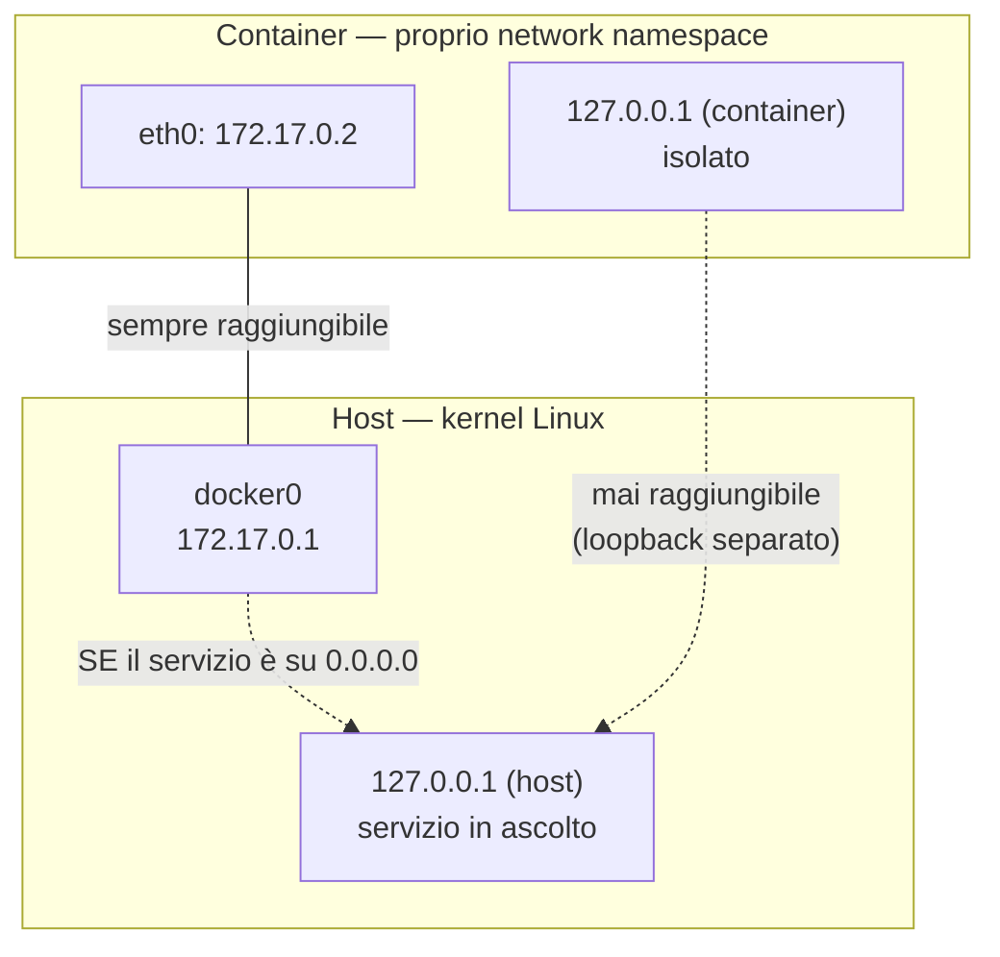

# Container ≠ Isolamento

> [!abstract] In una frase La containerizzazione (Docker) isola tramite **namespace del kernel Linux** (PID, network, mount, UTS, IPC, user) e **cgroups**, ma condivide lo **stesso kernel** dell'host — non è virtualizzazione. L'isolamento è una configurazione applicata da un **demone root**, e quindi è **rimovibile su richiesta**: per questo "container" e "sandbox di sicurezza" non sono sinonimi. Questa nota è il modello mentale dietro il vettore del gruppo `docker` in [[LinPEAS#6. Caso studio il gruppo docker]].

> [!tip] Come usare questa nota Non è un argomento d'esame isolato — è il **perché** che rende ovvi gli exploit di container escape e il vettore "gruppo docker = root". Se all'esame ti chiedono di _spiegare_ (non solo elencare) perché `docker run -v /:/host` funziona, il ragionamento è qui.

---

## 1. Container vs VM — il kernel condiviso

| |VM|Container|
|---|---|---|
|Virtualizza|l'hardware (hypervisor)|nulla — è un processo del kernel host|
|Kernel|uno per VM|**uno solo, condiviso** da host + tutti i container|
|Isolamento|a livello hardware/hypervisor|a livello kernel (namespace + cgroups)|

> [!danger] Implicazione di sicurezza Con un solo kernel condiviso, un **kernel exploit** (vedi [[ETHL 0x06 — Hacking Unix p2#4. Linux Exploit Suggester (LES)]]) compromette **host e tutti i container insieme** — non esiste un secondo kernel da bucare separatamente, a differenza delle VM.

---

## 2. Le "tende": i namespace del kernel

L'isolamento di un container è in realtà **una serie di namespace indipendenti**, ognuno dei quali isola un aspetto diverso. Puoi rimuoverne uno senza toccare gli altri.

|Namespace|Cosa isola|Cosa succede se rimosso / non attivo|
|---|---|---|
|**PID**|Vista sui processi — il container vede solo i propri, partendo da PID 1|Il container vede (e può segnalare) i processi dell'host|
|**Network**|Interfacce, routing, **proprio `127.0.0.1`**|`--network host` → il container condivide lo stack di rete dell'host|
|**Mount**|Vista sul filesystem — il proprio `/`|`-v /:/host` → il filesystem host viene bind-montato e diventa accessibile|
|**UTS**|hostname/domainname propri|Il container assume l'hostname dell'host|
|**IPC**|memoria condivisa, semafori, code di messaggi|Il container accede ai meccanismi IPC dell'host|
|**User** _(spesso non attivo di default)_|mapping UID container ↔ host|`uid=0` nel container = `uid=0` **reale** sull'host|

---

## 3. Network namespace in dettaglio — `127.0.0.1` vs `172.17.0.x`

Il punto più frainteso: **non esiste una "mappatura" del loopback host verso un IP del bridge**. Sono due cose distinte:

- Ogni container ha il **proprio** `127.0.0.1`, nel proprio network namespace — invisibile dall'host e viceversa.
- Sulla rete bridge di default (`docker0`), il container riceve un'interfaccia propria con un IP tipo `172.17.0.x`. Il lato host del bridge è tipicamente `172.17.0.1` (gateway).



### Matrice di raggiungibilità

|Configurazione servizio host|Raggiungibile da container (bridge default)|Raggiungibile da container (`--network host`)|
|---|---|---|
|bind su `127.0.0.1`|**No** — loopback separati|**Sì** — è letteralmente lo stesso loopback|
|bind su `0.0.0.0`|**Sì**, via `172.17.0.1:porta` (il container vede l'host sul gateway del bridge)|**Sì**|

> [!warning] `--network host` non dà "una propria porta" al container Con `--network host` il container **non ha un proprio network namespace**: usa quello dell'host. Se un processo nel container fa `bind(127.0.0.1:9999)`, è **esattamente equivalente** a un processo host che fa lo stesso bind — stessa interfaccia, stesso spazio di porte. Se la porta è già occupata sull'host, il bind nel container fallisce (conflitto reale). Per questo è "il caso peggiore": servizi che l'admin ha bindato su `127.0.0.1` _apposta_ per proteggerli dalla rete diventano raggiungibili da dentro il container, senza alcuna eccezione.

---

## 4. Mount namespace — il bind mount come porta sul filesystem host

```bash
docker run -it -v /:/host/ bash:latest bash   # bind mount: monta / dell'host su /host nel container
chroot /host bash                              # cambia la root del processo su /host → root del filesystem host
```

> [!info] Cosa succede davvero `-v /:/host` non è un "exploit" del mount namespace — è il **daemon** (root) che, su richiesta, bind-monta `/` dell'host dentro il container. Il mount namespace del container _esiste_ ancora, semplicemente ora contiene anche l'intero filesystem host sotto `/host`. `chroot` poi cambia semplicemente quale directory il processo considera come `/`.

---

## 5. User namespace — perché root nel container è root sull'host

Se il **user namespace** fosse attivo (`userns-remap`), `uid=0` _dentro_ il container sarebbe mappato su un UID non privilegiato _sull'host_ — scrivere su `/host` (bind-mount di cui sopra) avverrebbe con i permessi di quell'UID rimappato, non come root reale.

> [!danger] Default = user namespace OFF Nella configurazione di default (quella di praticamente tutti i lab/CTF), `userns-remap` **non è attivo**. Quindi `uid=0` nel container è **letteralmente** `uid=0` sull'host: nessuna traduzione, nessun filtro. `chroot /host bash` seguito da `id` restituisce `uid=0(root)` reale.

---

## 6. Il punto centrale — isolamento ≠ sandbox di sicurezza

> [!info] Sintesi Le "tende" (namespace) sono **reali e funzionano** per l'uso normale: un'app nel container non vede processi/file/rete dell'host, per design. Ma sono **configurazioni del kernel applicate da un processo root (il demone Docker)** — non proprietà immutabili del container.
> 
> Chi controlla il demone può scegliere, **per ogni singolo container**, quali tende lasciare e quali togliere:
> 
> - `--network host` → rimuove la tenda di rete
> - `-v /:/host` → rende visibile tutto il filesystem host attraverso la tenda mount (senza romperla)
> - `--privileged` → rimuove quasi tutte le restrizioni di capabilities
> 
> Il demone **non verifica se l'utente che chiede dovrebbe poter farlo** — se può parlare col socket, può chiedere qualsiasi cosa, e il demone (root) esegue.

---

## 7. Collegamento al vettore "gruppo docker"

Questo è esattamente il meccanismo dietro [[LinPEAS#6. Caso studio il gruppo docker]]: appartenere al gruppo `docker` significa poter parlare con un socket posseduto da un processo root, **senza ACL granulari**. Il comando `docker run -it -v /:/host/ bash:latest bash` non è un bypass di sicurezza nel senso classico (nessun bug, nessuna race condition) — è l'uso _previsto_ di una feature, concessa da un demone che non distingue "utente fidato" da "utente nel gruppo docker".

> [!quote] Confused Deputy, ancora Stesso schema di cron-root ([[ETHL 0x06 — Hacking Unix p2]]) e del dynamic linker su SetUID ([[Dynamic Linking]]): un componente con più privilegi di te (demone Docker root, cron, `ld.so` su un binario SetUID) esegue un'azione **per tuo conto**, e tu controlli un parametro di quell'azione (il flag `-v`, lo script eseguito, la libreria caricata). L'azione di per sé è legittima — il problema è _chi_ può richiederla.

---

## 8. Tabella riassuntiva

|Concetto|Punto chiave|
|---|---|
|Container vs VM|stesso kernel condiviso, isolamento via namespace+cgroups, non virtualizzazione|
|Namespace ("tende")|PID, Network, Mount, UTS, IPC, User — indipendenti, rimovibili singolarmente|
|`127.0.0.1` container vs host|**due loopback separati**, mai uguali per default|
|`172.17.0.x`|IP del container sul bridge `docker0`, non una "mappatura" del loopback|
|Servizio host su `0.0.0.0`|raggiungibile dal container via `172.17.0.1:porta`|
|Servizio host su `127.0.0.1`|**non** raggiungibile via bridge default|
|`--network host`|container condivide _tutto_ lo stack di rete dell'host — stesso `127.0.0.1`, stesso spazio porte|
|`-v /:/host` + `chroot`|bind-mount del filesystem host, concesso dal demone root su richiesta|
|User namespace default|**OFF** → `uid=0` container = `uid=0` host, reale|
|Isolamento vs sandbox|isolamento = config kernel applicata da root, rimovibile; non è un confine di sicurezza assoluto|

---

## 9. Trappole d'esame

> [!danger] Domande tipiche
> 
> 1. **Container e VM isolano allo stesso modo?** → no: VM = hypervisor + kernel separato; container = namespace/cgroups sullo stesso kernel host.
> 2. **`127.0.0.1` del container è lo stesso dell'host?** → no per default (network namespace separati); sì _solo_ con `--network host`.
> 3. **Un servizio host su `127.0.0.1:5432` è raggiungibile da un container sulla rete bridge default?** → no. Lo sarebbe se il servizio fosse su `0.0.0.0`, via `172.17.0.1:5432`.
> 4. **Perché `docker run -v /:/host` + `chroot` dà root reale sull'host?** → user namespace non attivo di default → `uid=0` container = `uid=0` host; mount namespace rende visibile `/` host sotto `/host`.
> 5. **Il vettore "gruppo docker" è un bug?** → no: è uso legittimo di una feature (bind mount / network host) concessa da un demone root senza controlli granulari sul richiedente.
> 6. **Perché un kernel exploit è più grave in ambiente containerizzato che in VM?** → un solo kernel condiviso: compromette host + tutti i container, non un singolo "ambiente".

---

## 10. Richiamo attivo (a libro chiuso)

> [!question] Verifica
> 
> 1. Spiega la differenza fondamentale tra l'isolamento di una VM e quello di un container.
> 2. Elenca almeno 4 namespace del kernel Linux e cosa isola ciascuno.
> 3. Un servizio sull'host è in ascolto su `127.0.0.1:8080`. È raggiungibile da un container sulla rete bridge default? E se fosse su `0.0.0.0:8080`?
> 4. Cosa cambia, in termini di network namespace, usando `--network host`? Perché si dice che il container "non ha più una rete propria"?
> 5. Perché `172.17.0.x` non è una "mappatura" di `127.0.0.1`?
> 6. Spiega passo passo perché `docker run -v /:/host bash` + `chroot /host bash` produce `uid=0` reale sull'host (cosa serve che NON sia attivo?).
> 7. In che senso il vettore "gruppo docker = root" non è un "bypass" dell'isolamento?
> 8. Collega questo meccanismo al pattern Confused Deputy visto in altri due contesti del corso.

---

> [!quote] Filo conduttore "Isolato" non significa "protetto da chi ha il permesso di chiedere che l'isolamento venga rimosso". I namespace sono tende reali, ma le tira un demone root che esegue ogni richiesta senza fare domande — il gruppo `docker` è semplicemente il pass per chiedere.