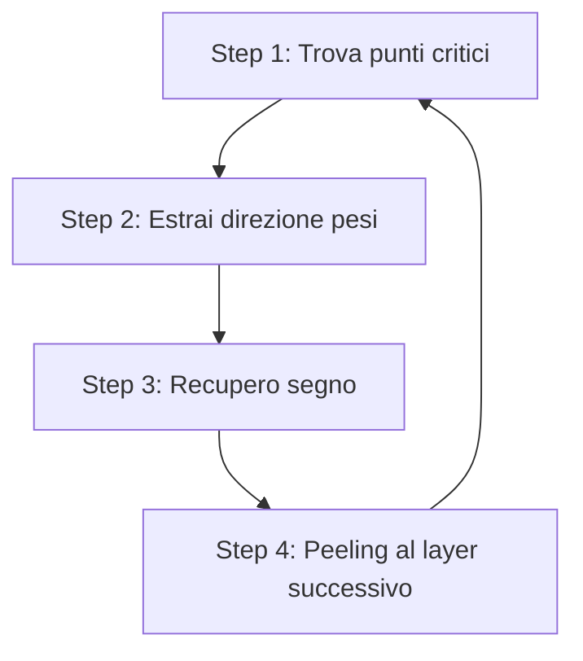

# Estrazione crittanalitica di parametri DNN — la linea di ricerca di Adi Shamir

<iframe width="560" height="315" src="https://www.youtube.com/embed/3KNBME7f0VI?si=UxF9tXVltWLyOme5" title="YouTube video player" frameborder="0" allow="accelerometer; autoplay; clipboard-write; encrypted-media; gyroscope; picture-in-picture; web-share" referrerpolicy="strict-origin-when-cross-origin" allowfullscreen></iframe>


> [!abstract] TL;DR Una [[DNN]] esposta come _black-box_ (API che accetta input e restituisce output) può essere trattata come un **cifrario con chiave segreta**: i pesi sono la chiave, le query sono il _chosen-plaintext attack_. Negli ultimi 5 anni, [[Adi Shamir]] e collaboratori hanno trasformato questo problema da "esponenziale nel numero di neuroni" a **polinomiale in query e tempo**, persino nello scenario più realistico (_hard-label_). Risultato emblematico: ~1M di parametri estratti da una rete CIFAR-10 a 4 hidden layer analizzando solo la _forma geometrica dei decision boundary_.

---

## 1. Contesto e motivazione

### 1.1 Perché conta

- Addestrare una DNN moderna costa **milioni di dollari** e mesi di GPU.
- L'oracolo $\mathcal{O}$ (l'API di inferenza) è spesso pubblico.
- I parametri sono **proprietà intellettuale**, ma anche: chi li conosce può montare attacchi _white-box_ (adversarial, membership inference, ecc.) con efficacia molto maggiore.

### 1.2 La grande analogia

> [!quote] Carlini, Jagielski, Mironov — Crypto'20 Il problema di _model extraction_ è in realtà un problema crittanalitico travestito.

|Cifrario a blocchi|DNN ReLU|
|---|---|
|Chiave segreta|Pesi $W^{(\ell)}$, bias $b^{(\ell)}$|
|Round (S-box + permutazione)|Layer (lineare + attivazione)|
|Chosen plaintext|Query controllate $x \to f(x)$|
|Differential cryptanalysis|Analisi della derivata $\partial f / \partial x$|

Con una differenza tecnica importante: **input e output sono reali**, non bit. La crittanalisi è quindi _geometrica_ e si appoggia all'analisi reale.

---

## 2. Concetti tecnici fondamentali

### 2.1 La rete come funzione lineare a tratti

Una ReLU-DNN totalmente connessa con $L$ layer è $$ f(x) = W^{(L)} , \sigma!\big(W^{(L-1)} , \sigma(\cdots \sigma(W^{(1)} x + b^{(1)}) \cdots) + b^{(L-1)}\big) + b^{(L)} $$ con $\sigma(z) = \max(0, z)$. È una **funzione continua, piecewise-linear**: lo spazio di input viene partizionato in regioni poliedrali, su ciascuna delle quali $f$ è affine.

[[ReLu in DNN|guarda qui per capirne di più]]

### 2.2 Critical points (punti critici)

> [!note] Definizione Un **critical point** è un input $x^\star$ tale che esiste un neurone $\eta_j$ il cui pre-attivazione $z_j(x^\star) = 0$. Cioè: $x^\star$ giace sul _boundary_ dove $\eta_j$ passa da "off" a "on".

**Proprietà chiave**: nei critical points, le derivate prime di $f$ sono **discontinue** — la matrice Jacobiana cambia in modo controllato di rango. Questa discontinuità è una "fessura" da cui far passare informazione.

I critical points sono cruciali perché la loro posizione **determina completamente** i parametri della rete (a meno di simmetrie note, come il rescaling positivo).

### 2.3 Dual points (Carlini–Chávez–Hambitzer–Rodríguez–Shamir, 2024)

Nello scenario _hard-label_ non si vedono i logit, quindi i critical point classici sono **invisibili**. Si introduce allora il **dual point**: un input che giace simultaneamente su:

1. il _decision boundary_ fra due classi (osservabile: l'etichetta cambia)
2. un _neuron boundary_ (la quantità che vogliamo estrarre)

> [!info] Intuizione Camminando lungo il bordo di una classe (es. "gatto" → "cane"), il bordo è poligonale; in certi punti gira angolo. Quegli angoli sono "ombre" dei critical point interni: i dual points.

---

## 3. Tassonomia dei threat model

Carlini et al. distinguono cinque livelli di accesso (S1 più difficile, S5 più facile):

|Setting|Cosa restituisce l'oracolo|Difficoltà|
|---|---|---|
|**S1**|Solo etichetta predetta (hard-label)|Massima|
|**S2**|Etichetta + confidence (top-1 score)|Alta|
|**S3**|Top-$k$ con probabilità|Media|
|**S4**|Tutte le probabilità (softmax output)|Bassa|
|**S5**|Tutti i logit (pre-softmax)|Minima|

> [!warning] Realismo Le API commerciali tendono al lato S1–S2. I lavori più recenti puntano qui.

---

## 4. Timeline dei risultati

### 4.1 Lowd & Meek (2005), Tramèr et al. (2016)

Prime estrazioni per modelli lineari e DNN piccole. **Funzionali** (rubano l'I/O), **non parametriche** (non recuperano i pesi).

### 4.2 Carlini, Jagielski, Mironov — Crypto 2020

- Primo attacco **crittanalitico** vero.
- Sfrutta i critical points dei ReLU.
- Setting S4/S5 (logit completi).
- **Polynomial queries, exponential time** nel numero di neuroni.
- Risultato pratico: estrae reti $2^{20}$ volte più precise con $100\times$ meno query rispetto al precedente stato dell'arte.

### 4.3 Canales-Martínez, Chavez-Saab, Hambitzer, Rodríguez-Henríquez, Satpute, Shamir — Eurocrypt 2024

- Setting ancora S4/S5.
- **Polynomial queries, polynomial time** — la svolta.
- Tre nuove tecniche di _sign recovery_:
    - **SOE** (System of Equations): sistema lineare derivato dai vincoli dei neuroni.
    - **Neuron Wiggle**
    - **Last-Hidden-Layer attack**
- **Demo:** rete CIFAR-10, 3072 input, 8 hidden layer × 256 neuroni, ~1.2M parametri → estratta in **30 minuti su un 256-core**.

### 4.4 Chen et al. — Asiacrypt 2024

- Primo tentativo serio in setting **S1 (hard-label)**.
- Limitato: solo classificatori **binari**, reti ≤ 4 neuroni su 2 hidden layer.
- Polynomial queries ma **exponential time**.

### 4.5 Carlini, Chávez-Saab, Hambitzer, Rodríguez-Henríquez, Shamir — 2024/2025 (arxiv 2410.05750)

> [!success] Il risultato che probabilmente sentirai presentare domani Primo attacco **hard-label** con **polynomial queries E polynomial time**, multi-classe, su reti realistiche.

- Tecnica chiave: **dual points** + algoritmo di consistenza fra dual points "duali fra loro" (separa nettamente neuroni consistenti vs inconsistenti).
- **Demo:** ~1M parametri estratti, rete CIFAR-10 con 832 neuroni in 4 hidden layer.
- _Quote_ dal paper: **tutti i pesi di una ReLU-DNN si possono determinare analizzando solo la forma geometrica dei suoi decision boundary**. Risultato sorprendente.

### 4.6 Estensione a non-ReLU — eprint 2026/253

- Attacco universale che recupera pesi **e** bias da reti con attivazioni che convergono al lineare fuori da regioni strette: **GELU, SiLU, SELU, Sigmoid**.
- Tecnica: derivate di ordine superiore + analisi delle "zone lineari adiacenti".
- Implicazione: le difese basate su "usiamo attivazioni smooth" **non funzionano**.

---

## 5. Anatomia dell'attacco polynomial-time (Eurocrypt'24)

### 5.1 Schema generale

```
per ogni layer ℓ = 1 ... L:
    1. Trova abbastanza critical points per i neuroni di layer ℓ
    2. Da ogni critical point: recupera la direzione di W^(ℓ)_j  (vettore peso, a meno di segno e scala)
    3. Sign recovery (SOE / wiggle / last-layer)
    4. Recupera bias b^(ℓ)_j  (intercette delle iperpiani)
    5. "Peeling": ora layer ℓ è noto → tratta layer ℓ+1 come la nuova prima layer
```

### 5.2 Il problema del segno

ReLU ha la simmetria $\sigma(z)$ vs $\sigma(-z) \cdot (-1)$ che il critical point **non distingue** (il piano è lo stesso). Bisogna risolvere ogni $j$-esimo neurone con segno corretto, altrimenti il layer successivo viene completamente sbagliato.

> [!tip] Trick "SOE" Per il neurone $\eta_j$ si raccolgono $s$ critical point distinti; ognuno fornisce un vincolo lineare sui coefficienti di output. Il sistema lineare risultante ammette soluzione coerente **solo** con il segno corretto — la maggioranza dei tentativi inconsistenti viene scartata per voto.

### 5.3 Peeling layer-by-layer

Recuperato $W^{(1)}, b^{(1)}$, il layer 1 diventa "visibile": si può quindi _simulare_ il primo passaggio e ridurre il problema a una rete con un layer in meno. Si procede ricorsivamente. Il costo si accumula in modo polinomiale (non esponenziale come prima).

---

## 6. Il salto all'hard-label

### 6.1 Cosa va in crisi

Senza logit:

- Niente derivate numeriche dirette.
- I critical point interni sono **invisibili** (cambiare lo stato di un neurone sepolto non sposta l'etichetta, in generale).
- Solo i punti dove l'**argmax** cambia sono osservabili.

### 6.2 La mossa: dual points

Si cerca un input $x^\star$ dove **simultaneamente**:

- $\arg\max f(x^\star) = c_1$ ma una perturbazione infinitesima dà $c_2$ (decision boundary).
- Uno dei neuroni interni è esattamente sul suo zero (neuron boundary).

Algoritmicamente: si cammina sul decision boundary (binary-search sull'etichetta) e si cerca dove il _boundary_ presenta un **kink** (variazione di pendenza). Quei kink rivelano la geometria dei neuroni interni.

### 6.3 Algoritmo di consistenza

Dato un candidato dual point per il neurone $\eta_j$, si calcola il suo "duale" e si verifica se la coppia è **consistente** con l'ipotesi che entrambi i punti corrispondano allo stesso neurone interno. La distribuzione delle consistenze separa quasi perfettamente le coppie corrette dalle spurie.

---

## 7. Assunzioni e limitazioni (importante per le domande al talk)

|Assunzione|Stato|
|---|---|
|Architettura fully-connected|Estesa a MobileNet-like in [eprint 2024/1870]|
|Solo ReLU|Estesa a GELU/SiLU/Sigmoid in [eprint 2026/253]|
|Precisione floating-point illimitata|Realistica per API che restituiscono `float32/64`|
|Query non rumorose|**Critica**: differential privacy a livello di query rompe l'attacco|
|Accesso illimitato all'oracolo|Le API commerciali fanno rate-limiting|
|Conoscenza dell'architettura|Numero di layer e neuroni assunto noto (problema separato)|

> [!warning] Difese che NON funzionano
> 
> - Usare attivazioni smooth (GELU/SiLU) — rotto nel 2026.
> - Restituire solo top-1 hard label — rotto nel 2024/25.
> - Quantizzazione a 8 bit — riduce solo la precisione, non l'estraibilità.

> [!success] Difese che funzionano (parzialmente)
> 
> - **Output perturbation** con rumore calibrato (DP-style).
> - **Rate limiting + anomaly detection** su pattern di query (chosen-input fa query _molto_ strutturate).
> - **Stochastic networks** (dropout/Bayesian inference a runtime).
> - **Distillation gating**: la API non espone la rete originale ma un modello-studente meno informativo.

---

## 8. Connessioni e ramificazioni

- [[Side-channel attacks su DNN]] — eprint 2024/1870 combina estrazione crittanalitica con leak EM da dispositivi STM embedded.
- [[Kraken — EM side-channel]] (Shamir et al., 2024) — attacchi higher-order in near/far field.
- [[Membership inference]] — l'estrazione completa rende banale qualsiasi inference attack a valle.
- [[Watermarking di modelli]] — l'estrazione completa rimuove i watermark "non-cryptographic".
- [[Identificabilità delle ReLU networks]] — risultato teorico precedente: le simmetrie di scala sono _complete_, quindi a meno di queste l'estrazione è ben definita.

---

## 9. Domande candidate per il Q&A

> [!question] Possibili spunti per chiedere qualcosa di non banale
> 
> 1. La consistenza fra dual points ha falsi positivi quando la rete è **molto** larga (centinaia di neuroni per layer)? Come scala il tasso di errore?
> 2. L'estensione a **CNN con stride > 1** sembra non banale: i critical point in domini con shared weights si replicano. Stato?
> 3. **Transformer**: attention è non-lineare nel logit ma ha una struttura algebrica forte. Esiste un analogo dei critical point per l'attention?
> 4. Se l'API aggiunge rumore $\mathcal{N}(0, \sigma^2)$ all'output, qual è la soglia $\sigma^\star$ sotto la quale l'attacco resta polinomiale?
> 5. Tutto questo è teoricamente affascinante: c'è già un caso documentato di estrazione su un modello **commerciale reale**, o resta dimostrazione su CIFAR-10?

---

## 10. Bibliografia essenziale

- **Carlini, Jagielski, Mironov** (2020). _Cryptanalytic Extraction of Neural Network Models_. Crypto. [arXiv:2003.04884](https://arxiv.org/abs/2003.04884)
- **Canales-Martínez, Chavez-Saab, Hambitzer, Rodríguez-Henríquez, Satpute, Shamir** (2024). _Polynomial Time Cryptanalytic Extraction of Neural Network Models_. Eurocrypt. [eprint 2023/1526](https://eprint.iacr.org/2023/1526)
- **Chen et al.** (2024). _Hard-label extraction_. Asiacrypt.
- **Carlini, Chávez-Saab, Hambitzer, Rodríguez-Henríquez, Shamir** (2024/2025). _Polynomial Time Cryptanalytic Extraction of DNNs in the Hard-Label Setting_. [arXiv:2410.05750](https://arxiv.org/abs/2410.05750)
- **(2026).** _Cryptanalytic Extraction of DNNs with Non-Linear Activations_. [eprint 2026/253](https://eprint.iacr.org/2026/253)
- **Schneier blog** — sintesi divulgative (2023, 2024).

---

## 11. Sull'oratore — [[Adi Shamir]]

- Co-inventore di **RSA** (la "S"), 1977.
- Turing Award **2002** (con Rivest e Adleman).
- Inventore della **crittanalisi differenziale** (con Biham, 1990) — la stessa tecnica che oggi applica alle DNN: c'è una continuità intellettuale di 35 anni.
- Weizmann Institute, Rehovot.
- Stile da talk: dense, very technical, ma con una forte cura per la motivazione e l'intuizione geometrica. Le sue slides tendono a partire con una "analogia" potente (qui: DNN ≡ cifrario) e a costruire ogni risultato come una mossa di scherma su quell'analogia.

> [!tip] Pre-talk checklist
> 
> - [ ] Leggere almeno l'introduzione di [arXiv:2410.05750](https://arxiv.org/abs/2410.05750)
> - [ ] Memorizzare la differenza S1 vs S5
> - [ ] Avere in testa la metafora "critical point = boundary di un neurone, dual point = ombra del boundary sul decision boundary"
> - [ ] Preparare 1 domanda concreta (vedi §9)

---
**Cosa ha pubblicato Shamir** (gen 2025 → oggi):

- **Eurocrypt 2025 (aprile-maggio 2025)**: pubblicazione formale del paper hard-label (Carlini, Chávez-Saab, Hambitzer, Rodríguez-Henríquez, Shamir). Stesso contenuto del preprint arXiv:2410.05750 che probabilmente è già il fulcro delle slide di oggi.
- **eprint 2025/288 — _"How to Securely Implement Cryptography in Deep Neural Networks"_** (Gérault, Hambitzer, Ronen, Shamir, feb 2025, rev. feb 2026). Stessa squadra (Hambitzer), ma è il **problema inverso**: come _embeddare_ primitive crittografiche dentro una DNN così che restino sicure quando l'input non è più una sequenza di bit ma un vettore di reali. Filone affine, non lo stesso.

**Cosa è uscito da altri gruppi** seguendo la sua scia (e questa è la parte interessante):

- **2026/253** — Asselineau, Derbez, Fouque, Minaud (Inria): estensione a GELU, SiLU, SELU, Sigmoid. Frantuma la difesa "uso attivazioni smooth".
- **2026/178** — gruppo Shandong (Qi et al.): Leaky ReLU, HardTanh, ELU, Step.
- **arxiv 2509.16620** (set 2025) — Cina: estrazione su reti PReLU.
- **2026/139, 2026/902** — Cina: estrazione su CNN hard-label (BTTB matrices, ACISP 2026).
- **2026/168** — Cina: estrazione di RNN.
- **2026/719** — Cina: estrazione di Graph Neural Networks.
- **2026/848** — _"PPML Is More Vulnerable to Cryptanalytic Extraction Attacks"_ — anche i modelli privacy-preserving cadono.

**E la cosa che renderebbe interessante una domanda al Q&A**:

- **arxiv 2510.06692** — _"Is the Hard-Label Cryptanalytic Model Extraction Really Polynomial?"_ (ottobre 2025). È una **critica diretta** al risultato di Carlini-Shamir et al. Eurocrypt 2025: sostiene che un'assunzione chiave (che ci siano abbastanza neuroni il cui stato di attivazione cambia con la query) diventa irrealistica man mano che cresce la profondità. Anche un solo neurone "quasi sempre attivo" basta a far cadere l'attacco. Se Shamir non l'ha citata nelle slide, è una domanda perfetta: _"Come risponde alla critica di [autori] del paper arxiv 2510.06692 sulla realisticità della sua assunzione di polinomialità in funzione della profondità?"_

Sì, hai inquadrato esattamente il punto della critica. Lasciami però essere più preciso sul "sfalsato": non è solo che la stima è imprecisa, è che **l'attacco si pianta**. Se un neurone $\eta_j$ ha pre-attivazione $z_j(x) > 0$ per _ogni_ $x$ nel dominio di query, allora la sua ReLU non lampeggia mai — non c'è nessun critical point, nessun kink nel decision boundary, **nessuna informazione geometrica** da cui ricostruire $W_j$ e $b_j$. Il neurone è invisibile all'attaccante, e tutti i layer a valle vengono ricostruiti su un input sbagliato (gli manca un contributo lineare costante che dovrebbe esserci).

Ora alla domanda interessante: **perché la depth e non la width?**

In realtà entrambe contano, ma in modi qualitativamente diversi.

**La width fa scalare il costo, non rompe l'attacco.** Se un layer ha 256 neuroni invece di 16, devi trovare 16× più critical points, ma è proprio quello che il risultato di Eurocrypt'24 garantisce: **polinomiale** in numero di neuroni. Anzi, una rete più larga aiuta in un certo senso: l'attacco lavora sul layer "in parallelo" e può facilmente diagnosticare quale neurone è patologico (sempre attivo) perché lo vede mancare nella geometria locale, e in linea di principio potrebbe scartarlo o trattarlo a parte.

**La depth invece amplifica il problema in modo strutturale, per due ragioni distinte:**

1. **Concentrazione della distribuzione effettiva.** L'input al primo layer è $x$ — distribuzione ampia, supporto pieno in $\mathbb{R}^n$. L'input al layer $\ell$ profondo è $\sigma(W^{(\ell-1)} \sigma(\cdots))$ — già filtrato attraverso $\ell-1$ ReLU. Quel vettore vive in un **cono poliedrale** sempre più stretto man mano che cresce $\ell$. Su un supporto più stretto, è statisticamente più probabile che il bias di un neurone sia tale da metterlo _interamente sopra o sotto zero_ su tutto quel supporto. In altre parole: gli "always-on neurons" sono **rari nei primi layer e progressivamente più comuni in profondità**, indipendentemente dalla width.
    
2. **Propagazione cumulativa dell'errore.** L'attacco fa _peeling_: ricostruito il layer 1, lo simula per ricostruire il layer 2, e così via. Se sbaglio (anche solo "salto") un neurone al layer 3, tutti i layer 4–L vedranno un input sistematicamente errato. Non c'è meccanismo correttivo — ogni layer si fida del precedente. Con un layer wide ma solo, anche se sbagli un neurone, sbagli "una volta sola"; con $L$ layer e probabilità $p$ di neurone patologico per neurone, la probabilità di un fallimento _da qualche parte_ cresce con $L \cdot N$, ma il **danno** di ogni fallimento cresce con $L$ (perché tutto a valle è compromesso).
    

In sintesi: la width ti costa **tempo polinomiale extra**; la depth ti costa **assunzioni statistiche che diventano più fragili e propagazione di errore che si accumula**. Per questo gli autori della critica (arxiv 2510.06692) puntano il dito sulla depth — è lì che la garanzia "polinomial-time" comincia a perdere significato pratico, anche se rimane formalmente vera.

Buona domanda da rilanciare al docente se rivedete il materiale in classe, tra l'altro: _qual è la depth massima a cui Shamir et al. hanno dimostrato l'attacco end-to-end nei loro esperimenti?_ Nel paper hard-label è 4 hidden layer su CIFAR-10 — non particolarmente profondo per gli standard moderni.

---
## Appendice — Glossario rapido

- **Oracolo $\mathcal{O}$**: l'API che dà $f(x)$ per ogni $x$.
- **Chosen-input attack**: l'attaccante sceglie $x$ a piacere (vs _known-input_).
- **Sign recovery**: determinare il segno di un vettore peso, indistinguibile dal solo critical point.
- **Peeling**: estrazione layer-by-layer dopo che il precedente è noto.
- **Folk theorem**: in crittografia, conoscenza informale ritenuta vera ma poi smentita — Shamir ne ha smontati diversi nella sua carriera.

---


# Estrazione Crittanalitica di Deep Neural Networks

> [!abstract] TL;DR Data una rete neurale ReLU accessibile solo come **black-box** (input → output), è possibile ricostruire **tutti i pesi reali** della rete con un numero polinomiale di query e in tempo polinomiale. L'attacco usa idee dalla **crittanalisi differenziale** classica di [[Biham-Shamir]]. Dimostrato su una DNN per CIFAR-10 con >1M parametri.

---

## 1. Il problema

### 1.1 Setting

- **Vittima**: una DNN ReLU $f: \mathbb{R}^{n_0} \to \mathbb{R}^{n_L}$ con $L$ layer, parametri ${W_k, b_k}_{k=1}^{L}$ segreti.
- **Attaccante**: può fare query arbitrarie $x \mapsto f(x)$, osserva **output numerici** (logits, non solo label — caso "soft-label").
- **Obiettivo**: recuperare tutti i $W_k, b_k$ con precisione arbitraria.

### 1.2 Perché è interessante

- I pesi sono l'asset economico (training di un LLM ≈ $100M+).
- Parallelo con [[chosen-plaintext attack]] su un cifrario: la rete è la black-box, i pesi sono la **chiave segreta**.
- Applicazione moderna di [[Differential Cryptanalysis]].

---

## 2. Fondamento matematico: ReLU = piecewise linear

Una rete con $\text{ReLU}(z) = \max(0, z)$ è una funzione **affine a tratti** su $\mathbb{R}^{n_0}$:

$$ f(x) = A_R \cdot x + c_R \quad \text{per } x \in R $$

dove $R$ è un poliedro convesso. I poliedri sono delimitati dagli **iperpiani critici**:

$$ H_{k,j} = {x : W_k^{(j)} \cdot h_{k-1}(x) + b_k^{(j)} = 0} $$

ovvero i punti dove il neurone $j$ del layer $k$ ha pre-attivazione zero.

> [!info] Intuizione geometrica Lo spazio di input è tassellato in regioni poligonali. Dentro ciascuna, la rete è una banale funzione lineare. Tutta l'informazione sui pesi è codificata nella **geometria dei confini** tra regioni.

---

## 3. L'attacco in 4 step



### 3.1 Step 1 — Localizzare punti critici

Parametrizza una retta $x(t) = a + t \cdot d$ nello spazio di input. La funzione $g(t) = f(x(t))$ è piecewise-lineare in $t$:

- $g'(t)$ ha kink (continua ma non derivabile)
- $g''(t)$ ha **discontinuità di tipo Dirac** ai punti critici

Numericamente: $$ g''(t) \approx \frac{g(t+h) - 2g(t) + g(t-h)}{h^2} $$

Picchi anomali → punto critico → un neurone del primo layer si trova esattamente sul suo iperpiano.

> [!tip] Sample efficiency Bastano $O(n_1)$ rette esplorative per intercettare tutti gli $n_1$ neuroni del primo layer (con alta probabilità su direzioni random).

### 3.2 Step 2 — Estrazione direzione dei pesi

Sia $x^_$ un punto critico per il neurone $j$ del layer 1: $w_j \cdot x^_ + b_j = 0$.

Attraversando l'iperpiano, il **gradiente** dell'output salta:

$$ \Delta_i := \lim_{\epsilon \to 0^+} \left[ \frac{\partial f}{\partial x_i}(x^* + \epsilon e_j^\perp) - \frac{\partial f}{\partial x_i}(x^* - \epsilon e_j^\perp) \right] = c \cdot (w_j)_i $$

dove $c$ è uno scalare ignoto che dipende dai layer successivi.

Misurando $\Delta_i$ per ogni coordinata $i = 1, \ldots, n_0$:

$$ \boxed{w_j \text{ ricostruito a meno di scala e segno}} $$

> [!warning] Cosa manca
> 
> - **Norma** $|w_j|$ (scalare $c$)
> - **Segno** globale di $w_j$ (potrebbe essere $-w_j$)

### 3.3 Step 3 — Recupero del segno (il bottleneck)

Con $n_1$ neuroni nel layer 1, ci sono $2^{n_1}$ assegnazioni di segno possibili.

**Carlini et al. (Crypto'20)**: ricerca esaustiva → $O(2^{n_1})$ ⇒ infattibile per layer larghi (es. $n_1 = 256 \Rightarrow 2^{256}$).

**Shamir et al. (Eurocrypt'24)** — innovazione chiave:

I segni non sono indipendenti. Per ogni coppia $(j, k)$ di neuroni si può costruire un input $x$ che si trova vicino all'intersezione $H_{1,j} \cap H_{1,k}$. In quel punto, il comportamento locale dell'output dà un'equazione lineare nei segni $s_j, s_k \in {-1, +1}$:

$$ \alpha_{jk} s_j + \beta_{jk} s_k = \gamma_{jk} $$

con $\alpha, \beta, \gamma$ osservabili. Raccogliendo abbastanza coppie → sistema lineare sovradeterminato → soluzione in tempo polinomiale.

> [!success] Risultato Per la rete CIFAR-10 (8 layer × 256 neuroni): da $2^{256}$ a **30 minuti su 256 core**.

### 3.4 Step 4 — Peeling layer-by-layer

Una volta noti $(W_1, b_1)$ esatti, costruisci un **oracolo virtuale** per il sotto-network $f_2 \circ \cdots \circ f_L$.

Dato un vettore $h \in \mathbb{R}^{n_1}$ desiderato come input a layer 2:

1. Scegli $h$ nella regione in cui tutti i ReLU di layer 1 sono attivi.
2. In quella regione $\text{ReLU}(W_1 x + b_1) = W_1 x + b_1$.
3. Risolvi $W_1 x + b_1 = h \Rightarrow x = W_1^{-1}(h - b_1)$ (richiede $W_1$ pseudo-invertibile).
4. Invii $x$ alla rete reale, leggi l'output.

Per il sotto-network questo è indistinguibile da una query diretta. → ripeti Step 1-3.

> [!danger] Vincolo critico La precisione su $W_1$ deve essere arbitrariamente alta: errori si **propagano e amplificano** layer dopo layer. Per questo il paper si concentra molto sulla numerica.

---

## 4. Architettura: cosa serve sapere a priori?

L'attacco **assume** noti:

- numero di layer $L$
- larghezze $n_1, \ldots, n_{L-1}$
- tipo di attivazione (ReLU)

**Ma**:

- Architetture commerciali spesso pubbliche (model cards, paper).
- Le larghezze sono stimabili contando gli iperpiani critici trovati a ogni "profondità".
- La profondità è inferibile dall'**ordine** delle discontinuità: un neurone al layer $k$ produce kink nella derivata $k$-esima.

> [!question] Open problem Estrazione **simultanea** di architettura e pesi senza priors → ancora aperto.

---

## 5. Implicazioni

### 5.1 Proprietà intellettuale

- Training di un modello SOTA: $10^7$–$10^9$ USD.
- L'attacco lo "ruba" con richieste legittime all'API → nessun hacking tradizionale.

### 5.2 Sicurezza

- Pesi noti → [[adversarial examples]] costruibili in tempo banale.
- Sistemi critici (riconoscimento facciale, guida autonoma, anti-frode) vulnerabili.

### 5.3 Privacy

- I pesi "memorizzano" il training set in forma compressa.
- Apre la strada a [[model inversion]] e [[membership inference]].

> [!quote] Kerckhoffs principle (riformulato) _La sicurezza di un sistema ML non può basarsi sul tenere segreti i pesi se questi sono recuperabili da query._

---

## 6. Estensioni recenti

### 6.1 Hard-label setting (Eurocrypt'25)

[[Carlini, Chávez-Saab, Hambitzer, Rodríguez-Henríquez, Shamir]]: stesso risultato quando l'API restituisce **solo la classe predetta** (top-1 label), non i logits.

> [!note] Risultato sorprendente Tutti i pesi di una ReLU-DNN sono determinabili dalla sola **geometria dei confini decisionali**.

### 6.2 Limiti aperti

- Attivazioni smooth (GeLU, SiLU): la piecewise linearity si rompe.
- Transformer / attention: struttura non-feedforward, attacco non si applica direttamente.
- Quantizzazione, rumore stocastico in output: difese pratiche da valutare.

---

## 7. Riferimenti

- Canales-Martínez, Chávez-Saab, Hambitzer, Rodríguez-Henríquez, Satpute, Shamir. **"Polynomial Time Cryptanalytic Extraction of Neural Network Models"**. Eurocrypt 2024. [ePrint 2023/1526](https://eprint.iacr.org/2023/1526)
- Carlini, Chávez-Saab, Hambitzer, Rodríguez-Henríquez, Shamir. **"Polynomial Time Cryptanalytic Extraction of Deep Neural Networks in the Hard-Label Setting"**. Eurocrypt 2025. [arXiv 2410.05750](https://arxiv.org/abs/2410.05750)
- Carlini, Jagielski, Mironov. **"Cryptanalytic Extraction of Neural Network Models"**. Crypto 2020.
- Biham, Shamir. **"Differential Cryptanalysis of DES-like Cryptosystems"**. Crypto 1990.

---

## 8. Domande da fare al seminario

- [ ] L'attacco scala a transformer/LLM o resta su MLP?
- [ ] Quali difese pratiche degradano l'utilità in modo accettabile?
- [ ] Connessione con [[neural tangent kernel]] e geometria dei loss landscapes.
- [ ] Limiti teorici inferiori sul numero di query (lower bound information-theoretic)?
- [ ] Estensione a reti con normalization layers (BatchNorm, LayerNorm)?

---

## 9. Collegamenti

- [[Differential Cryptanalysis]]
- [[Model Stealing Attacks]]
- [[Adversarial Examples]]
- [[Membership Inference]]
- [[Kerckhoffs Principle]]
- [[Black-box Attacks ML]]